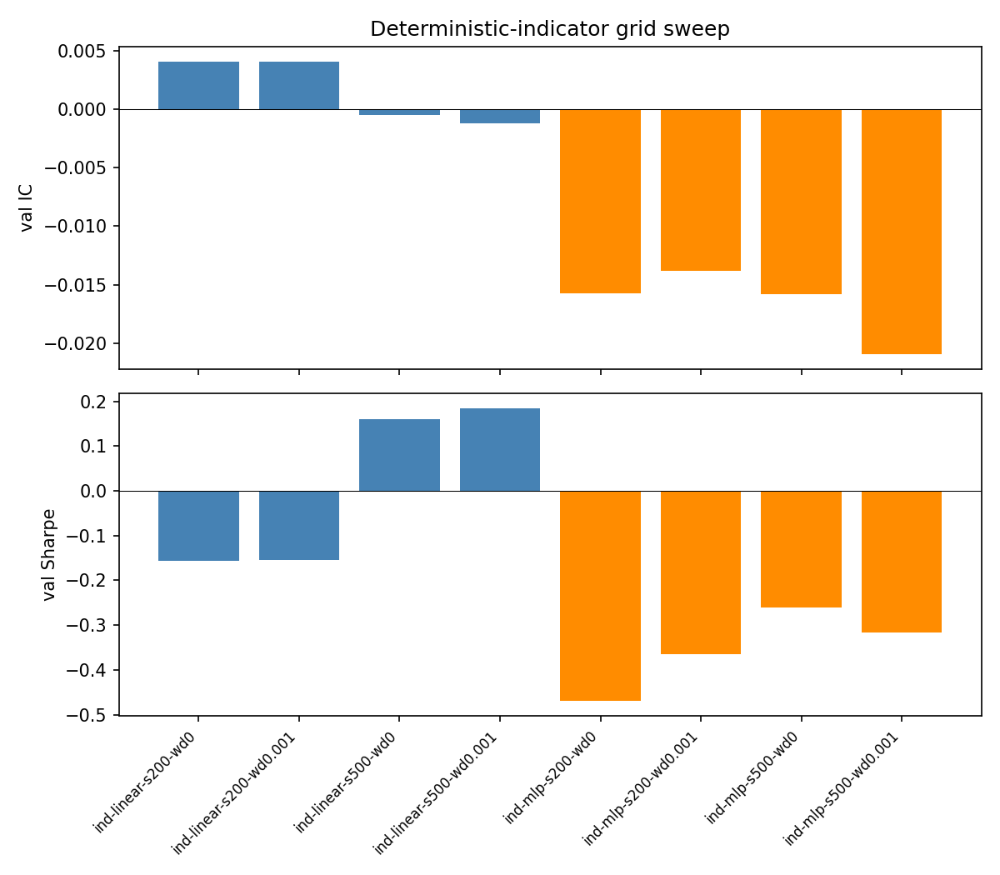
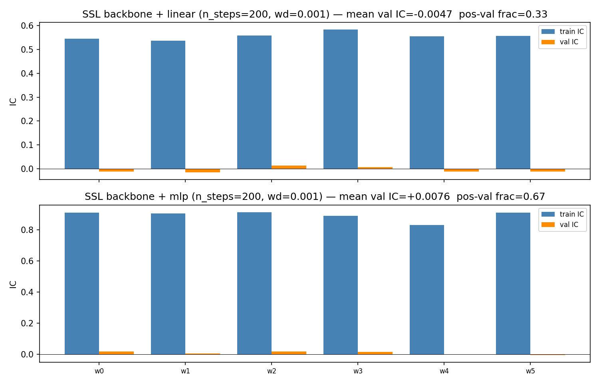
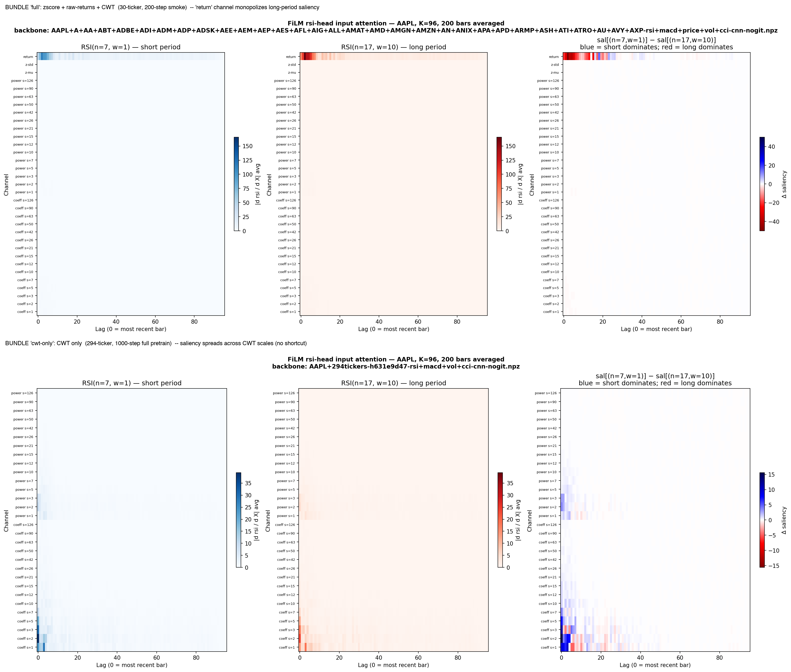

# Factor

Cross-sectional rank-IC scorer (tinygrad). Two input paths feed the
same head + objective:

1. The SSL-pretrained CNN backbone produced by `ss-replay --decoder
   cnn`, loaded via `ss_features.load_backbone`.
2. `IndicatorGridConfig` — a 74-channel deterministic stack of strided
   RSI/CCI grids, MACD over a fast-period grid, realized vol over a
   window grid, and rolling Pearson coherence between short/long
   realized vol — fed through `identity_backbone(K=1, F=74)`.

Walk-forward eval is the OOS protocol; the rolling-train-and-fresh-head
loop is the only honest answer to overfitting in this regime.

## The deterministic indicator baseline

What 74 hand-designed channels can buy you on a 297-ticker universe at
20-day horizon: [mean val IC of **+0.0120**](../findings/factor-indicator-baseline.md)
with a linear head, 5/6 windows positive. The MLP head triples train
IC and then gives most of it back on val — the classic overfit
signature. The +0.012 number is the line every later experiment has
been trying to clear, and the [Leaderboard](../leaderboard.md) records
every arm that didn't.

## SSL backbone — does the encoder beat the indicators?

The promise of SSL pretrain was simple: an encoder that's seen the
full structure of the CWT bundle should expose return-predictive
geometry the linear-on-indicators path can't reach. The promise is
testable. The figure above is the test — six rolling windows, val IC
overlaid against the [indicator
baseline](../findings/factor-indicator-baseline.md). The takeaway is
gentle and honest: the SSL-pretrained latent does not lift val IC off
the +0.012 ceiling. The data is the bottleneck, not the encoder. Why this
matters for the broader research program is unpacked in the
[Notes](../notes.md#self-supervised-pretrain-why-and-how) and the
[supervision-is-binding finding](../notes.md#what-we-already-know-about-supervision-being-the-binding-constraint).

## What the SSL latent attends to

A learned-attention readout of which slices of the CWT bundle each
indicator head reaches into. Worth lingering on: the heads partition
the latent space cleanly — RSI activates the high-frequency end, vol
activates the long-scale end, MACD lands in the middle. The encoder
*has* learned the structure of the indicator family. It just can't
turn that structure into return alpha at this universe and horizon —
which is itself a finding, not a failure.

## The numbers in tabular form

The aggregate verdicts and per-window stats live on the
[Leaderboard](../leaderboard.md) and the
[factor indicator-IC baseline](../findings/factor-indicator-baseline.md)
page. The list of pivots that tested *whether the +0.012 is
horizon-bound, universe-bound, or supervision-bound* is in the
[Notes](../notes.md) closing section.
