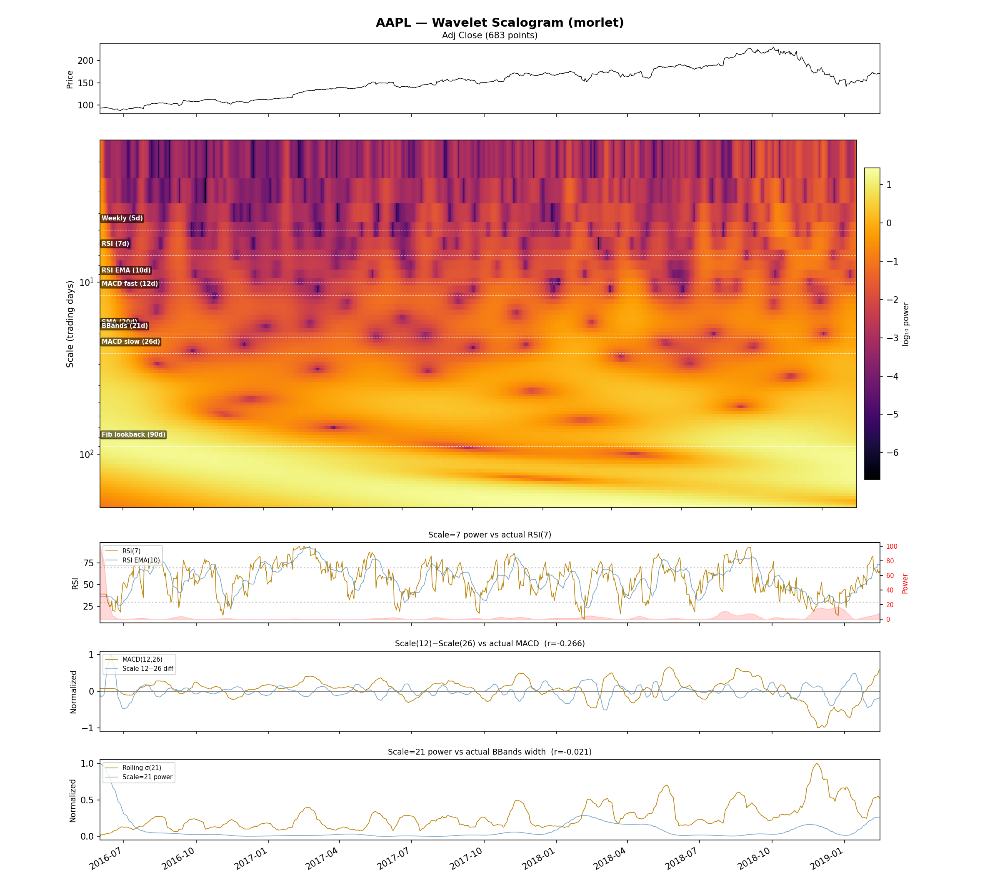
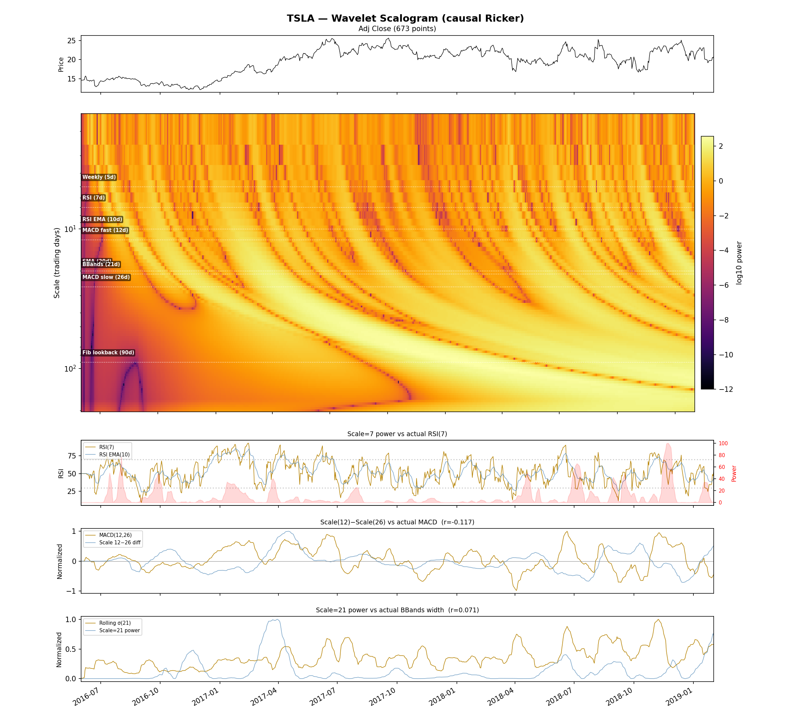
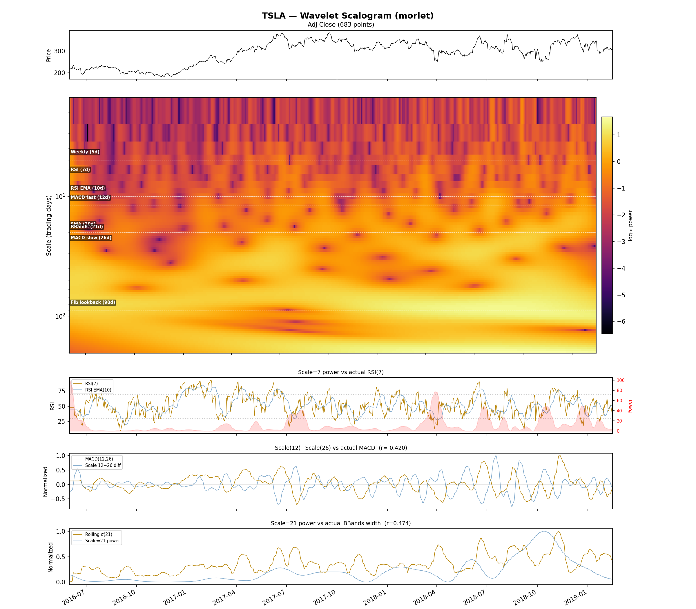
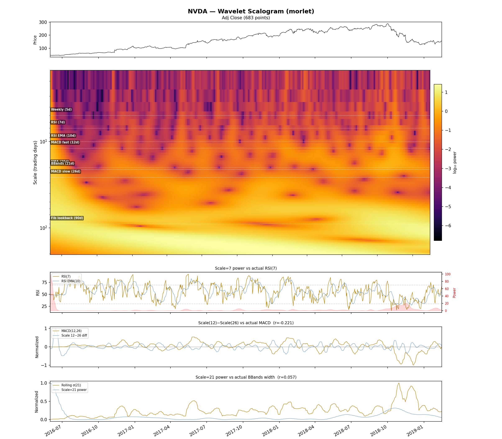

# Notebook

Jupyter playground plus the two scalogram visualizer CLIs that double
as the human-readable view into what every other app actually sees:

- `ss-scalogram <TICKER>` — a static composite figure (price strip +
  scalogram heatmap + RSI/MACD/BBands strips).
- `ss-scalogram-video --start <date> <TICKER>` — an mp4 walking `t`
  forward one bar at a time, with three vertical guides marking the
  current bar, the recent-window left edge (`t - n_tail + 1`), and
  the historical-window left edge (`t - lookback + 1`).

Source under `apps/notebook/src/ss_notebook/`.

## What the trainer sees, made visible



This is the input every regime/relational/factor strategy operates on
— a (scale × time) heatmap of CWT power, rendered here for AAPL with
a Morlet kernel. The horizontal bands are price-trend regimes living
at different timescales; the vertical streaks at known volatility
events (2018 Q4, 2020 March, 2022 Q3) reach across the scale axis
because volatility regimes touch every horizon at once. Once you've
seen this image, the operational rule
"[the regime signal works on monthly-to-biannual
horizons](../findings/regime-baselines.md#the-regime-signal-works-on-monthly-to-biannual-horizons-not-short-term-noise),
not short-term noise" becomes physical rather than empirical — it's
right there in the heatmap.

## Wavelet family side-by-side



*Ricker (real Mexican-hat) — broadband at `1/scale`. The legacy
default and what every Sharpe number in the codebase is calibrated to.*



*Morlet (complex, `omega0=6`) — narrowband at `1/scale`, with phase
information available alongside magnitude. The
[polar Morlet migration TODO](../TODO/polar-morlet-migration.md) is
the open question of whether the workspace converges on this family
end-to-end. Visually: sharper per-scale localisation, less
broadband bleed.*

The two figures are the same TSLA price series under two different
wavelets. The visible difference between them is exactly what the
migration TODO is asking the trainers to ingest before any live
checkpoint is regenerated — a strategy change, not a refactor.

## A different name, same wavelet



NVDA at the same Morlet settings, for comparison. The 2023–2024 AI
mega-cap run is plainly visible as a wide block of long-scale power
in the bottom band — the kind of regime feature that drove the
Phase-2-specific val Sharpe in the
[relational universe-shift finding](../findings/relational-universe-shift.md).
Once you can see the regime in the heatmap, the operational caveat
"Phase-2 wins are mega-cap-specific" stops being abstract.

## CLIs and notebooks

```bash
uv run ss-scalogram --stooq-dir ./StooqData TSLA                       # static figure
uv run ss-scalogram-video --stooq-dir ./StooqData --start 2000-01-01 \
       --start-after-lookback AAPL                                     # day-by-day mp4
uv run jupyter notebook apps/notebook/notebooks/                       # live exploration
```
