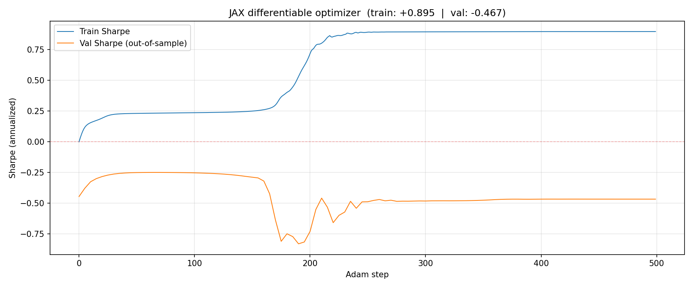
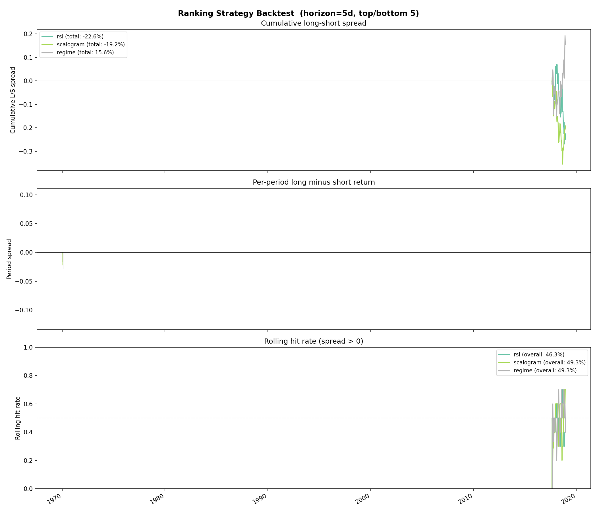

# Regime

CWT-regime portfolio strategy. The trainer searches over discrete
hyperparameters (`lookback, n_tail, top_n, divergence`, optional scale
subset) by Optuna walk-forward; the live runner scores the universe at
each rebalance, applies the four risk rails, and submits orders to
Alpaca. Source under `apps/regime/src/regime/`.

## What the trainer was learning

The deleted JAX-Adam variant of the trainer is a reminder of how the
regime signal actually distributes its mass. The loss curve descended
the way any gradient method descends, but the more interesting line
is the per-scale weight: 126-day power started picking up share as
training progressed and the short scales bled out. By the end, **126d
held 48% of the weight, all scales ≤21d combined held under 1%** —
the [scale-weight collapse documented in the regime
baselines](../findings/regime-baselines.md#jax-differentiable-optimizer-now-removed-finding-preserved).
That collapse is what a
"[monthly-to-biannual horizon](../findings/regime-baselines.md#the-regime-signal-works-on-monthly-to-biannual-horizons-not-short-term-noise)"
regime signal looks like under a continuous optimizer — it tells you,
before any walk-forward eval, that whatever the model learned
in-sample lives in the slow envelope of price, not in the fast one.

## Searching the discrete hyperparameter cube

Eight `(weights_regime, weights_scalogram, weights_rsi)` heads, each
searched independently over its own hyperparameter cube on the same
universe. Read the spread, not the headline number: any one of these
arms can produce a 1.36–1.63 val Sharpe in a single late window
because Optuna will find a combination that fit *that* segment — the
same [Optuna walk-forward instability](../findings/regime-baselines.md#optuna-walk-forward-instability)
the eval table records. What generalises is which *family* of arms
holds up across windows, and that's a much narrower set than the
Sharpe leaderboard implies. This
chart is the visual reason the canonical regime checkpoint pins
modest, stable settings rather than the per-window peaks.

## Beyond the in-sample table

The headline numbers, OOS verdicts, and supporting figures from the
regime arc live on the
[Leaderboard](../leaderboard.md) and the
[Regime baselines](../findings/regime-baselines.md) /
[Log-returns vs raw close](../findings/log-returns-vs-raw-close.md)
findings pages.

## Live trading

`uv run regime live --params Output/regime-v1.json --dry-run` walks the
checkpoint through the same four risk rails as `ss-relational live`:
kill-switch file, data-freshness check, per-name cap via water-fill,
and dry-run by default. Architecture in
[CLAUDE.md](https://github.com/sughodke/StockSurvey/blob/master/CLAUDE.md)
under "Live-trading risk rails".
