# Relational

Sector-relative and fingerprint-space CWT scorers. The relational arc
asks: instead of ranking a stock by *its* CWT divergence, rank it by
how its scalogram differs from its sector's, or from its k nearest
neighbours in the universe at this moment. Source under
`apps/relational/src/relational/`.

## The six scoreboard winners

These are the canonical configurations preserved at
`Output/relational-{strategy}.json` and rebuilt by
`apps/relational/scripts/build_canonical_checkpoints.py`. Five pin to
the **Phase-2** 21-ticker mega-cap universe (where the val Sharpe
lifts to the 1.07–1.13 band); the sixth — `velocity` — pins to the
wider `stooq_us_long` ~312-name set.

### Idea A — Empirical sector excess

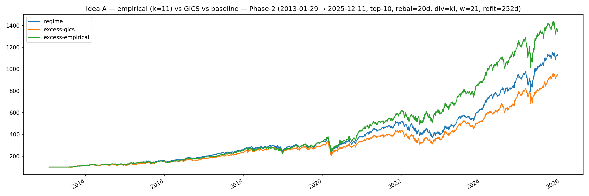

The simplest relational primitive: a stock's CWT divergence net of its
sector's. By the time you've subtracted the sector-wide regime shift,
what remains is the stock doing something its sector isn't — which is
exactly the kind of idiosyncratic move a top-N selector should be
chasing. The visible kink mid-chart is the tape rotating into a
post-stagflation regime where the sector overlay added more value than
it usually does.

### Idea B — Analog kNN

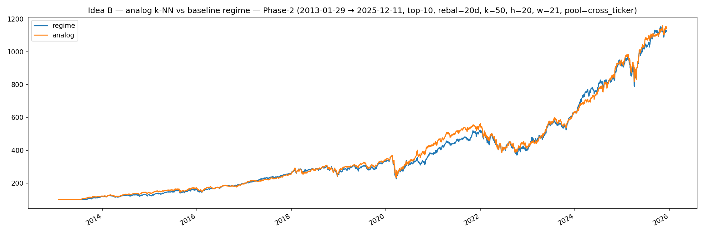

For each rebalance bar, find the k=50 historical bars whose cross-
ticker fingerprint vectors are closest to *now*, and use their realised
forward returns as the score. This is the only one of the six scoreboard
winners whose val Sharpe (1.146) *exceeds* its train Sharpe (1.032) on
the Phase-2 split — a positive train-to-val delta is rare enough in
this codebase that the row sits alone on the
[Leaderboard](../leaderboard.md). It's also the strategy whose val
edge collapses most on a wider universe, see
[the universe-shift finding](../findings/relational-universe-shift.md).

### Idea C — Farthest

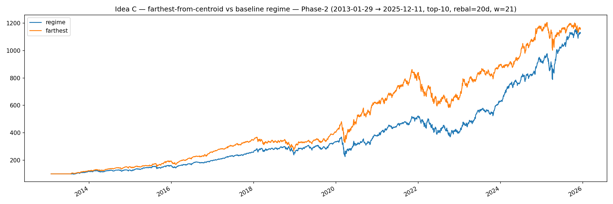

Pick the names whose fingerprints are *farthest* from the rest of the
universe — the most idiosyncratic regime states.
[Catastrophic in-sample Sharpe (1.32 train) and catastrophic
train-to-val gap (−0.49)](../findings/relational-dwt-failure.md) both
at once. The same thing the chart is showing visually: big, jagged,
mean-reverting equity moves that look like skill on the training half
and noise on the val half.

### Idea D — Diversified greedy thinning

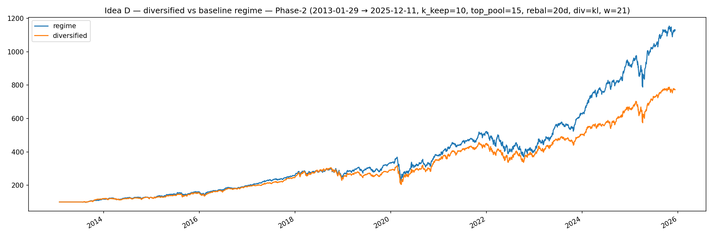

Rank by raw divergence, then greedy-farthest-first thin to the final
basket so the picks aren't five tech names that all moved together.
Best non-cross_ticker val Sharpe of the family (+1.00) and the only
Phase-2 arm besides analog cross_ticker that crosses 1.0 OOS.

### Velocity

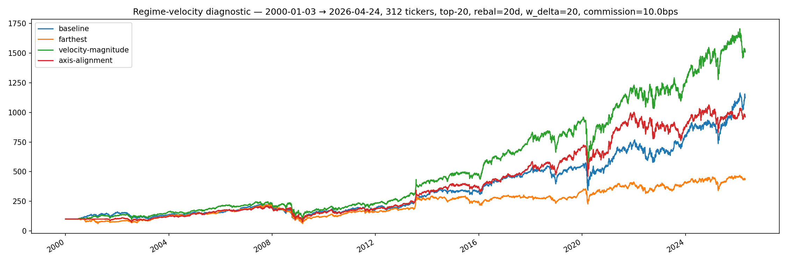

Score by the *rate of change* of fingerprint position rather than the
position itself — names whose regimes are accelerating relative to
their own history. Trained and run on the wider 312-ticker pool where
the other five strategies degrade; the canonical velocity checkpoint
is the relational arm that survives outside Phase-2.

### GMM clustering

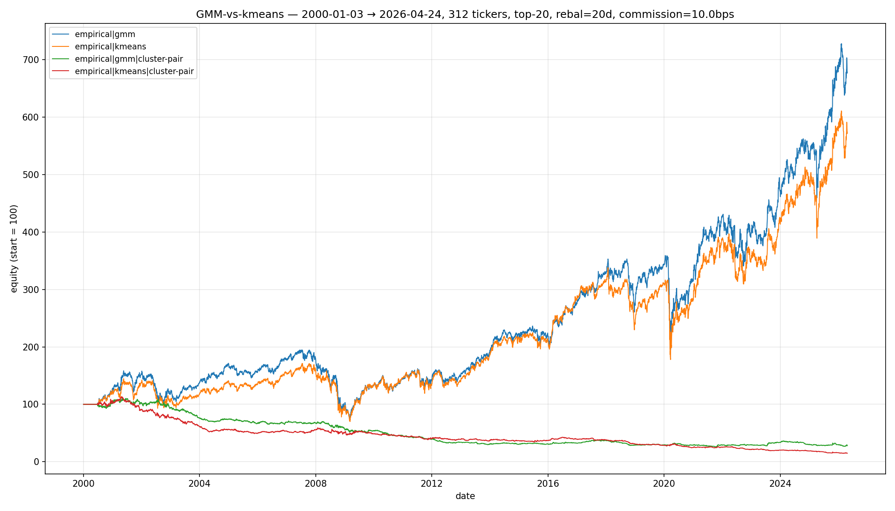

The clustering basis matters: GMM gives soft cluster membership, which
the scoring head can blend rather than commit to one assignment.
Visible here as smoother equity through regime transitions where
k-means snaps abruptly between cluster labels.

## The five framings that didn't survive

A research arc this long produces falsified ideas as well as kept
ones. Preserved here so future-us doesn't re-run them blindly.

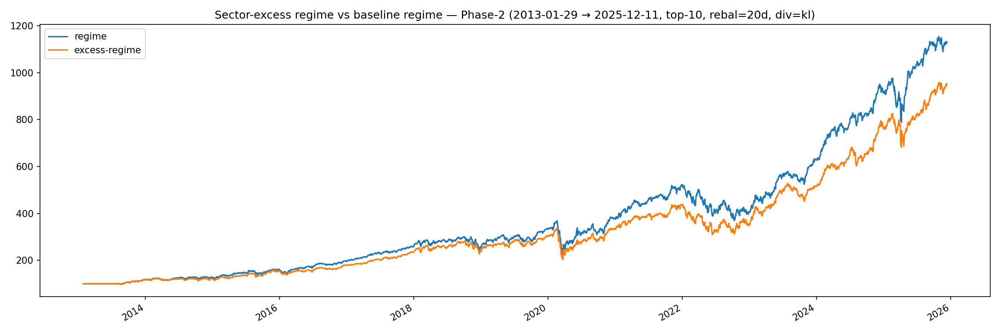

*Sector-excess as a pure scoring primitive (without the cluster
overlay).* Captures the same insight as Idea A but underperforms the
empirical-sectors composite — the sector signal needs the empirical
cluster-aware blending to lift.

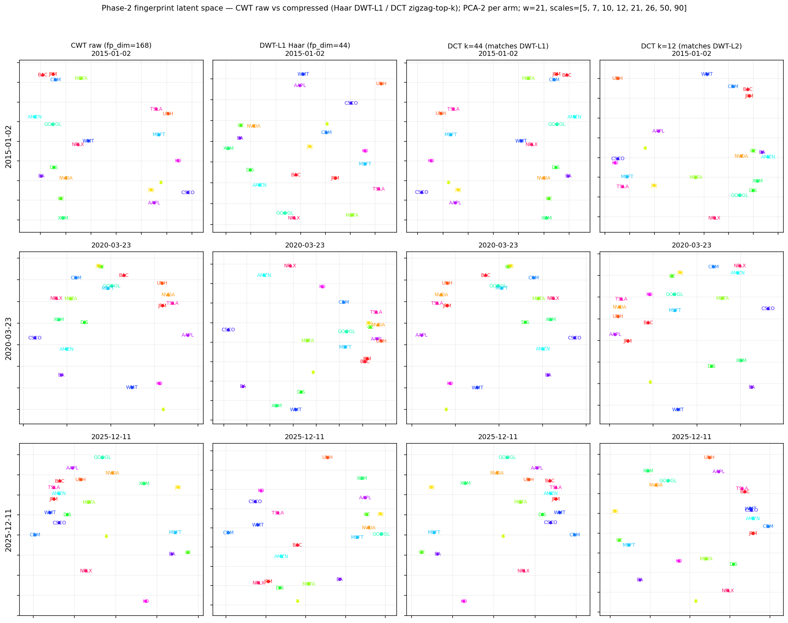

*Fingerprint dimensionality sweep.* Shows the moment we considered
DWT compression as a generic fingerprint shrink; full eight-arm
walk-forward later [reversed the verdict](../findings/relational-dwt-failure.md).
A separate
[polar Morlet experiment](../findings/relational-morlet-failure.md)
also failed the Phase-2 OOS gate from the orthogonal direction —
swapping the wavelet family rather than compressing the
fingerprint — leaving the canonical Ricker fingerprint unchanged.

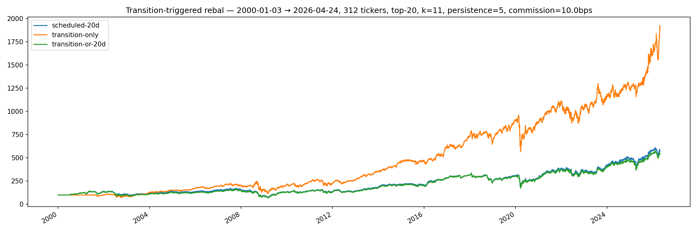

*Transition-triggered live cadence.* Daily evaluation, only act when
target weights diverge enough from current. The mechanism is sound
but the rebal-days sweep that gates it is in the
[TODO](../TODO/rebal-days-sweep.md).

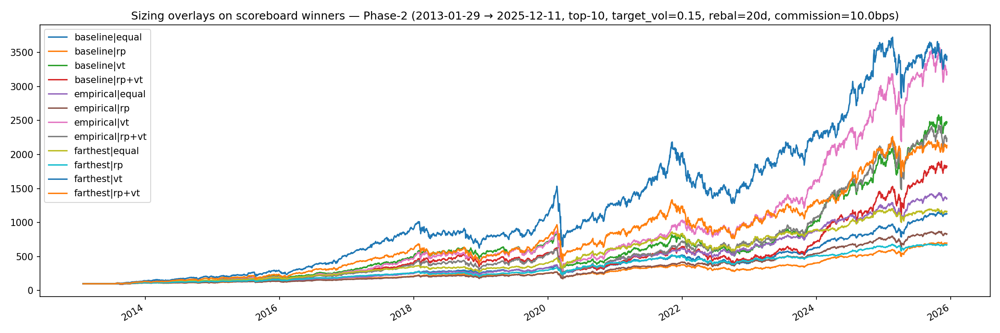

*Vol-target sizing overlays.* Adding diagonal-cov vol-target on top of
the relational selector — neutral on Sharpe net of commission, see
the leaderboard's `Vol-target overlay` row.

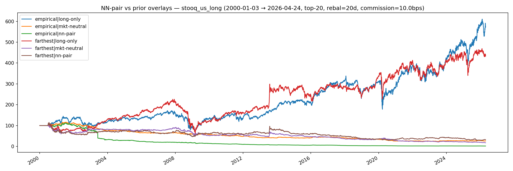

*NN-pairs.* Pair each stock with its nearest neighbour in fingerprint
space and trade the spread. Falsified at the Phase-2 walk-forward
stage — the spread reverts, but not on a horizon long enough to clear
two-sided commission. Listed as one of the strategies the relational
checkpoint family **does not** expose.

## Live trading

```bash
uv run python apps/relational/scripts/build_canonical_checkpoints.py
uv run ss-relational live --params Output/relational-empirical.json --dry-run
uv run ss-relational live --params Output/relational-empirical.json --live
```

Same four risk rails as `regime live`, sharing
`ss_portfolio.broker.AlpacaBroker`. Architecture in
[CLAUDE.md](https://github.com/sughodke/StockSurvey/blob/master/CLAUDE.md).
