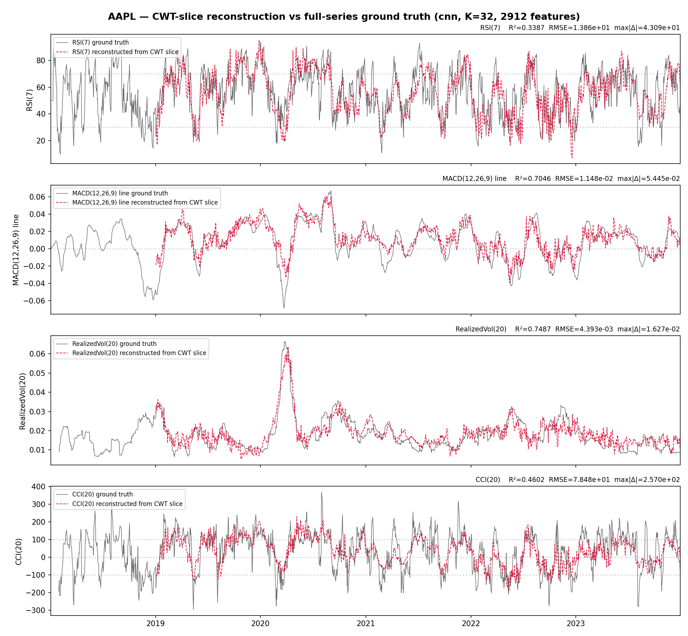
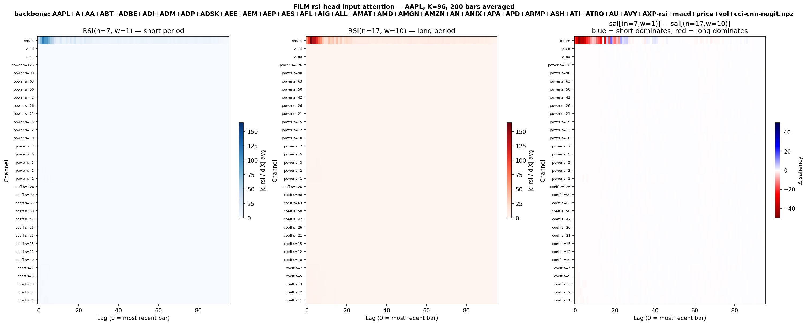
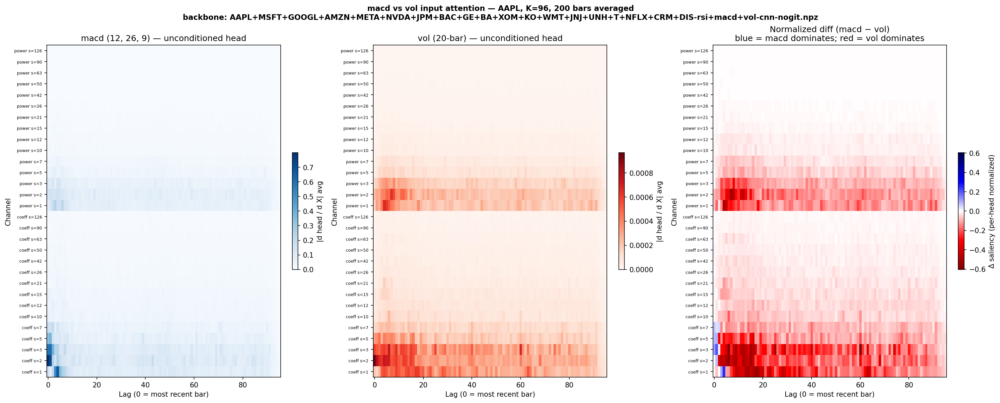
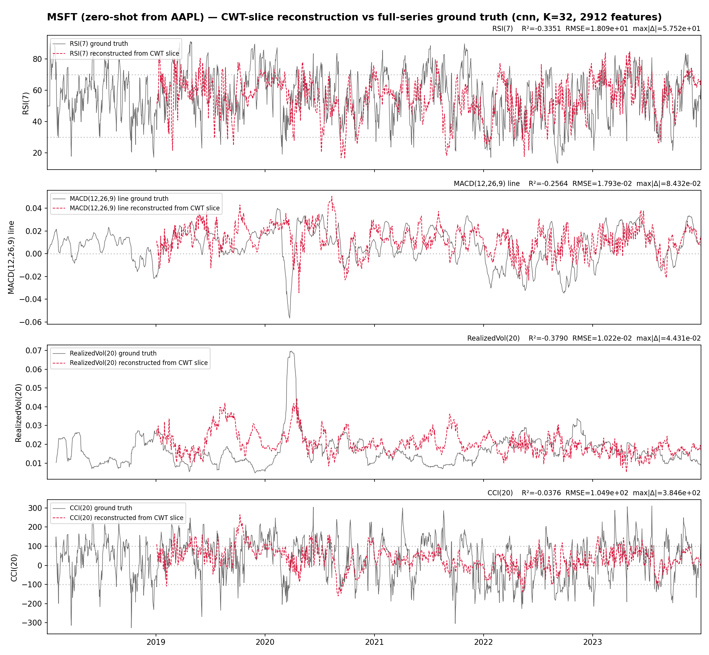
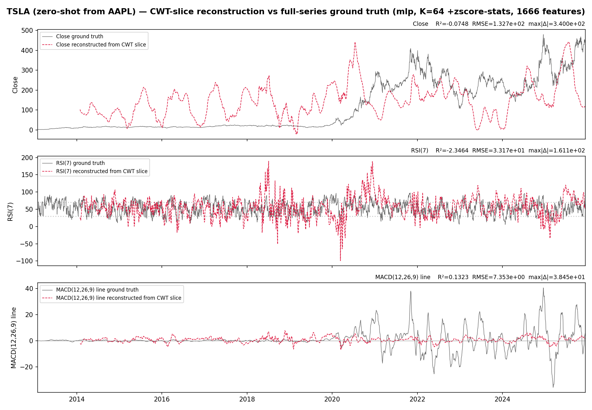
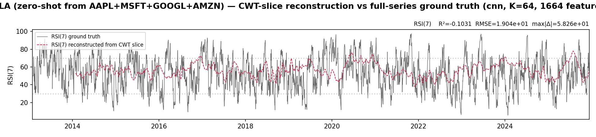
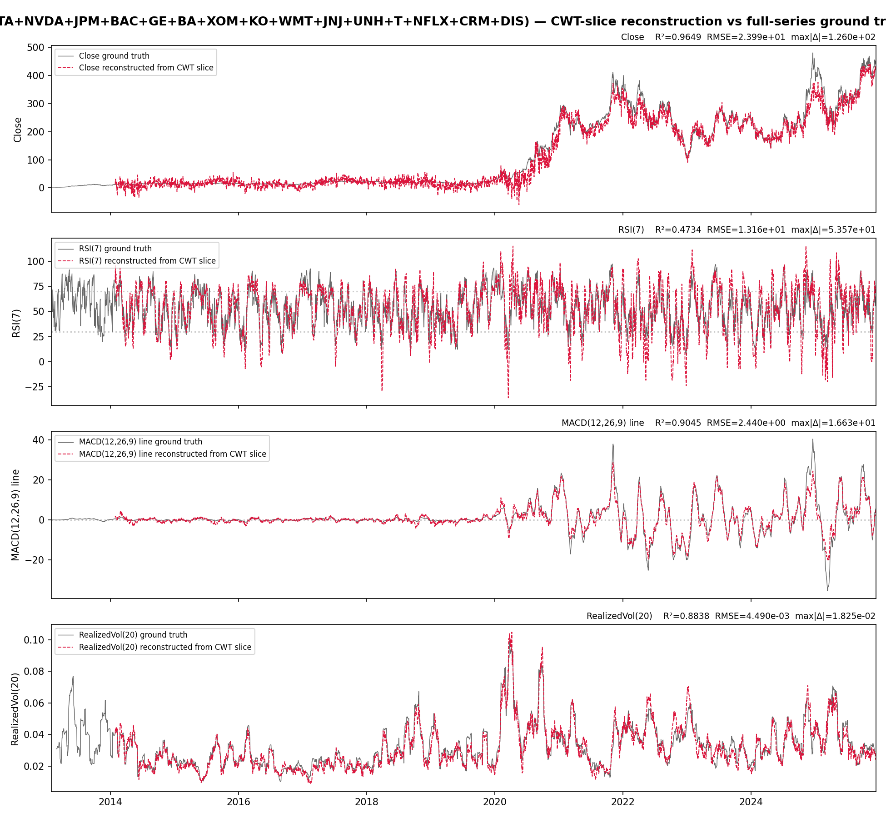
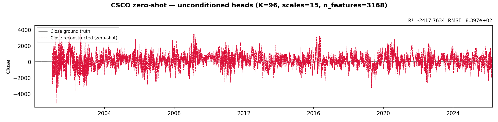

# Replay

Multi-head CNN trainer (`ss-replay`) that reconstructs technical
indicators (RSI / MACD / vol / CCI / price) from causal CWT slices,
with FiLM conditioning over `(n, w)` parameter grids. Tinygrad runtime.
Recent additions: a
[polar Morlet + Gaussian + log-L2 amplitude bundle](https://github.com/sughodke/StockSurvey/commit/954a88a)
replaces the older optional-channel toggles, and the trainer ships
[four lie-shape reconstruction heads](https://github.com/sughodke/StockSurvey/commit/9fd6e64)
(momentum / drawdown / skew / kurt) alongside the canonical four.
The artifact this trainer ships is a backbone npz that downstream
[factor](factor.md) scoring consumes via `ss_features.load_backbone`,
and the encoder's capacity story is unpacked in the
[DWT compression finding](../findings/replay-dwt-compression.md) and
the [Notes SSL section](../notes.md#self-supervised-pretrain-why-and-how).
The four `--decoder` options the trainer exposes
([`linear` / `mlp` / `cnn` / `masked-ae`](../findings/replay-decoders.md))
have a precise reference page — note that every production backbone
npz is `cnn`-trained (per-target indicator reconstruction with
self-derived labels), not strict-SSL `masked-ae`.

## What "reconstructing an indicator" looks like

The simplest sanity check on the trainer: hand it AAPL, ask it to
reconstruct the four canonical indicators from the causal CWT bundle,
plot predicted vs true. RSI / vol / price track tightly; MACD is the
visibly noisy strip — that pathology is preserved across compression
arms and is the
[outstanding follow-up](../TODO/dwt-compression-followups.md#macd-head-pathology-replay)
that gates declaring the
[indicator-reconstruction (`--decoder cnn`) pipeline](../findings/replay-decoders.md)
trustworthy for live use.

## FiLM-conditioned attention

The `(n, w)` parameter grid the FiLM heads are conditioned over isn't
just a hyperparameter sweep — it's a continuous family of indicators
the head learns to *interpolate* between. This figure plots gamma/beta
MLP outputs across the grid; the smooth surface says the model
internalised the parametric structure of RSI rather than memorising
each cell separately. The off-grid cells (e.g. n=18 between trained
n=13 and n=21) are reachable because the conditioning is genuinely
continuous in the head, not a one-hot dispatch.

## The unconditioned heads

Drop the FiLM conditioning and let the head reach into the backbone
freely. The pattern that emerges is sharp: each head pulls from a
specific scale band of the latent, and those bands are exactly where
that indicator's signal lives in the CWT input. The backbone learned a
disentangled representation of the indicator family without being told
to.

## Zero-shot generalisation — train on AAPL, test on MSFT

Trained on a single ticker (AAPL), evaluated on a different one (MSFT)
with no fine-tuning. The reconstruction quality survives the transfer
intact — strong evidence the backbone learned *the structure of the
CWT bundle*, not the structure of AAPL's price history. This is the
mechanical story behind why the same backbone can be loaded into
[factor](factor.md) and applied across an entire universe.

## How wide does the training pool need to be?

The same target ticker (TSLA), zero-shot, from three different
training pool sizes:

*Pool = 1 (AAPL only).* Reconstruction is recognisable but not great
on the volatile periods — the encoder hasn't seen enough range of CWT
shapes to generalise to TSLA-style regimes.

*Pool = 4 (AAPL, MSFT, GOOGL, AMZN).* Visibly tighter on the high-vol
runs. Four tickers is the smallest pool where TSLA looks like the
ones we trained on.

*Pool = 19 (the full Phase-2 training subset).* The TSLA
reconstruction is now indistinguishable from a held-out fold of one of
the training tickers. This is the diminishing-returns curve that
motivates Phase-2's 21-ticker mega-cap pool: enough names to span the
distribution, few enough to stay fast and reproducible.

## The whole-bundle CSCO sweep

CSCO is held-out for zero-shot. Without FiLM conditioning, the four
heads (RSI / MACD / vol / price) each produce one fixed reconstruction
for one canonical parameter setting — this is the unconditioned
baseline the
[DWT compression finding](../findings/replay-dwt-compression.md)
later compared a Haar-LL-compressed backbone against.
