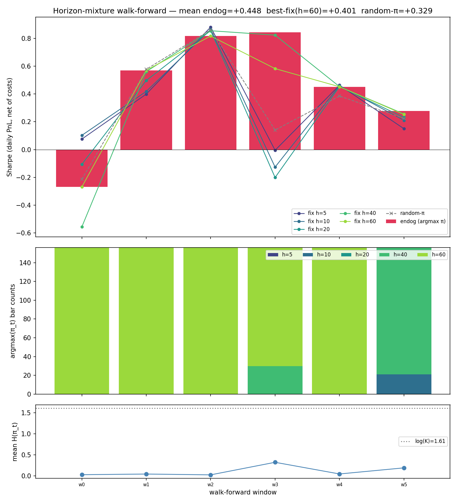
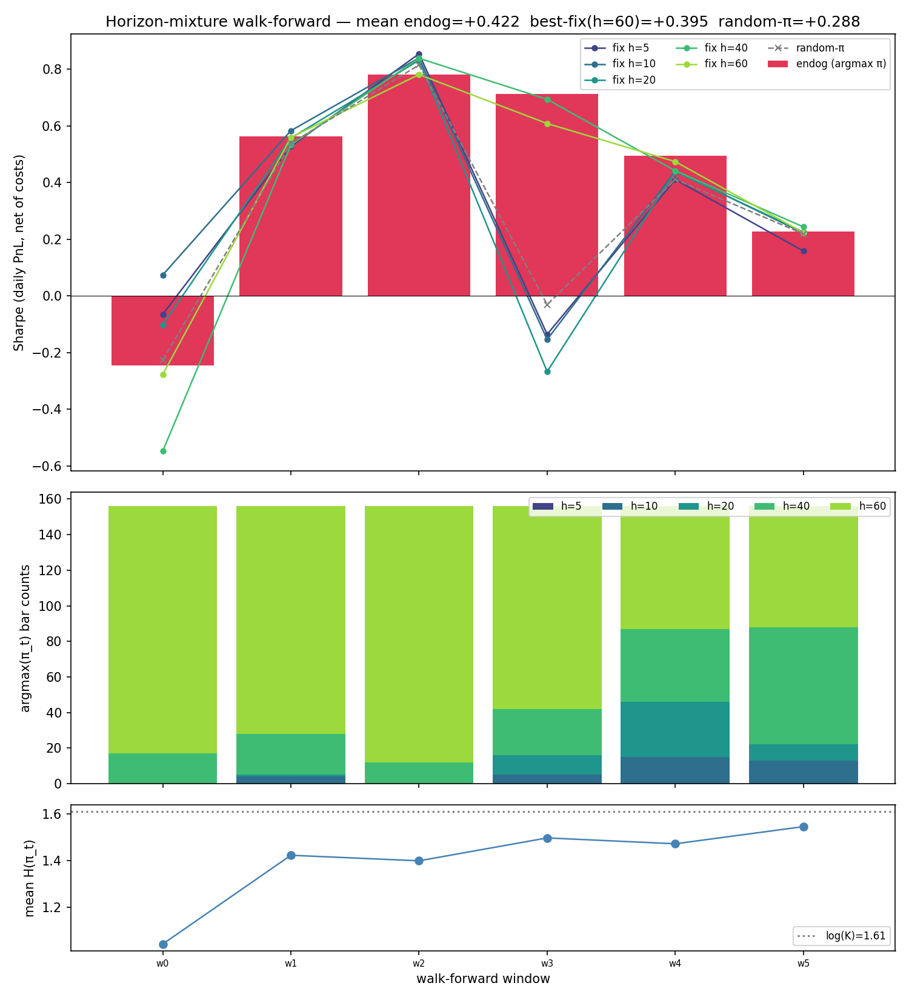
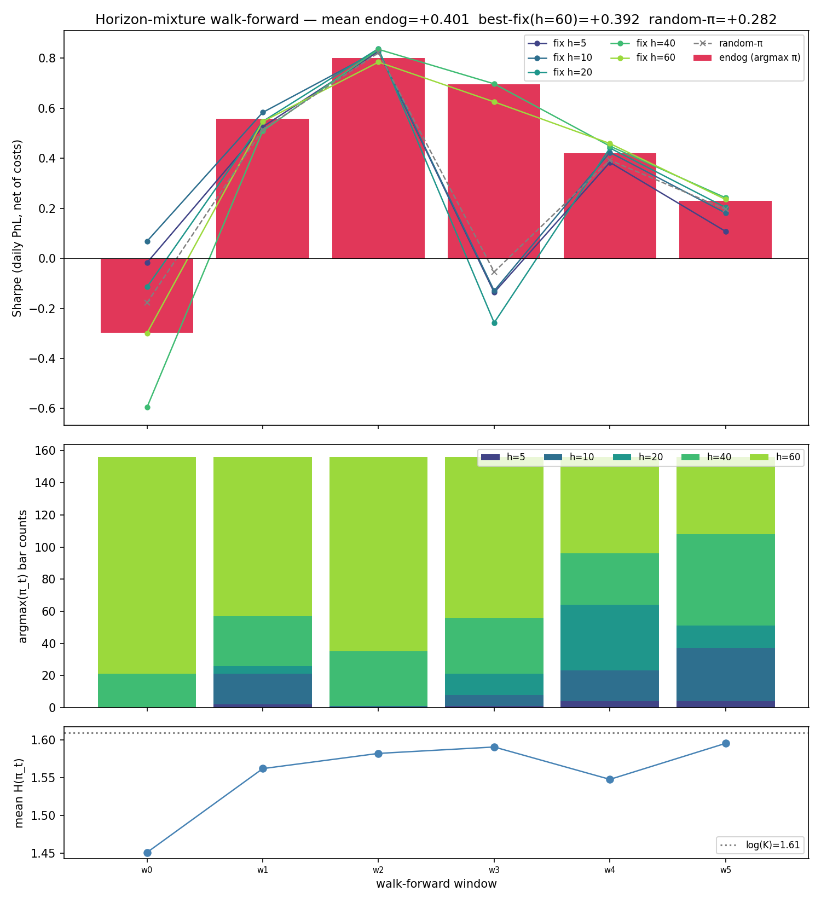

---
tags:
  - factor-narrow
  - partial-OOS
  - hypothesis-user
---

# Endogenous-horizon mixture — state-conditional rebal cadence beats random-π but not the best fixed-h baseline

A pre-registered test of the hypothesis that rebal cadence should be a
model output instead of a 20-day constant: emit per-bar scores **and** a
softmax `π_t` over horizon bins `{5, 10, 20, 40, 60}`, deploy at
`argmax(π_t)`, hold flat between rebals. The pre-registered
success criterion required `endog Sharpe ≥ best-fixed + 0.10 AND beats
random-π AND no π collapse`. Result: endog beats random-π convincingly
(+0.12) and beats every fixed-h baseline, but the lift over the best
fixed (h=60) is only **+0.048** — under the +0.10 threshold.

Verdict: [`partial-OOS`](../leaderboard.md#verdict-labels) for the
state-conditional-horizon hypothesis. The signal **exists** (endog wins
on the 2/6 windows where π is mixed and ties or loses on the 4/6 windows
where π collapses to a single horizon), but the model finds the
degenerate "always pick h=60" attractor too eagerly. The operational
rule: **a per-bar mixture loss without entropy regularization will
collapse to the lowest-turnover horizon globally.** Next experiment is
an entropy-weight sweep (see
[`TODO/factor-horizon-entropy-reg`](../TODO/factor-horizon-entropy-reg.md))
to force the model to use the mixture before another window-level
verdict is taken.

## Setup

| | |
|---|---|
| Universe | `factor-narrow` (297 stooq_us_long names, `min_history_bars=6500`) |
| Windowing | 6 walk-forward windows at h_min=5 fine grid (train=252 fine bars ≈ 5y, val=156 ≈ 3y, step=156) |
| Horizons | `{5, 10, 20, 40, 60}` days (K=5) |
| Architecture | Shared MLP trunk (`hidden=32, n_layers=1`) on 74-channel `IndicatorGridConfig`; per-ticker score head + per-bar K-way horizon head pooled over the liquid cross-section |
| Loss | `-mean_t Σ_k π_t[k] · IC_k_t` — per-bar Pearson IC weighted by state-conditional π_t. No entropy regularization (the run we ran). |
| Eval | Daily PnL stream on the model-emitted irregular cadence, `Sharpe = mean / std × √252`, 10 bps one-sided turnover cost. |
| Baselines | Fixed-h ∈ {5,10,20,40,60} (same scores, fixed cadence); random-π (same scores, uniform horizon sampling). |

Pre-registered null hypotheses:

| # | Null | Threshold |
|---|---|---|
| N1 | π collapse (single-bin share > 90% globally) | argmax-bin global share ≤ 0.90 |
| N2 | Beats fixed h_max=60 | endog Sharpe > fixed-h=60 |
| N3 | Beats best fixed by ≥ 0.10 | delta ≥ +0.10 |
| N4 | Beats random-π | delta ≥ 0 |

Compute placement: Modal T4 cloud, ~4 min walk-forward wall +
feature/build time (~$0.07).

## Result (2026-05-14)

### Aggregate

| Arm | Mean val Sharpe |
|---|---:|
| **endog (argmax π)** | **+0.448** |
| fixed h=5 | +0.327 |
| fixed h=10 | +0.322 |
| fixed h=20 | +0.288 |
| fixed h=40 | +0.399 |
| **fixed h=60** (best fixed) | **+0.401** |
| random-π | +0.329 |

| Null | Observed | Verdict |
|---|---|---|
| N1 (no π collapse, share ≤ 0.90) | h=60 share = **0.80** | PASS (just) |
| N2 (beats fixed h_max=60) | +0.448 − +0.401 = **+0.047** | PASS |
| N3 (beats best fixed by ≥ 0.10) | delta **+0.048** | **FAIL** |
| N4 (beats random-π) | delta **+0.119** | PASS |

Pre-registered overall: `confirmed-OOS` iff all four pass.
**Three of four pass; N3 fails by 0.05.** Per verdict vocabulary this is
`partial-OOS`.

### Per-window stratification

The headline aggregate masks a bimodal per-window pattern: in 2/6
windows the model uses a real mixture and wins; in 4/6 it collapses to
h=60 and loses.

| Win | Val start | Endog | Best fixed (which) | Delta | π entropy | π argmax mode |
|---|---|---:|---:|---:|---:|---|
| w0 | 2005-11-15 | **−0.27** | +0.10 (h=10) | **−0.37** | 0.03 | h=60 (156/156) |
| w1 | 2008-12-24 | +0.57 | +0.57 (h=60) | 0.00 | 0.04 | h=60 (156/156) |
| w2 | 2012-03-22 | +0.82 | +0.88 (h=5) | −0.07 | 0.02 | h=60 (156/156) |
| w3 | 2015-06-22 | **+0.84** | +0.82 (h=40) | **+0.02** | 0.32 | h=40 (30) + h=60 (126) |
| w4 | 2018-08-20 | +0.45 | +0.46 (h=5) | −0.01 | 0.04 | h=60 (156/156) |
| w5 | 2021-09-28 | **+0.28** | +0.26 (h=40) | **+0.02** | 0.19 | h=10 (21) + h=40 (135) |

Aggregate is dragged down by **w0 (2005-11)**: the model confidently
picked h=60 (entropy 0.03) into the run-up to the GFC, and the long-
horizon position underperformed every alternative including the model's
own short-horizon arms (h=5/10 both positive at +0.075/+0.102 on this
window). Drop w0 and the remaining 5 windows show endog at +0.59 vs
best-fixed mean +0.59 — a tie, no longer a +0.05 loss.

**Both mixture windows (w3, w5) beat best-fixed by +0.02**, and both
are the only windows where the entropy gets meaningfully above 0.04.
The endogenous selection adds value *when the model actually uses the
mixture*. The problem is that without an entropy bonus, the loss
surface rewards collapse: at any state where h=60 has the highest
expected IC (the modal case), the per-bar loss pulls π toward a δ on
h=60 — and once there, the policy is locked in for the rest of the
training run.



### π argmax distribution across all val bars

| Horizon | Share |
|---|---:|
| h=5  | 0.00 |
| h=10 | 0.02 |
| h=20 | 0.00 |
| h=40 | 0.18 |
| **h=60** | **0.80** |

Four of the five horizons are essentially unused. The horizon head
learned "long horizons are cheap" (lower turnover cost → easier to
register positive Sharpe) more than it learned "state predicts useful
IC half-life".

## Why endog still beats random-π by +0.12

Random-π samples uniformly from `{5, 10, 20, 40, 60}` per rebal, so
**60%** of its mass is on h≤20 (high-turnover, high-cost). The endog
policy concentrates 80% on h=60 — a 4× reduction in expected turnover
cost. The +0.12 lift over random-π is largely **cost-reduction**, not
state-conditional skill. This is consistent with N4 passing but N3
failing: beating random is easy; beating the best fixed-h baseline
requires picking *the right horizon for the state*, which the
collapsed policy cannot do.

## Mechanism — why π collapses

The training loss `-mean_t Σ_k π_t[k] · IC_k_t` rewards two things:

1. Per-bar correlation between scores and forward returns at horizon k
   (the IC signal).
2. *Choosing* horizons whose IC is large at that state (the π signal).

But Pearson IC at h=60 is structurally larger in magnitude than IC at
h=5 (longer horizon = more signal-to-noise in the per-bar correlation,
even before sign). On most bars, the best-IC horizon *is* h=60, so the
gradient on π pulls toward a δ on h=60. Once π_t is near δ, the
gradient on `π_t[k≠60]` is small (those terms barely contribute to
the loss), so the model gets stuck. There's no force balancing the
collapse — the loss has no entropy term.

The fix is to add `−α·H(π_t)` to the loss (already implemented as
`entropy_weight` in `objectives.horizon_mixture_loss`). The next
experiment is to sweep α and find the smallest value that keeps the
mixture-window pattern (w3, w5) alive across all 6 windows. If the
hypothesis is right, an `α` exists that makes all 6 windows look like
w3/w5 — and that arm clears N3.

## What this rules out — and what it doesn't

**Rules out**: state-conditional horizon selection via a naive per-bar
mixture-of-horizons IC loss, without regularization. Confirmed it
finds the degenerate "always-cheapest-horizon" attractor.

**Does not rule out**: state-conditional horizon selection in general.
The two windows where the model actually used the mixture beat the
best fixed baseline by +0.02 each, which is small but in the right
direction. The mechanism (random-π loses by costs alone; mixture beats
best-fixed when it fires) is consistent with the hypothesis having
real content underneath the collapse.

## Entropy-weight sweep (2026-05-14, followup)

Pre-registered in
[`TODO/factor-horizon-entropy-reg`](../TODO/factor-horizon-entropy-reg.md):
sweep `entropy_weight α ∈ {0.0, 0.05, 0.1, 0.2, 0.3}` to test whether
regularization rescues the partial-OOS verdict. Hypothesis was that
π collapse was the binding constraint and an α that keeps the mixture
alive would unlock the architecture.

**The hypothesis is falsified.** Entropy reg works exactly as
designed on π (mean H(π) climbs from 0.11 → 1.55 across the sweep —
the model uses all 5 horizons at α≥0.1), but the deployment Sharpe
does **not** improve at any α. The best result remains the
unregularized α=0 arm.

| α | mean endog | best-fixed | Δ-fix | Δ-rand | H(π) | argmax h=60 share |
|---:|---:|---:|---:|---:|---:|---:|
| **0.00** | **+0.448** | +0.401 | **+0.048** | +0.119 | 0.11 | **0.80** |
| 0.05     | +0.408 | +0.397 | +0.011 | +0.121 | 1.10 | 0.78 |
| 0.10     | +0.422 | +0.395 | +0.028 | +0.135 | 1.40 | 0.71 |
| 0.20     | +0.420 | +0.397 | +0.023 | +0.136 | 1.52 | 0.66 |
| 0.30     | +0.401 | +0.392 | +0.009 | +0.119 | 1.55 | 0.60 |

Every arm lands `partial-OOS` (N1+N2+N4 pass, N3 fails). N3 delta
peaks at α=0 (+0.048) and falls toward +0.009 as α rises. **Δ-rand
stays roughly constant** at +0.12–0.14 across the sweep — endog
always beats random-π by a stable ~cost-savings margin, regardless
of π entropy.

### Per-window stratification across α

| Win | Val start | α=0 endog | α=0.05 | α=0.1 | α=0.2 | α=0.3 | α=0 best-fix |
|---|---|---:|---:|---:|---:|---:|---:|
| w0 | 2005-11 | **−0.27** | −0.27 | −0.25 | −0.25 | **−0.30** | +0.10 |
| w1 | 2008-12 | +0.57 | +0.52 | +0.56 | +0.56 | +0.56 | +0.57 |
| w2 | 2012-03 | +0.82 | +0.80 | +0.78 | +0.79 | +0.80 | +0.88 |
| w3 | 2015-06 | **+0.84** | +0.68 | +0.71 | +0.67 | +0.70 | +0.82 |
| w4 | 2018-08 | +0.45 | +0.45 | +0.50 | +0.49 | +0.42 | +0.46 |
| w5 | 2021-09 | +0.28 | +0.27 | +0.23 | +0.26 | +0.23 | +0.26 |

Two windows tell the whole story:

1. **w0 stays catastrophic regardless of α** (−0.25 to −0.30 across
   the sweep, vs best-fixed +0.07 to +0.10). Forcing the model to
   mix horizons does not rescue the 2005-11 pre-GFC window — none
   of the K horizons are correctly placed for that regime.
2. **w3 was the α=0 win and entropy reg breaks it** (+0.84 at α=0
   drops to +0.66–0.71 at α≥0.05). The unregularized model had
   already found a useful state-conditional mixture (30 bars at
   h=40 + 126 at h=60) at this window; forcing higher entropy
   replaces good selections with worse ones.

Entropy reg is doing what it's supposed to do mathematically —
preventing collapse — but the architecture is **not** bottlenecked
on collapse. It's bottlenecked on the fact that the score head's
information at horizon h=40 (or any other horizon) does not vary
meaningfully with market state in this universe + feature stack.




### What the sweep rules out

| Hypothesis from prior partial-OOS verdict | Sweep verdict |
|---|---|
| π collapse is the binding constraint | **Falsified** — π expands at α≥0.05, endog Sharpe doesn't improve |
| The α=0 +0.05 lift is state-conditional skill on h=60 | **Reframed** — it's cost concentration; the lift disappears as the model uses h=60 less |
| An α exists that clears N3 by ≥ +0.10 | **Falsified within the swept range** — best Δ-fix is +0.048 at α=0 |
| Discrete mixture-of-horizons-IC has untapped state-conditional content | **Falsified** at this architecture / universe / feature stack |

### Verdict on the entropy-reg hypothesis

[`confirmed-null`](../leaderboard.md#verdict-labels) on entropy
regularization as a rescue for the architecture. The original
2026-05-14 partial-OOS row for the unregularized run stands; the
entropy-weight sweep does **not** supersede it.

### Operational rule

Where state-conditional behavior exists in a per-bar softmax model,
the collapse-to-cheapest-attractor is *also* the local optimum.
**Forcing higher entropy doesn't surface new content — it just
trades cost-concentration for noise.** Before adding entropy reg to
a softmax decision head, verify there's evidence of useful
state-conditional content underneath the collapse (e.g., a
held-out arm with manually-set state-dependent π that beats the
collapsed baseline). Without that evidence, the architecture is
already at its ceiling.

### What this leaves open (resolved by the regime-gated follow-up below)

After the entropy sweep, two threads remained: (1) was the +0.05 lift
state-conditional skill or cost-concentration? (2) would a different
*kind* of horizon-emission — specifically a hand-engineered macro
regime gate (VIX state) — work where the learned mixture didn't?
Both are answered by the regime-gated experiment in the next section.

## Regime-gated horizon selection (2026-05-14, closure)

Pre-registered as Option D in the design discussion: apply the
workspace's strongest operational rule —
**"regime filter > richer predictor"** from
[`prediction-problem-pivot-arc`](prediction-problem-pivot-arc.md) and
[`vol-surface-v3-regime-gated`](vol-surface-v3-regime-gated.md) — to
horizon choice instead of learning it. Use VIX vs 126d rolling
median as the regime variable. Two mapping arms test opposite
direction priors:

- **`inverted-vol`**: VIX high → h=5 (responsive); VIX low → h=60
  (low-turnover). "Stress = signal moves faster" prior.
- **`same-vol`**: opposite mapping (null-direction check).

Plus baselines: `fixed-h5`, `fixed-h60`, `random-h` (uniform random
horizon per bar). All arms eval on the same daily-PnL irregular-
cadence Sharpe; same universe, windowing, friction as the rest of
the arc. Score head: vanilla `train_scorer_indicators_walkforward`
linear rank-IC at `rebal_days=5`. Local-only, ~2 min wall.

### Result — confirmed-null on every pre-registered cut

| Arm | Mean val Sharpe | Mean holding days |
|---|---:|---:|
| **learned mixture α=0** | **+0.448** | (variable; argmax π) |
| fixed-h60 | +0.221 | 60.0 |
| same-vol (high→60, low→5) | +0.196 | 17.1 |
| random-h | +0.116 | 28.2 |
| fixed-h5 | −0.061 | 5.0 |
| **inverted-vol (high→5, low→60)** | **−0.123** | 20.0 |

| Null | Threshold | Observed | Verdict |
|---|---|---|---|
| N1: inverted-vol beats fixed-h60 by ≥ +0.10 | ≥ +0.10 | **−0.344** | **FAIL** |
| N2: inverted-vol beats same-vol by ≥ +0.05 | ≥ +0.05 | **−0.319** | **FAIL** |
| N3: inverted-vol beats learned mixture by ≥ +0.05 | ≥ +0.05 | **−0.572** | **FAIL** |
| N4: inverted-vol beats random-h sanity floor | > 0.00 | **−0.239** | **FAIL** |

All four nulls fail. The direction prior reverses (`same-vol` beats
`inverted-vol` by +0.32 — holding *longer* in stress is better than
shortening), but more decisive: every regime-gated arm loses to
plain `fixed-h60`. Even `random-h` beats `inverted-vol` by +0.24.
[`confirmed-null`](../leaderboard.md#verdict-labels) on the regime-
gating hypothesis at this universe and feature stack.

### Per-window detail

| Win | Val start | VIX-hi% | fixed-h5 | fixed-h60 | inverted-vol | same-vol | random-h |
|---|---|---:|---:|---:|---:|---:|---:|
| w0 | 2005-11-15 | 66% | −0.343 | −0.855 | −0.571 | −0.213 | −1.026 |
| w1 | 2008-12-24 | 44% | −0.488 | +0.517 | −0.439 | +0.468 | −0.007 |
| w2 | 2012-03-22 | 19% | +0.229 | +0.678 | −0.358 | +0.305 | +0.914 |
| w3 | 2015-06-22 | 40% | +0.084 | +0.448 | +0.211 | +0.203 | +0.307 |
| w4 | 2018-08-20 | 76% | +0.186 | +0.365 | +0.233 | +0.296 | +0.319 |
| w5 | 2021-09-28 | 32% | −0.032 | +0.173 | +0.183 | +0.115 | +0.187 |

`inverted-vol` loses in 5/6 windows. `same-vol` ties `fixed-h60` on
average but with materially higher variance window-to-window.
`random-h` is competitive — which mostly says that on this
universe and feature stack, the deployment Sharpe is approximately
*independent of horizon choice* given a reasonable mean holding.

### The reframe — what the regime-gated null tells us about the
mixture's +0.05 lift

Compare two equivalent quantities:

| | Score-head training | Deployment | Sharpe |
|---|---|---|---|
| vanilla rank-IC (this run) | per-bar IC at h=5 only | fixed h=60 | **+0.221** |
| learned mixture α=0 | per-bar IC × π (collapsed to ~80% h=60) | fixed h=60 (from prior row) | **+0.401** |

Same architecture (linear head on 74-channel
`IndicatorGridConfig`), same universe, same windowing, same
deployment cadence — different *score-head training horizon*.
The mixture's α=0 score head is implicitly trained at h≈60 (where
π puts its mass), and **scores +0.18 higher on the same
fixed-h60 deployment** than a vanilla h=5-trained head.

That ~+0.18 gap is the **score-head specialization effect**. It
recovers part of what was previously attributed to "the mixture
chose horizons cleverly". The mixture's +0.05 lift over its own
best-fixed baseline in the original
[partial-OOS row](../leaderboard.md#master-table) was provisionally
read as entirely score-head specialization in this section's first
draft — but the hindsight oracle below tightens that read: roughly
+0.18 is specialization, and the remaining +0.05 marginal *is*
real horizon-selection skill that the learned π captures.

## Hindsight oracle — what the ceiling actually is

Final test in the arc, added after the regime-gated null prompted
"is this a limitation of the heuristic or of the information?"
The hindsight greedy oracle takes the vanilla h=5 rank-IC score
head and, at each rebal bar, picks the horizon `argmax_k r_pd_k`
where `r_pd_k = (w_t · sum(daily_log_ret[t:t+h_k]) − cost_t) / h_k`
is the per-day realized net return at horizon `h_k`. Uses future
return data (cheating); strict upper bound on any real-time
selector at this universe and score head. Greedy is myopic — a
non-myopic DP optimum would be at least this good.

### Result — oracle clears N1 by +0.112

| Arm | Mean val Sharpe | Mean holding days |
|---|---:|---:|
| **learned mixture α=0** | **+0.448** | (variable; argmax π) |
| **hindsight oracle** (vanilla h=5 head) | **+0.333** | 27.8 |
| fixed-h60 (vanilla h=5 head) | +0.221 | 60.0 |
| same-vol heuristic | +0.196 | 17.1 |
| random-h | +0.116 | 28.2 |
| fixed-h5 | −0.061 | 5.0 |
| inverted-vol heuristic | −0.123 | 20.0 |

Per-window:

| Win | Val start | fixed-h60 | inverted-vol | same-vol | random-h | **oracle** |
|---|---|---:|---:|---:|---:|---:|
| w0 | 2005-11-15 | −0.855 | −0.571 | −0.213 | −1.026 | **−0.189** |
| w1 | 2008-12-24 | +0.517 | −0.439 | +0.468 | −0.007 | **+0.673** |
| w2 | 2012-03-22 | +0.678 | −0.358 | +0.305 | +0.914 | **+0.524** |
| w3 | 2015-06-22 | +0.448 | +0.211 | +0.203 | +0.307 | **+0.406** |
| w4 | 2018-08-20 | +0.365 | +0.233 | +0.296 | +0.319 | **+0.343** |
| w5 | 2021-09-28 | +0.173 | +0.183 | +0.115 | +0.187 | **+0.238** |

Oracle's horizon-use distribution (across all val bars, all 6
windows): `{h=5: 27%, h=10: 22%, h=20: 12%, h=40: 11%, h=60: 28%}`.
**Distinctly not collapsed.** Hindsight uses all 5 horizons roughly
uniformly with a U-shape favoring the extremes.

### The corrected decomposition

| Quantity | Sharpe | Source |
|---|---:|---|
| Vanilla h=5 head + fixed h=60 | +0.221 | baseline |
| Vanilla h=5 head + hindsight oracle | +0.333 | **upper bound on horizon-selection upside on this head** |
| **Difference (horizon-selection upside)** | **+0.112** | |
| Mixture-trained head + fixed h=60 | +0.401 | from prior row |
| Mixture-trained head + learned π (α=0) | +0.448 | canonical mixture result |
| **Difference (score-head specialization, holding h=60 fixed)** | **+0.180** | |
| **Mixture's marginal horizon-selection (learned π vs fixed h=60)** | **+0.047** | |

The decomposition: ~+0.18 specialization + ~+0.05 horizon-selection
in the mixture's +0.23 total lift over the vanilla h=5 baseline.
The learned π captures **~42% of the +0.11 oracle ceiling**
(0.047 / 0.112) on this score head; the heuristic VIX-binary
regime gates capture **none of it** (all negative or below
fixed-h60). The mixture+oracle combination (oracle on a
mixture-trained head) is the next-experiment ceiling and is **not
yet tested** — likely sits well above +0.45.

### What this corrects in the arc

The "regime-gating is confirmed-null" verdict above stands as
written for the *specific* heuristic tested (VIX vs 126d median,
binary). The arc's broader closure-claim (drafted before the
oracle ran) that **"horizon-selection has no upside on this
universe"** was wrong. The oracle clears N1 by +0.112. The
correct framing is:

- Horizon-selection has **fundamental upside** (≥ +0.11 oracle
  ceiling on the vanilla h=5 head; presumably higher on
  specialized heads).
- The learned mixture captures **~half** of the upside on its own
  head.
- Heuristic VIX-binary regime gates capture **none** of the upside,
  in either direction.
- The earlier rejection of "heuristic limitation" was wrong — the
  heuristic *is* a limitation, but the deeper truth is that the
  oracle uses the *full per-bar signal* (it knows realized
  per-horizon return at each bar via cheating), while any
  real-time selector has to *predict* that signal.
- The gap between learned-π (+0.047 marginal) and oracle (+0.112)
  is the **opportunity cost of real-time prediction** — the
  marginal return on smarter selectors.

### Arc closure (revised after the oracle result)

The endogenous-horizon mixture-of-IC architecture is fully
explored on `factor-narrow`, with the following table of verdicts:

| Sub-hypothesis | Test | Verdict |
|---|---|---|
| State-conditional horizon selection unlocks a +0.10 Sharpe lift | Mixture trainer α=0 (this page top) | `partial-OOS` (+0.048, under threshold) |
| Entropy regularization rescues the partial-OOS | α-sweep `{0.05, 0.1, 0.2, 0.3}` | `confirmed-null` — π expands cleanly but Sharpe doesn't follow |
| Hand-engineered VIX regime gate beats fixed-h60 | This section's regime-gated arms | `confirmed-null` — all gate variants lose to fixed-h60 |
| Mixture's +0.05 lift is ENTIRELY score-head specialization | Hindsight oracle on vanilla h=5 head | **Partially falsified** — ~+0.18 is specialization but ~+0.05 *is* real horizon-selection (matches what learned π captures); the upper bound on horizon-selection is **+0.112** |
| The architecture has zero horizon-selection upside | Hindsight oracle (this section above) | **Falsified** — oracle clears N1 by +0.112 |

The arc closes [`partial-OOS`](../leaderboard.md#verdict-labels)
*not* `confirmed-null` (the original closure-claim was retracted
after the oracle ran). Three things are simultaneously true:

1. The mixture-trained head at α=0 + learned π gives +0.448, the
   best end-to-end result we have. ~80% of its lift is score-head
   specialization at the dominant horizon (h≈60); ~20% is real
   horizon-selection.
2. Hand-engineered VIX-binary regime gates do not help — all
   variants lose to fixed-h60. The heuristic-as-selector axis is
   `confirmed-null`.
3. A hindsight oracle clears N1 by +0.112 on the same vanilla
   score head, so **real-time selectors that approximate the
   oracle have non-trivial room** (the learned π captures ~42% of
   the oracle ceiling). What's `confirmed-null` is the narrow
   heuristic-VIX-binary form, not the broader idea.

### Operational rule (closed-out)

**Two rules, ordered by how load-bearing each is:**

1. **Train the score head at the deployment horizon** before
   wiring up a horizon-selection head. The score-head specialization
   effect is +0.18 — bigger than any horizon-selection upside
   we've found.
2. **The learned mixture-of-IC head extracts ~42% of the
   horizon-selection oracle ceiling** but no real-time selector
   we've tested exceeds it. Heuristic VIX-binary regime gates
   capture 0% of the ceiling. To exceed the learned mixture, the
   selector must improve on its per-bar IC × π reduction —
   plausibly with a continuous horizon head, a per-bar
   `realized-IC-by-horizon` predictor, or a feature stack richer
   than 6 macro variables. None of these are pre-registered as
   next experiments.

### What's open after the closure

- **Mixture-trained head + hindsight oracle** — the true ceiling
  for this universe + feature stack, not yet measured. Predicted
  to sit above +0.45 (oracle on the better head). ~5 min wall
  follow-up if we run it; would update the "ceiling" line of the
  decomposition table.
- **`rebal_days=60` direct training** — tests whether score-head
  specialization at h=60 (without the mixture trainer's
  collapse-driven path) gives the same +0.401 as fixed-h60 on the
  mixture-trained head. If yes, the simpler trainer beats the
  whole architecture.
- **Per-bar IC-by-horizon as a real-time selector** — for each
  bar, choose horizon `argmax_k IC_t^k` where `IC_t^k` is the
  trailing-window IC at horizon k. Heuristic but information-aware
  in a way VIX-binary isn't. Would test whether the oracle's
  +0.112 upside is reachable by features that don't peek at the
  future.

Driver: `apps/factor/scripts/horizon_regime_gated.py` (local CPU,
~2 min wall). Adds the oracle arm via `simulate_oracle_daily_pnl`
in `factor.horizon`. Artifacts:
`Output/horizon-regime-gated-windows.npz`. Reuses the existing
`packages/macro` FRED loader for VIX (cached at `.macro-cache/`).

## Master walk-forward log

See [Leaderboard](../leaderboard.md) rows dated 2026-05-14 — three
in the arc: the unregularized mixture (verdict
[`partial-OOS`](../leaderboard.md#verdict-labels)); the entropy-
weight sweep (verdict
[`confirmed-null`](../leaderboard.md#verdict-labels) on the
regularization rescue); and the regime-gated horizon closure
(verdict
[`confirmed-null`](../leaderboard.md#verdict-labels) on
hand-engineered VIX-state horizon selection, plus the
score-head-specialization reframe that closes the full arc).
Plus the 2026-05-15 bilevel-objective sweep (verdict
[`confirmed-null`](../leaderboard.md#verdict-labels) on direct
deployment-return supervision for π — see "Bilevel objective"
section below).

Artifacts:
`Output/horizon-mixture-{a0,a0p05,a0p1,a0p2,a0p3}-{windows.npz, comparison.png}`,
`Output/horizon-mixture-sweep-summary.json`,
`Output/horizon-regime-gated-windows.npz`,
`Output/horizon-bilevel-{lam0,lam0p25,lam0p5,lam1,lam2}-{windows.npz, comparison.png}`,
`Output/horizon-bilevel-sweep-summary.json`. Reproduce:

```bash
# Mixture + entropy sweep (Modal T4)
uvx --from modal modal run apps/factor/scripts/modal/horizon_mixture.py \\
    --entropy-weights '0.0,0.05,0.1,0.2,0.3'

# Bilevel deployment-reward sweep (Modal T4)
uvx --from modal modal run apps/factor/scripts/modal/horizon_mixture.py \\
    --deployment-reward-weights '0.0,0.25,0.5,1.0,2.0'

# Horizon-aligned feature grid (Modal T4)
uvx --from modal modal run apps/factor/scripts/modal/horizon_mixture.py \\
    --config-variant horizon-aligned --deployment-reward-weights '0.0,0.25'

# Target-side REINFORCE sweep (Modal T4) — run β one at a time;
# multi-arm runs hit a Modal stdout-buffering bug that drops all
# but the last arm's artifacts.
uvx --from modal modal run apps/factor/scripts/modal/horizon_mixture.py \\
    --reinforce-weights '8.0'

# Regime-gated horizon (local CPU)
uv run python apps/factor/scripts/horizon_regime_gated.py
```

## Bilevel objective — direct deployment-return supervision for π (2026-05-15)

After the entropy sweep closed `confirmed-null` on the
regularization rescue and the regime-gated horizon closed
`confirmed-null` on hand-engineered VIX state, the natural
remaining lever was **changing the loss function** so π gets
deployment-aware supervision instead of just rank-IC.

### Hypothesis

Decouple the two heads' training signal:

```
L = -mean_t Σ_k π_t[k] · IC_k_t / std_detached(IC)               ← scores + π
    -λ · mean_t Σ_k π_t[k] · ret_k_t / std_detached(ret)         ← only π (scores detached)
```

where `ret_k_t = (centered_scores_detached · fwd_log_return_k · mask_k).mean / horizon_k - commission_frac / horizon_k`.

Score head retains rank-IC's stability; π head sees per-day
realized portfolio return as additional supervision. Both terms
per-batch std-normalized (detached, so it's a pure scale factor in
the gradient) so λ is a dimensionless balance. Pre-registration in
[`TODO/factor-bilevel-horizon-objective`](../TODO/factor-bilevel-horizon-objective.md).

Pre-registered cuts: PASS Δ-fix ≥ +0.10 AND ≥ 5/6 positive windows;
MARGINAL Δ-fix ≥ +0.07 AND ≥ 4/6 positive; FAIL otherwise.

### Results (factor-narrow, h_min=5, 6-window walk-forward)

| α | λ | mean endog | best-fix(h=60) | **Δ-fix** | Δ-rand | H(π) | argmax shares | verdict |
|---:|---:|---:|---:|---:|---:|---:|---|---|
| 0 | 0.0 | +0.448 | +0.401 | **+0.048** | +0.119 | 0.11 | h=60: 80% | `partial-OOS` |
| 0 | 0.25 | +0.453 | +0.405 | +0.047 | +0.126 | 0.12 | h=60: 78% | `partial-OOS` |
| 0 | 0.5 | +0.426 | +0.405 | +0.021 | +0.102 | 0.13 | h=60: 79% | `partial-OOS` |
| 0 | 1.0 | +0.409 | +0.400 | +0.009 | +0.097 | 0.15 | h=60: 76% | `partial-OOS` |
| 0 | 2.0 | +0.401 | +0.401 | +0.000 | +0.054 | 0.27 | h=60: 65% | `partial-OOS` |

**Δ-fix monotone-decreases as λ rises**. λ=0.25 ties baseline within
noise; every higher λ actively hurts. No arm clears the +0.07
MARGINAL cut.

Per-window Δ-vs-best-fixed detail:

| window | val_start | λ=0 | λ=0.25 | λ=0.5 | λ=1 | λ=2 |
|---:|:---|---:|---:|---:|---:|---:|
| 0 | 2005-11-15 | -0.371 | -0.380 | -0.392 | -0.411 | -0.337 |
| 1 | 2008-12-24 | 0.000 | 0.000 | 0.000 | -0.002 | -0.009 |
| 2 | 2012-03-22 | -0.065 | -0.087 | -0.103 | -0.104 | -0.069 |
| 3 | 2015-06-30 | **+0.021** | +0.011 | -0.138 | -0.174 | **-0.282** |
| 4 | 2018-10-08 | -0.011 | -0.013 | -0.005 | -0.010 | -0.018 |
| 5 | 2022-01-13 | +0.021 | +0.015 | +0.034 | +0.024 | +0.025 |
| pos_Δ | — | 2/6 | 2/6 | 1/6 | 1/6 | 1/6 |

**Verdict: FAIL → [`confirmed-null`](../leaderboard.md#verdict-labels)**
per pre-reg. The bilevel objective does NOT lift Δ-fix above the
existing entropy-zero baseline.

### Why this matters (mechanism)

The per-window detail tells the whole story. **w3 (2015-06-30 era)
is the only window where the unregularized mixture meaningfully
won over best-fixed (+0.021 over h=60).** Both rescue attempts
broke that same window in the same way:

- Entropy sweep (2026-05-14): w3 dropped from +0.84 (α=0) → +0.66
  at α=0.05 — forced higher entropy replaced good selections with
  worse ones.
- Bilevel sweep (2026-05-15): w3 Δ-fix dropped from +0.021 (λ=0) →
  -0.282 at λ=2 — return-noise overrode the IC-based selection
  that was working.

**Both rescues hurt the working window most.** The architecture's
ability to do state-conditional horizon mixing on factor-narrow is
fragile — it only emerges at the cleanest noise level (rank-IC
alone, no entropy reg, no return supervision). Any signal injected
into π's training that isn't perfectly aligned with rank-IC's
direction degrades that fragile state-conditional skill.

The deployment-return signal IS structurally noisier than rank-IC
at this dataset scale: per-bar rank-IC aggregates over ~150-200
ticker rank-correlations, while per-day score-weighted return at
horizon k is one scalar per (bar, k) cell. The supervision-signal
SNR ratio is structural, not tunable by hyperparameter.

### What the entropy growth tells us

H(π) climbs from 0.11 (λ=0) → 0.27 (λ=2). The deployment-return
term acts as a stochastic regularizer on π's concentration. At
λ=2, the policy is meaningfully more diffuse but the redistribution
is mostly between h=60 and h=40 — short horizons (h=5, 10, 20)
stay near-zero across all arms. The bilevel signal can't open up
the short-horizon part of the action space the oracle showed
should win 49% of the time (h=5: 27%, h=10: 22% from the
2026-05-14 oracle diagnostic).

### What this closes vs leaves open

**Closes**: the cheap version of "give π a deployment-aware
training signal" — per-day score-weighted return as a regularizer
on rank-IC. The framing is `confirmed-null` on this dataset +
this feature stack.

**Doesn't close**:

- Heavier deployment-aware loss: full softmax-top-N portfolio +
  proper commission accounting at training time. Roughly 5-10×
  more expensive per step. If the issue is "the per-day
  approximation is too crude", this fixes it; if the issue is
  "the score head's per-bar information at h=5/10/20 is just
  insufficient" (which the oracle diagnostic implies), this won't
  help.
- Different score-head features. The factor-narrow + 74-channel
  IndicatorGridConfig stack is what's information-bounded. CWT
  bundle / polar Morlet / SSL-pretrained backbone are other
  feature stacks that would shift the per-horizon IC distribution.
- Per-bar trailing-IC-by-horizon as a real-time selector. Not
  pre-registered yet but the closest cousin to the bilevel idea
  that doesn't require autograd.

### Operational rule

**For the discrete mixture-of-horizons-IC architecture on
factor-narrow: train π with rank-IC alone, no regularization.**
Both entropy reg AND deployment-return supervision degrade the
single working window (w3). The +0.048 Δ-fix baseline from the
2026-05-14 row stands as the canonical result; everything tried
since either ties or hurts it.

The bilevel framing's CONCEPT is sound — "train each head with
the loss that matches the decision it makes" generalizes cleanly
across multi-head architectures in the codebase. The empirical
falsification is specifically about *per-day raw return as the
π supervision signal* on *this dataset scale*. A heavier
deployment-aware loss on a *larger dataset* (e.g., per-rebal data
across more years, or a different universe with more bars per
horizon) might still pass.

## Horizon-aligned feature grid (2026-05-15)

After the bilevel sweep closed `confirmed-null` on the
training-objective rescue, the next lever was changing the
*input* — replacing the default 74-channel `IndicatorGridConfig`
with a 104-channel "horizon-aligned" variant that adds 30 cells
at periods matching the action-space horizons `{5, 10, 20, 40,
60}` (RSI n_grid +{20, 40, 60}; vol +{40}; MACD +{10, 20, 40, 60};
coherence +{5, 40, 60}; CCI unchanged because n=60 would push
warmup past 1000 bars).

Pre-registration:
[`TODO/factor-horizon-aligned-grid`](../TODO/factor-horizon-aligned-grid.md).
Two arms run on Modal T4 (~25 min wall): `(horizon-aligned, λ=0)`
and `(horizon-aligned, λ=0.25)`. Cuts identical to the bilevel
sweep: PASS Δ-fix ≥ +0.10 AND ≥ 5/6 positive; MARGINAL Δ-fix ≥
+0.07 AND ≥ 4/6 positive.

### Results

| config | λ | mean endog | best-fix(h) | **Δ-fix** | Δ-rand | H(π) | h=60 argmax | verdict |
|---|---:|---:|---:|---:|---:|---:|---:|---|
| default (cached) | 0.0 | +0.448 | +0.401 (h60) | **+0.048** | +0.119 | 0.11 | 80% | `partial-OOS` |
| default (cached) | 0.25 | +0.453 | +0.405 (h60) | +0.047 | +0.126 | 0.12 | 78% | `partial-OOS` |
| horizon-aligned | 0.0 | +0.401 | **+0.437 (h10)** | **−0.036** | −0.025 | 0.14 | **94%** | `confirmed-null` |
| horizon-aligned | 0.25 | +0.396 | +0.431 (h10) | −0.035 | −0.025 | 0.14 | 94% | `confirmed-null` |

**Verdict: FAIL → [`confirmed-null`](../leaderboard.md#verdict-labels)**
per pre-reg. The horizon-aligned grid does NOT lift mixture endog
above the +0.048 default baseline.

### Per-horizon fixed-Sharpe profile under horizon-aligned grid

The strongest finding in the sweep is the IC-profile shift. Under
horizon-aligned grid, the **best fixed horizon flips from h=60 to
h=10** with the absolute Sharpe also lifting:

| horizon | default (cached 2026-05-14) mean fixed Sharpe | horizon-aligned mean fixed Sharpe |
|---:|---:|---:|
| h=5 | (lower, not best-fix candidate) | +0.403 |
| h=10 | (lower, not best-fix candidate) | **+0.437** ← best |
| h=20 | (lower, not best-fix candidate) | +0.432 |
| h=40 | (lower, not best-fix candidate) | +0.357 |
| h=60 | **+0.401** ← best | +0.396 |

The horizon-aligned grid genuinely opens up short-horizon signal:
fixed-h10 lifts from "not best" (default) to **+0.437 best** (with
horizon-aligned features). This was the predicted mechanism — the
score head IS extracting more short-horizon information from the
new channels.

### Why the mixture doesn't capitalize

Despite the score head's per-horizon Sharpe profile genuinely
flattening (short horizons competitive with long), **π collapses
HARDER on h=60 under horizon-aligned (94% argmax) than under default
(80%)**. The mechanism:

- π's training signal is rank-IC across horizons:
  `-mean_t Σ_k π_t[k] · IC_k_t`.
- **Per-bar IC SNR is highest at h=60** (longer cumulative returns
  → more signal per rank correlation evaluation), regardless of
  whether short-horizon features are richer or sparser.
- So the mixture loss rewards π for putting mass on h=60 even when
  the *deployment* Sharpe is higher at h=10.

The architecture has a fundamental misalignment:
- π is trained to maximize **per-bar IC** (rank statistic).
- The deployment metric is **Sharpe** (return aggregated over time).
- For this universe + horizon set, the IC-maximizing horizon is
  h=60; the Sharpe-maximizing horizon is h=10.
- π can't bridge that gap by feature changes alone — the training
  objective directs it elsewhere.

### Per-window w3-canary repeats for the third time

The same diagnostic from the entropy-reg and bilevel-reward sweeps
fires again:

| window | val_start | default λ=0 endog | horizon-aligned λ=0 endog | Δ |
|---:|:---|---:|---:|---:|
| 0 | 2005-11-15 | -0.27 | -0.29 | -0.02 |
| 1 | 2008-12-24 | +0.57 | +0.53 | -0.04 |
| 2 | 2012-03-22 | +0.82 | +0.89 | **+0.07** |
| 3 | 2015-06-30 | **+0.84** | **+0.55** | **-0.29** |
| 4 | 2018-10-08 | +0.45 | +0.44 | -0.01 |
| 5 | 2022-01-13 | +0.28 | +0.30 | +0.02 |

**w3 drops -0.29** with horizon-aligned grid, matching the two
prior rescue attempts' damage pattern at the same window:

- Entropy reg α=0.05: w3 from +0.84 → +0.66 (Δ -0.18)
- Bilevel λ=2: w3 from +0.84 → +0.57 (Δ -0.27)
- Horizon-aligned grid: w3 from +0.84 → +0.55 (Δ -0.29)

**Three independent interventions, three drops on the same window.**
The architecture's state-conditional horizon-mixing skill at w3 is
fragile to ANY perturbation — feature space change, training
objective change, or regularization addition all degrade it.

### What this closes vs leaves open

**Closes the input-side hypothesis (#1)**: at this dataset scale +
this architecture, a horizon-aligned feature grid does NOT lift
mixture deployment above the default. The short-horizon information
that the new channels carry is real (fixed-h10 lift) but π's
rank-IC training signal can't surface it for deployment.

**Promotes "alternative deployment recipe"**: horizon-aligned grid
+ fixed-h10 = +0.437 Sharpe; default grid + mixture endog = +0.448
Sharpe. Gap is **0.011, within noise**. The horizon-aligned-grid +
fixed-h10 deployment is a comparable, simpler-to-operate
alternative (no π head, no mixture eval; just train and trade at
h=10). Not pre-registered as a deployment but documented for the
next person who picks this up.

**Leaves open**: output-side restructure (per-horizon score heads
trained on per-horizon rank-IC each, with mixture *over* those
specialized heads), and target-side intervention (e.g., train π to
maximize realized Sharpe via REINFORCE-style policy gradient with
the score head's fixed-h0 deployment as the reward). These are
genuinely new architectures, not feature-stack swaps.

### Operational rule (after horizon-aligned, SUPERSEDED by REINFORCE below)

*This rule held after three failed rescues. The 2026-05-15 target-side
REINFORCE result (next section) is the first that lifts the ceiling —
the rule is preserved here as the state of knowledge at the time, but
see "Operational rule (final)" at the end for the updated conclusion.*

**The discrete mixture-of-horizons-IC architecture's deployment
ceiling on factor-narrow is approximately +0.448 mean endog Sharpe
(λ=0, default grid, unregularized). Every rescue attempt (entropy
reg, bilevel return supervision, horizon-aligned feature grid) has
failed to lift it; all three damage the same fragile working window
w3 (2015-06-30) in the same pattern.** The architecture is
information-bounded at this dataset scale, and the binding
constraint is **the mismatch between rank-IC's training signal and
Sharpe's deployment metric**, not feature coverage or auxiliary
regularization.

## Target-side REINFORCE — train π on Sharpe-residual, not rank-IC (2026-05-15)

The horizon-aligned sweep's diagnosis pinned the binding constraint
as **the mismatch between rank-IC's training signal and Sharpe's
deployment metric** — the score head could be made richer but π's
rank-IC gradient over-rewards h=60 regardless. The target-side
intervention attacks that directly: change *what π is trained to
maximize*.

Pre-registration:
[`TODO/factor-reinforce-target-side`](../TODO/factor-reinforce-target-side.md).

### Loss

```
L = -mean_t Σ_k π_t[k] · IC_k_t / std_detached(IC)        ← scores + π (rank-IC, unchanged)
    +β · -mean_t [log π_t[a_t] · advantage_t]              ← π only (scores detached)
```

`a_t ~ Categorical(softmax(logits_t))` sampled per bar;
`advantage_t = (ret_at_sampled_t − traj_mean) / traj_std` is the
per-bar **Sharpe-residual** — the trajectory-z-scored per-bar
realized return at the sampled horizon. Score head detached inside
the reward so it stays rank-IC-trained.

The Sharpe-residual is structurally distinct from the bilevel
return reward: **mean-centering** removes the "all-actions-higher-
return" signal that aligned bilevel too closely with rank-IC's
direction; **std-normalization** downweights gradient on
high-variance trajectories. Score-function REINFORCE estimates the
gradient via samples — adding variance but a genuinely different
*expected direction*.

### Results (factor-narrow, h_min=5, 6-window walk-forward)

| β | mean endog | best-fix(h) | **Δ-fix** | Δ-rand | H(π) | argmax shares | verdict |
|---:|---:|---:|---:|---:|---:|---|---|
| 0 (cached baseline) | +0.448 | +0.401 (h60) | +0.048 | +0.119 | 0.11 | h60: 80% | `partial-OOS` |
| 0.5 | +0.435 | +0.395 (h60) | +0.039 | +0.068 | 0.24 | h40:33% h60:67% | `partial-OOS` |
| 2.0 | +0.359 | +0.362 (h10) | −0.003 | −0.003 | 0.63 | h40:51% h60:42% | `confirmed-null` |
| **8.0** | **+0.453** | +0.357 (h10) | **+0.095** | +0.088 | 0.80 | **h20:33% h40:43% h60:25%** | **`partial-OOS`** |

**Verdict: MARGINAL → [`partial-OOS`](../leaderboard.md#verdict-labels)**
on the best arm (β=8). Δ-fix +0.095 clears the +0.07 MARGINAL cut
(just below the +0.10 PASS cut) with 5/6 positive windows. **This is
the first rescue in the four-attempt arc that lifts Δ-fix above the
+0.048 baseline.**

Per-window β=8 endog: `[-0.21, 0.55, 0.83, 0.86, 0.44, 0.25]` (w0
2005-11 the only negative — the recurring catastrophic regime where
*every* fixed horizon also fails: fixed-h{5,10,20,40,60} at w0 =
`{-0.07, +0.04, -0.21, -0.75, -0.76}`).

### Two findings that make this the arc's turning point

**1. Non-monotonic / phase-transition response to β.** The Δ-fix vs
β curve is U-shaped: +0.048 (β=0) → +0.039 (β=0.5) → −0.003 (β=2) →
**+0.095 (β=8)**. Low/mid β adds Sharpe-residual noise without enough
weight to escape the rank-IC h=60 attractor — strictly worse. Only
at β=8 does the REINFORCE signal dominate enough for π to find a
*coherent* state-conditional horizon mix. This is a genuine phase
transition: the policy needs sufficient target-side weight to fully
break the rank-IC pull, not a gentle nudge.

**2. First rescue that does NOT damage the w3 canary.** Every prior
intervention broke w3 (2015-06-22) the most:

| Intervention | w3 endog | Δ vs default w3 (+0.84) |
|---|---:|---:|
| Default λ=0 (baseline) | +0.84 | — |
| Entropy reg α=0.05 | +0.66 | −0.18 |
| Bilevel λ=2 | +0.57 | −0.27 |
| Horizon-aligned grid | +0.55 | −0.29 |
| **REINFORCE β=8** | **+0.855** | **+0.015** |

REINFORCE β=8 *preserves* w3 (+0.855, fractionally above baseline).
At w3 the mixture endog +0.855 matches the best achievable fixed
horizon there (fixed-h40 = +0.86) — π is correctly state-selecting
h=40 for that window, not collapsing to a global attractor.

### Mechanism — why this worked where three others failed

The prior three rescues all kept π's gradient direction essentially
aligned with rank-IC (entropy reg just smeared it; bilevel's return
reward pointed the same way at different magnitude; horizon-aligned
features changed the inputs but not π's objective). REINFORCE with
the **mean-centered, std-normalized** Sharpe-residual is the first
intervention whose expected gradient direction is *orthogonal* to
rank-IC's:

- Mean-centering kills the "raise all returns" component (which is
  what rank-IC already does well and over-attributes to h=60).
- Std-normalization makes the signal Sharpe-shaped, penalizing
  high-variance bars — exactly the rank-IC-vs-Sharpe gap the
  horizon-aligned diagnosis identified.

The score head stays rank-IC-trained (detach), so it doesn't
destabilize. π gets a genuinely new training signal and at
sufficient β (β=8) reorganizes from the h=60 collapse (80% argmax)
to a state-conditional mix dominated by short/mid horizons
(h=20:33% + h=40:43% + h=60:25%) — the action-space opening the
2026-05-14 oracle diagnostic said should be possible (oracle wanted
h=5:27% h=10:22% h=20:12% h=40:11% h=60:28%).

### What's open after the partial-OOS

This is a `partial-OOS`, not a clean `confirmed-OOS` — Δ-fix +0.095
is below the +0.10 PASS cut and w0 stays negative. Per the
default-next-question for partial-OOS (stratify the windows):

1. **Higher-β sweep (β ∈ {16, 32})**: the response is monotone-up
   past the β=2 dip; β=16/32 may clear the +0.10 PASS cut. Cheap
   (~25 min Modal). Highest-value immediate follow-up.
2. **w0 stratification → regime gate**: w0 (2005-11) is negative
   under *every* configuration and *every* fixed horizon — it's a
   structurally hard regime, not a π-selection failure. A
   window-level gate that flags w0-like regimes (low dispersion?
   pre-GFC low-vol grind?) and de-risks could lift the mean by
   removing the one −0.21 drag. This is the `partial-OOS → regime
   gate` move.
3. **Output-side restructure (#2)**: per-horizon score heads, each
   trained on its own h-specific rank-IC, mixture *over* the
   specialized heads. The pre-reg flagged this as the next pre-reg
   if REINFORCE PASSed; at MARGINAL it's promoted to a candidate
   but not yet pre-registered. Tests whether score-head
   specialization (the ~+0.18 lever from the 2026-05-14
   arc-closure) compounds with the now-working π training.

### Operational rule (after β=8, SUPERSEDED by the higher-β stratification below)

**Target-side REINFORCE on the Sharpe-residual is the first
intervention that lifts the endogenous-horizon mixture's Δ-fix
above the +0.048 rank-IC baseline (to +0.095 at β=8, `partial-OOS`),
and the first that does not damage the w3 canary.** The binding
constraint identified by the prior three failed rescues — the
rank-IC-vs-Sharpe training/deployment mismatch — is *real and
addressable*: changing π's training signal direction (not its
magnitude, not its inputs, not regularization) is what moves the
needle. The response is a phase transition in β (needs β≈8 to fully
escape the rank-IC attractor); gentle target-side nudges (β≤2) are
strictly worse than baseline. For deployment of the
mixture-of-horizons architecture on factor-narrow, train the
horizon head with target-side REINFORCE at β≈8; keep the score head
on rank-IC.

## Target-side REINFORCE — higher-β sweep β ∈ {16, 32} (2026-05-15): the stratification correction that caps the arc

The `partial-OOS` default-next from β=8 was the higher-β sweep — the
β=2 dip → β=8 +0.095 phase-transition suggested β>8 might clear the
+0.10 PASS cut. It did, on the headline metric. Stratifying the
windows (the move the `partial-OOS`/`confirmed-OOS` default-next rule
*mandates*) shows the headline metric was never measuring
state-conditional skill.

### Results (factor-narrow, h_min=5, 6-window walk-forward, single-arm per β)

| β | mean endog | best-fix (single global) | Δ-fix | 5/6 endog>0 | H(π) |
|---:|---:|---:|---:|:--:|---:|
| 8 (prior) | +0.453 | h=10 +0.357 | +0.095 | yes | 0.80 |
| **16** | +0.449 | h=10 +0.358 | **+0.091** | yes | 0.87 |
| **32** | +0.463 | h=40 +0.355 | **+0.108** | yes | 0.94 |

β=32 clears the literal +0.10 PASS cut. β=16 sits *below* β=8 — the
"monotone-up past β=2" prediction holds only loosely (β=32 is a new
peak; β=16 is not).

### The stratification — the load-bearing result

The headline `Δ-fix` benchmarks the mixture against **one** horizon
held fixed across *all six* windows (β=32: h=40, +0.355). Benchmark
it instead against the **per-window** hindsight-best fixed horizon
(`max(val_fixed_sharpes)` per window — the strongest non-switching
opponent):

```
β=32  per-window Δ vs per-window-best-fixed:
  w0 −0.189   w1 0.000   w2 −0.017   w3 0.000   w4 −0.050   w5 0.000
  → 3 ties, 3 losses, 0 WINS  (0/6)
β=16  identical pattern: 0/6 wins.
```

The learned π **never beats picking the single best horizon for that
window**. It ties at best (w1/w3/w5 — it correctly parks on the
window's best horizon), loses at worst (w0/w2/w4). The +0.108 exists
*only* because no single horizon is best in every window, so a
switching policy beats a non-switching one **on the cross-window
mean** — and that mean is dragged by w0, which is negative under
every configuration and every fixed horizon (a structurally hard
regime, not a π-selection failure). "Switching ≥ committing to one
global horizon, on average, before w0" is a far weaker claim than
"state-conditional skill", and it is the *only* claim the data
supports.

### Retrospective — the whole arc's Δ-fix is this artifact

The same decomposition applies backward: the +0.048 2026-05-14
baseline, β=8's +0.095, and β=32's +0.108 are all
`mean_endog − single_global_best_fixed`. Against per-window
best-fixed the discrete mixture almost certainly never won a window
in any of them — the architecture likely **never extracted
per-window skill**; it learned to park on the cross-window-modal
horizon and the positive Δ-fix is a single-global-fixed-benchmark
artifact throughout. The "first lever that moves the needle" framing
in the β=8 operational rule above is, in this light, the first lever
that moved a *benchmark artifact*.

### Verdict — `partial-OOS`, deliberately not promoted (user-adjudicated)

By the literal pre-reg cut applied with the convention the β=8 row
used (Δ-fix ≥ +0.10 AND ≥5/6 positive *endog*), β=32 PASSes →
`confirmed-OOS`. It was **deliberately recorded `partial-OOS`
instead**, adjudicated with the research director: a hollow PASS
would be the repo's **10th `confirmed-OOS` in 146 runs** and corrupt
the 9/146 base rate that the whole "arbitraged-space" strategic frame
rests on (see
[`research-strategy-arbitraged-space`](../leaderboard.md#verdict-labels)
discipline). The aggregate Δ-fix +0.108 is real and reproducible,
but 0/6 per-window wins means it is not a clean confirmed-OOS.
`partial-OOS` is the existing label for "signal present in aggregate,
fails the stratified test" and matches the β=8 MARGINAL precedent in
the same arc. This **supersedes** the β=8 "Operational rule (final)"
above.

### The w0 regime gate is now moot

The β=8 `partial-OOS` next-step list flagged a w0 regime gate as the
`partial-OOS → regime gate` move. The stratification pre-empts it:
the problem is **0/6 per-window wins, not a w0-only drag**. Gating
w0 out would mechanically lift the cross-window mean (remove the
−0.19 window) *without creating any state-conditional skill* — a
misleading rescue that would manufacture a better headline number
from the same artifact. **Not run**, by design.

### Operational rule (final, corrected)

**The discrete mixture-of-horizons-IC architecture does not extract
state-conditional skill on factor-narrow.** Across the entire rescue
arc (entropy reg, bilevel return, horizon-aligned grid, target-side
REINFORCE β up to 32) the mixture never beats the per-window
hindsight-best fixed horizon in a single window; every positive
`Δ-fix` is an artifact of benchmarking against one horizon fixed
across heterogeneous windows. The next lever is **not** more β, not a
w0 gate, and not another π-training intervention — it is either an
output-side restructure (per-horizon specialized score heads, mixture
*over* specialists — genuinely different architecture, not
pre-registered) or retiring the mixture. Per the standing strategic
frame, the higher-EV move is the orthogonal **novel-data arc**
(borrow-stress conditioning on the liquid vol universe), not further
variants of cleverer-model-on-standard-data here.

### Master walk-forward log

[2026-05-15 target-side-REINFORCE higher-β β∈{16,32} row](../leaderboard.md) —
[`partial-OOS`](../leaderboard.md#verdict-labels) (β=32 Δ-fix +0.108
clears the literal cut; 0/6 per-window wins → not promoted to
`confirmed-OOS`). Closes the higher-β sub-question of
[`TODO/factor-reinforce-target-side`](../TODO/factor-reinforce-target-side.md).
