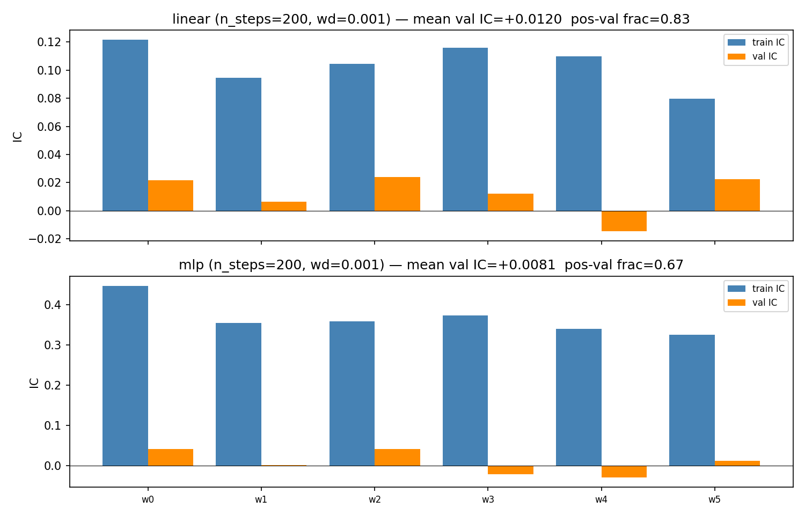

---
tags:
  - factor-narrow
  - confirmed-OOS
  - partial-OOS
---

# Factor deterministic-indicator val-IC baseline

The bar the supervised-`cnn` CWT backbone path must beat: **mean val
IC > +0.012, pos-val-IC frac ≥ 5/6** on the same universe and
walk-forward config. (Earlier wording said "SSL-pretrained" without
specifying the decoder — the production backbones are
[`--decoder cnn`](replay-decoders.md), not the strict-SSL
`masked-ae` path.)

## Setup

- Stooq 2000-2026, 297 tickers after `min_history_bars=6500`.
- 6-window walk-forward; train=63 / val=39 / step=39 blocks at
  `rebal_days=20`.
- AdamW `lr=1e-2`, `wd=1e-3`, `n_steps=200`.

## Linear head

| Stat | Value |
|------|-------|
| Mean val IC      | **+0.0120** |
| Median val IC    | +0.0168 |
| Positive windows | 5/6 |
| Mean val Sharpe  | ~+0.44 |

Broadly consistent with Grinold's IR ≈ IC·sqrt(BR) after sector/beta-
correlation breadth deflation.

## MLP head

| Stat | Value |
|------|-------|
| Mean val IC      | +0.0081 |
| Median val IC    | +0.0075 |
| Positive windows | 4/6 |

MLP triples train IC over linear but lower val IC and 2 negative
windows — overfitting signature.

## Artifacts

- `Output/walkforward-{linear,mlp}-s200-wd0.001-windows.npz`
- `Output/walkforward-comparison.png`
- `Output/walkforward-summary.json`

## Source

[`1db67a8c`](https://github.com/sughodke/StockSurvey/commit/1db67a8c) — recorded in `CLAUDE.md` under "Key findings" (2026-05-03).

Master walk-forward log: [Leaderboard](../leaderboard.md) (rows
*Deterministic-indicator baseline (linear head)* —
[`confirmed-OOS`](../leaderboard.md#verdict-labels) — and
*MLP head* — [`partial-OOS`](../leaderboard.md#verdict-labels)).
