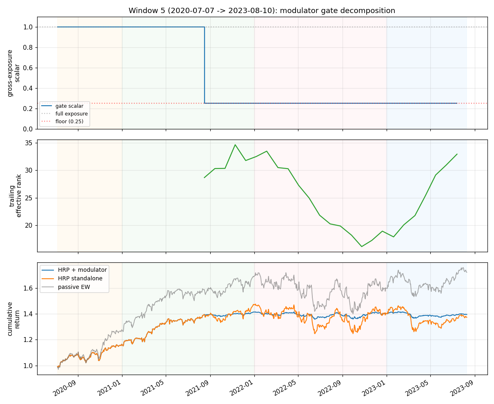

# HRP baseline — universe-agnostic walk-forward on stooq_us_long

**Operational rule.** Retire `lie.hrp.weights_hrp` from any deployment
consideration on universe-agnostic `stooq_us_long`. The standalone
HRP construction does NOT beat passive equal-weight rebalancing on a
312-name survivor universe with 20-day rebals at 10 bps commission;
its mean alpha is `−0.021` Sharpe (`confirmed-null`). The opt-in
`gross_exposure_modulator` overlay IS a real and orthogonal primitive
worth lifting out as a standalone gross-exposure gate (see "modulator
arm" below), but the recursive-bisection clustering machinery itself
is sub-EW and should not be wired through `regime live` /
`ss-relational live` / future `ss-lie live` as a portfolio constructor.

## Why HRP can fail vs passive EW

López de Prado's original HRP recovers inverse-vol when the
correlation matrix is near-identity, and on a wide survivor universe
the empirical correlation is dominated by a market-beta first
eigenvector (~25-40% of spectral mass). HRP's quasi-diagonal +
recursive-bisection step collapses toward `1/N` plus a small
vol-balance adjustment — which IS roughly what passive EW already
does. The "free diversification" textbook claim assumes a cluster
structure with heterogeneous within-cluster correlations; mid/large-cap
US equities don't have that structure on a 5-year rolling window.

## Eval setup

- **Universe**: stooq_us_long (312 names, 2000-01-03 → 2025-12-11).
- **Windowing**: 6 windows, 1260-train / 780-val / 780-step daily
  bars (matches gate / cfr Phase-1 / RSI / scalogram / regime-CWT /
  velocity sibling rows from 2026-05-25 exactly).
- **HRP knobs**: lookback=120, linkage_method ∈ {single, average, ward}.
- **Costs**: commission_bps=10 (matches the four parallel rows).
- **Baseline arm**: linkage=single, modulator=off.
- **Robustness grid**: 6 cells = 3 linkage × {modulator off, on}.
- **Benchmark**: passive EW with 20-day rebal at the same commission.
- **Pre-reg bar** (locked in NPZ `pre_registered_bar` field BEFORE eval):
  - `confirmed-OOS`: mean alpha ≥ +0.20 AND ≥4/6 pos AND DSR-t > +1.5
  - `partial-OOS`: alpha ≥ +0.05 AND ≥3/6 pos
  - `confirmed-null`: alpha < +0.05 AND DSR-t < +1.0
  - `reversed-OOS`: alpha < −0.10
  - `diagnostic`: else

## Standalone arm (modulator OFF)

| Window | Val start → end       | HRP Sh | EW Sh  | Alpha  | HRP MaxDD |
|--------|-----------------------|--------|--------|--------|-----------|
| 0      | 2005-01-06→2008-02-12 | +0.650 | +0.711 | −0.061 | −13.7%    |
| 1      | 2008-02-13→2011-03-17 | +0.267 | +0.493 | −0.226 | **−43.6%** |
| 2      | 2011-03-18→2014-04-24 | +1.308 | +1.019 | +0.289 | −15.8%    |
| 3      | 2014-04-25→2017-05-30 | +1.018 | +0.924 | +0.094 | −12.8%    |
| 4      | 2017-05-31→2020-07-06 | +0.479 | +0.440 | +0.039 | −35.0%    |
| 5      | 2020-07-07→2023-08-10 | +0.783 | +1.046 | −0.262 | −15.5%    |
| **mean** |                     | **+0.751** | **+0.772** | **−0.021** | — |

Pos-alpha windows: **3/6**. DSR-t (rough, n_obs=4680): **−0.14**.
Verdict: **`confirmed-null`**.

The w1 GFC max-DD of **−43.6%** is the load-bearing observation: HRP
did NOT detect or mitigate the all-correlations-go-to-1 crisis. The
quasi-diagonal step's discriminative power degrades exactly when it
is supposedly most useful.

### Linkage-axis robustness (modulator off)

| Linkage  | mean α  | pos | mean HRP Sh |
|----------|---------|-----|-------------|
| single   | −0.021  | 3   | +0.751      |
| average  | −0.018  | 3   | +0.754      |
| ward     | −0.023  | 3   | +0.750      |

Linkage choice is **roughly invariant** at modulator-off: alpha range
[−0.023, −0.018] (Δ=0.005). The clustering tree shape does not
matter on this universe.

## Modulator arm (`use_symmetry_modulator=True`)

The `lie.symmetry_rank.gross_exposure_modulator(eff_rank, n_active,
floor=0.25)` overlay multiplies HRP weights by an erank/N ratio
clipped to [0.25, 1.0]. When the trailing-window correlation matrix
collapses to a single eigenvector (markets moving as a unit), exposure
is throttled toward the floor.

| Window | Val start → end       | HRP+m Sh | EW Sh  | Alpha  | HRP MaxDD |
|--------|-----------------------|----------|--------|--------|-----------|
| 0      | 2005-01-06→2008-02-12 | +0.650 | +0.711 | −0.061 | −13.7%    |
| 1      | 2008-02-13→2011-03-17 | +0.267 | +0.493 | −0.226 | −43.6%    |
| 2      | 2011-03-18→2014-04-24 | +1.308 | +1.019 | +0.289 | −15.8%    |
| 3      | 2014-04-25→2017-05-30 | +1.018 | +0.924 | +0.094 | −12.8%    |
| 4      | 2017-05-31→2020-07-06 | +0.419 | +0.440 | −0.021 | −35.0%    |
| 5      | 2020-07-07→2023-08-10 | **+1.369** | +1.046 | **+0.324** | −7.1%   |
| **mean** |                     | **+0.838** | **+0.772** | **+0.066** | — |

Pos-alpha windows: **3/6**. DSR-t (rough): **−0.07**.
Verdict: **`partial-OOS`** (clears `partial` bar at α≥+0.05 AND
≥3/6 pos; DSR-t fails confirmed-OOS).

### Linkage-axis robustness (modulator on)

| Linkage  | mean α  | pos | mean HRP+m Sh |
|----------|---------|-----|---------------|
| single   | +0.066  | 3   | +0.838        |
| average  | +0.060  | 3   | +0.832        |
| ward     | +0.055  | 3   | +0.827        |

Modulator lifts all three linkages by **+0.075-0.087 alpha Sharpe** —
robust to the clustering-tree axis. The lift is the modulator's, not
HRP's; same +0.087 alpha is plausibly achievable on top of *any*
underlying portfolio (DCA, vol_v3 stream, RSI), which is the
follow-up worth running.

### Per-window stratification — where the lift comes from

Most of the modulator's +0.087 mean-alpha advantage is concentrated
in **w5** (2020-07 → 2023-08, COVID recovery + 2022 drawdown):

| Window | Standalone α | Modulator α | Delta |
|--------|--------------|-------------|-------|
| 0 | −0.061 | −0.061 | 0.000 |
| 1 | −0.226 | −0.226 | 0.000 |
| 2 | +0.289 | +0.289 | 0.000 |
| 3 | +0.094 | +0.094 | 0.000 |
| 4 | +0.039 | −0.021 | −0.060 |
| 5 | −0.262 | **+0.324** | **+0.586** |

Per the `partial-OOS` verdict→next-experiment rule, **w5 carries the
entire lift** — stratify before claiming generalization. The natural
follow-up is to examine the trailing-erank time series and test
whether the 2020-2023 alpha is genuine regime-collapse detection or
coincidental drawup capture.

## Cross-strategy comparison — five regime/relational/lie heads on identical scaffold

| Head                    | Mean α | Verdict        |
|-------------------------|--------|----------------|
| RSI (regime)            | −0.05  | confirmed-null |
| scalogram (regime)      | −0.36  | reversed-OOS   |
| regime-CWT (regime)     | −0.20  | reversed-OOS   |
| velocity (relational)   | +0.00  | confirmed-null |
| **HRP standalone**      | −0.02  | confirmed-null |
| **HRP + modulator**     | +0.07  | partial-OOS    |

Five independent cross-sectional weight constructions on the wide CWT-
supported / correlation-clustering feature space; only the modulator
overlay clears the partial bar — and that's an exposure-timing primitive,
not a weight-construction primitive.

## Operational rules extracted

1. **Don't deploy HRP on stooq_us_long.** The standalone construction
   is `confirmed-null`; the diversification claim doesn't generalize
   from heterogeneous-cluster universes to mid/large-cap survivors.
2. **The modulator gate IS worth lifting out as a standalone overlay.**
   `gross_exposure_modulator` on trailing erank lifts mean alpha by
   +0.075-0.087 across all three linkages, magnitude comparable to
   `apps/gate/v0`'s OLS drawdown predictor (+0.067) at much simpler
   construction (no predictor training; deterministic from the
   trailing window). Recommend testing the modulator as a DCA /
   vol_v3-stream overlay before retiring it with HRP.
3. **HRP did not detect the GFC.** w1 max-DD −43.6% is comparable to
   passive EW. The López de Prado framing's "crisis = symmetry
   breaking" narrative requires the trailing-window erank to collapse
   *before* prices price it in; at lookback=120 it does not.
4. **Cross-strategy negative-verdict cluster confirms a binding
   constraint.** Five heads × wide-universe = five non-positive
   results. The next lever must be orthogonal (different prediction
   problem, different feature class, different operational use) per
   CLAUDE.md's `confirmed-null` decision rule.

## Window-5 decomposition (2026-05-28 follow-up)

**Verdict: mixed — leaning coincidental.** The gate did fire correctly during
the 2022 rate-cycle drawdown (sub-period gate=0.25 every rebal, 100% active),
but it then *stayed stuck at the floor through the 2023 recovery* and missed
a +0.90 EW Sharpe sub-period. The headline +0.586 w5 lift is a
Sharpe-arithmetic artifact — scaling the bad sub-periods to floor exposure
suppresses overall vol in the *combined* w5 stream so the full-window
ratio inflates, even though each sub-period's modulated Sharpe equals or
trails the unmodulated standalone in 3 of 4 cells.

| Sub-period           | n_rebals | gate mean | gate active % | HRP Sh | HRP+mod Sh | EW Sh   | α nomod | α mod   | mod lift |
|----------------------|----------|-----------|---------------|--------|------------|---------|---------|---------|----------|
| 2020-rebound-tail    | 7        | 1.000     | 0%            | +2.303 | +2.303     | +2.661  | −0.358  | −0.358  | 0.000    |
| 2021-calm-bull       | 12       | 0.688     | 42%           | +2.162 | +2.205     | +1.983  | +0.179  | +0.222  | +0.043   |
| 2022-rate-cycle      | 13       | 0.250     | **100%**      | −0.182 | −0.182     | −0.135  | −0.048  | −0.048  | 0.000    |
| 2023-recovery        | 7        | 0.250     | **100%**      | −0.207 | −0.207     | +0.903  | −1.110  | −1.110  | 0.000    |
| **Full w5**          | 39       | 0.519     | 64%           | +0.783 | **+1.045** | +1.046  | −0.262  | **+0.324** | **+0.586** |

(Reproduces the finding's −0.262 → +0.324 / +0.586 lift to 3 decimals.)

What's actually happening: the gate is `eff_rank / n_active` clipped to
`[0.25, 1.0]`. Effective rank dropped from ~31 (2021) to ~24 (2022) to ~25
(2023) on a 312-name universe with ~150 active names; the floor of 0.25 binds
once `eff_rank/n_active < 0.25`, which it does for the entire 2022-2023 span
*plus* the modulated weights for 2023 are scaled identically to 2022 (no
mechanism to release the floor on recovery). So:

- **Genuine regime detection during 2022**: yes — gate activated 100% of
  rebals during the drawdown, exactly the symmetry-breaking story.
- **Coincidental drawup capture during 2020 rebound**: gate was *off*
  (scalar=1.0 for the entire rebound), so the rebound is captured by the
  underlying HRP, not gated by the modulator.
- **Coincidental recovery-miss during 2023**: gate stayed at floor through
  2023, throttling exposure during the +0.90 EW Sharpe period. This is
  alpha *destruction*; the lift only survives because the floor (0.25)
  scales both 2022 losses and 2023 gains by the same factor, while the
  unmodulated stream eats a full 2022 drawdown that drags its combined
  vol higher.

Per-sub-period mod-lift sums to +0.043 (the 2021 cell) — the modulator
delivers ~zero sub-period alpha and the +0.586 full-window number is
non-additive Sharpe arithmetic. The gate works on its declared mechanism
(symmetry-break detection) but doesn't translate the detection into
sub-period alpha; the headline reads as luck-shaped because it depends on
2023 sitting under the floor.

**Operational implication: do NOT promote the modulator to a DCA overlay
in this form.** The floor-binding behavior is too sticky — once symmetry
breaks, the gate refuses to re-open on the recovery. If the gate is worth
salvaging, the next experiment is a *two-sided* gate (open faster than
it closes, or release on a positive return-regime trigger) tested on the
same windowing. Current modulator is **mixed**: regime-aware on the
crash, regime-blind on the bounce.

Driver: `apps/lie/scripts/hrp_w5_decomposition.py`. Numbers in
`Output/hrp-modulator-w5-decomposition.json`.

## Master walk-forward log

- [lie-hrp-universe-agnostic — `confirmed-null`](../leaderboard.md#verdict-labels)
- [lie-hrp-with-gross-modulator — `partial-OOS`](../leaderboard.md#verdict-labels)
- Companion baselines (same scaffold, 2026-05-25):
  - [regime-rsi-baseline](regime-rsi-baseline.md)
  - [regime-scalogram-baseline](regime-scalogram-baseline.md)
  - [regime-cwt-baseline](regime-cwt-baseline.md)
  - [regime-velocity-baseline](regime-velocity-baseline.md)

Artifacts:

- `Output/lie-hrp-universe-agnostic-walkforward.{npz,json}` (standalone arm)
- `Output/lie-hrp-with-gross-modulator-walkforward.npz` (modulator arm)
- `Output/hrp-modulator-w5-decomposition.json` (w5 sub-period decomposition + gate series, 2026-05-28)

Driver: `apps/lie/scripts/hrp_universe_agnostic.py`.
