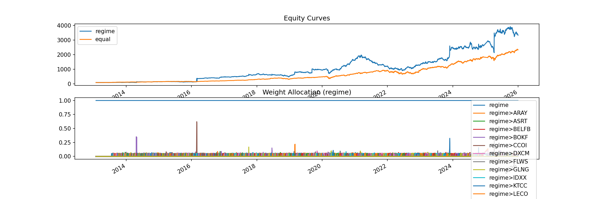
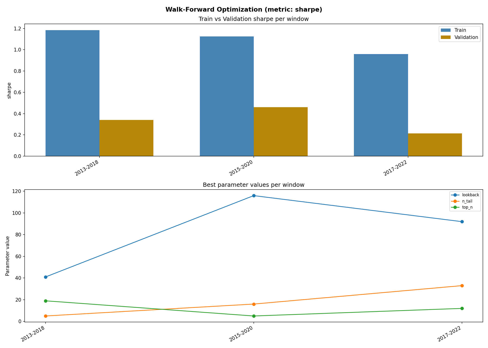

# Regime baselines, Optuna instability, JAX-Adam scale-weight collapse

Eval window: 2013-01-29 → 2025-12-11, 10bps commission, 20-day rebal.

## Baseline regime

Default params: `lookback=120, n_tail=20, top_n=20, KL divergence`.

| Metric           | Value           |
|------------------|-----------------|
| CAGR             | 31.2%           |
| Total return     | 3234%           |
| Daily Sharpe     | **0.63**        |
| Max drawdown     | -59.5%          |
| Daily kurtosis   | 750 (fat-tailed; dominated by a 150% best-day spike) |

High return but poor risk-adjusted.

## Equal-weight baseline

| Metric         | Value     |
|----------------|-----------|
| CAGR           | 27.6%     |
| Daily Sharpe   | **1.26**  |
| Max drawdown   | -30.8%    |

Better Sharpe than the regime baseline despite lower return.

## Optuna walk-forward instability

Optuna walk-forward best params vary wildly across windows
(`lookback` 144–246, `n_tail` 3–110, `top_n` 6–24, divergence bounces
cosine/js/kl) — the signal is unstable. Val Sharpe in later windows
reaches ~1.36–1.63.

## JAX differentiable optimizer (now removed; finding preserved)

Configuration: `lookback=229, n_tail=106`, 500 Adam steps, train 70%
/ val 30%.

- Train Sharpe: **+1.22**
- Val Sharpe: **+0.80** out-of-sample.

Learned scale weights collapsed to long horizons:

| Scale | Weight |
|-------|--------|
| 126d  | 48%    |
| 90d   | 18%    |
| 26d   | 16%    |
| 42d   | 15%    |

All short scales (≤21d) dropped to <1%. Temperature dropped to 0.005
(near-hard top-1 concentration). Implementation deleted with the JAX
dep drop; if differentiable regime training is wanted again, rebuild
on tinygrad following the `apps/factor` pattern.

## The regime signal works on monthly-to-biannual horizons, not short-term noise.

## Source

Recorded in `CLAUDE.md` under "Key findings" by:

- [`9d8c118d`](https://github.com/sughodke/StockSurvey/commit/9d8c118d) — baselines and Optuna instability (2026-04-24)
- [`b24f8adc`](https://github.com/sughodke/StockSurvey/commit/b24f8adc) — monthly-to-biannual horizons note (2026-04-24)
- [`6812b60a`](https://github.com/sughodke/StockSurvey/commit/6812b60a) — JAX-Adam scale-weight collapse (2026-05-07)

Master walk-forward log: [Leaderboard](../leaderboard.md) (the
*Optuna walk-forward* row — [`diagnostic`](../leaderboard.md#verdict-labels)
— and the *JAX-Adam differentiable trainer* row —
[`confirmed-OOS`](../leaderboard.md#verdict-labels)).
