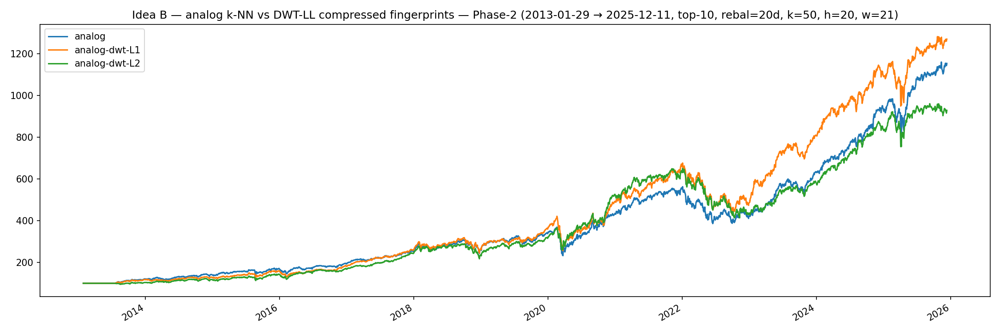
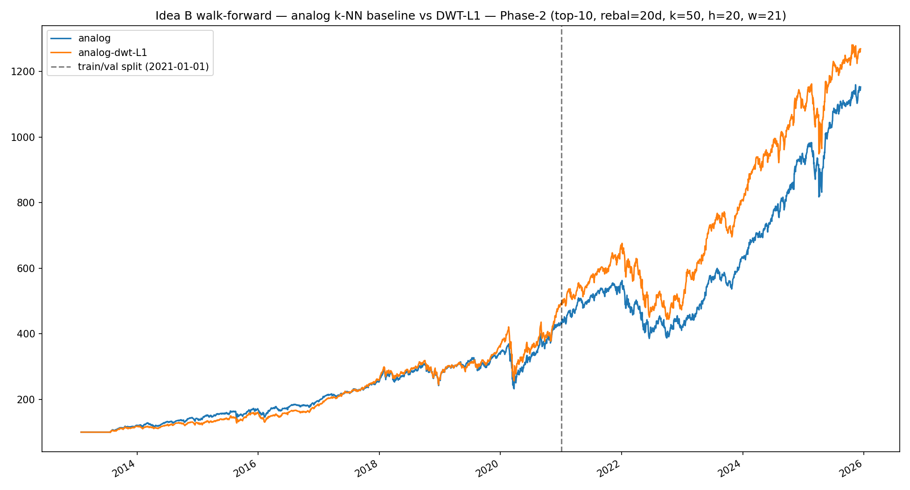
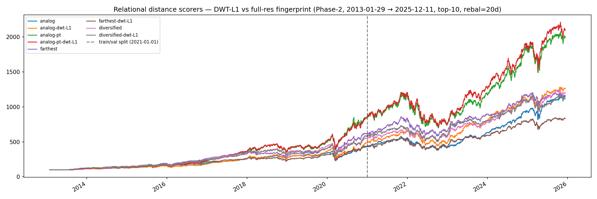

# Relational distance scorers — DWT-L1 fingerprint compression FAILS OOS

**Operational rule: do NOT pin compression on canonical relational
checkpoints.** `Output/relational-analog.json` retains full-resolution
fingerprints. The four `weights_*` builders still accept `compression=…`
so the experiment is reproducible, but no canonical checkpoint pins it.

## Setup

Phase-2, 2013-01-29 → 2025-12-11, 21 tickers, top-10 rebal-20d, 10bps
commission, `k=50, h=20, fp_window=21, scales=[5,7,10,12,21,26,50,90]`.

## Initial single-arm bt (2026-05-07)

L=1 winning vs uncompressed baseline (Daily Sharpe 1.11 vs 1.07,
fp_dim 168 → 44, L=2 over-compressed). The mechanism story was plausible
— Haar keep-LL acting as a low-pass denoiser of CWT noise dilating kNN
distances.

## Walk-forward eval reverses the verdict (2026-05-08)

The 8-arm Modal A/B extended the eval across all four distance-based
scorers + per_ticker analog pool, all ±DWT-L1.

**The uncompressed cross_ticker baseline is the ONLY arm whose val
Sharpe (1.146) exceeds its train Sharpe (1.032)**; every compressed
arm shows train > val by 0.02–0.44 Sharpe.

Per-arm summary (train Sharpe → val Sharpe):

| Arm                       | Train  | Val    | Δ        |
|---------------------------|--------|--------|----------|
| cross_ticker              | 1.032  | 1.146  | +0.114 (baseline wins) |
| cross_ticker-DWT-L1       | 1.116  | 1.099  | -0.017   |
| per_ticker                | 1.305  | 0.824  | -0.481   |
| per_ticker-DWT-L1         | 1.320  | 0.876  | -0.444   |
| farthest                  | 1.321  | 0.828  | -0.493 (catastrophic) |
| farthest-DWT-L1           | 1.102  | 0.833  | -0.269   |
| diversified               | 1.222  | 1.002  | -0.220   |
| diversified-DWT-L1        | 1.245  | 0.832  | -0.413 (strictly worse than uncompressed) |

Fingerprint dim collapses cleanly: 168 → 44 (L=1) → 12 (L=2).

## Possible mechanism

2013-2020 was a low-vol bull regime where high-freq CWT detail is
genuinely noise (and Haar-LL helps). 2021-2025 (2022 bear, Fed-pivot
bull, AI mega-cap rally) the same high-freq detail may carry
informative regime-change signal that DWT-LL erases.

## Notes

The DWT primitive is preserved as research infrastructure, and the
replay-side reconstruction R² result is independent — that was an SSL
setup, not a portfolio metric.

## Artifacts

- `Output/relational-idea-b-analog-knn-dwt-{equity.png,stats.txt}` (single-arm)
- `Output/relational-idea-b-analog-knn-dwt-walkforward-*` (cross_ticker train/val)
- `Output/relational-dwt-phase2-{equity.png,stats.txt,walkforward.csv,walkforward.txt}` (8-arm Modal A/B)

Master walk-forward log: [Leaderboard](../leaderboard.md).

Repro:

- Full-period: `uv run python -m relational.research.idea_b_analog_knn_dwt --data-dir ./StooqData`
- Segmented cross_ticker: `… idea_b_analog_knn_dwt_walkforward`
- Full 8-arm: `uvx modal run apps/relational/scripts/modal/relational_dwt_phase2.py`
  (after `prep_phase2_prices.py`).

## Source

[`46d1d25e`](https://github.com/sughodke/StockSurvey/commit/46d1d25e) — recorded in `CLAUDE.md` under "Key findings" (2026-05-08).
