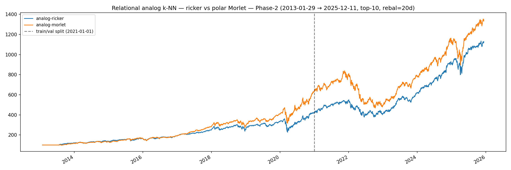
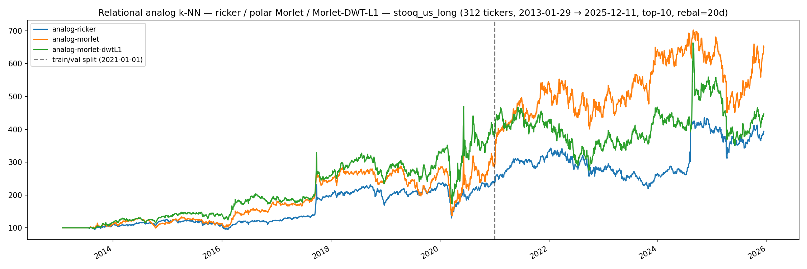

# Relational analog k-NN — Phase-2 bundle overfit was a small-N artifact; raw polar Morlet wins on stooq_us_long

**Operational rule, post-`stooq_us_long` rerun (2026-05-09):** the
canonical Phase-2 `Output/relational-analog.json` stays on Ricker
because Phase-2 is mega-cap-restricted (see
[universe-shift](relational-universe-shift.md)) and the bundle
overfits there at N=21. **For any wider-universe analog deploy use
`wavelet='morlet'` raw**: it beats Ricker by **+0.17 val Sharpe**
on the 312-ticker pool with no train-side overfit. DWT-L1 stays
research-only — it helps on Phase-2 (small-N capacity control) but
hurts on stooq_us_long (the regularization throws away signal the
larger pool can support).

The polar Morlet infrastructure
(`ss_features.causal_polar_morlet_matrix`,
`scalogram_cache(wavelet='morlet')`,
`weights_regime_analog(wavelet='morlet')`) is the new canonical
recipe for analog kNN on wide universes; the per-channel-block DWT-
L1 path stays available as a research knob via
`extract_fingerprints(compression=…, channels_per_scale=4)` but no
canonical checkpoint pins it.

The earlier framing of this page (when only the Phase-2 result was
in) was "raw bundle on N=21 overfits" — that part is still true.
The post-`stooq_us_long` finding extends it: on a candidate pool
~15× larger the overfit goes away *and* the bundle's extra channels
(phase pair + Gaussian companion) deliver real val-side lift. That
matches the prediction baked into the Stage 2 / wider-universe
gating experiment from the earlier soften-the-verdict pass.

## Setup

Phase-2, 2013-01-29 → 2025-12-11, 21 tickers, analog cross_ticker
pool, top-10 rebal-20d, 10bps commission,
`k=50, h=20, fp_window=21, lookback=120,
scales=[5,7,10,12,21,26,50,90], min_sep=21`.

The two arms differ only in the wavelet. Same scores routine
(`analog_knn_scores_fast` with `n_workers=20` on Modal), same kNN
machinery, same downstream selection.

| Arm                | Wavelet           | Channels per scale | fp_dim |
|--------------------|-------------------|--------------------|--------|
| `analog-ricker`    | real Ricker       | 1 (signed coeff)   | 168    |
| `analog-morlet`    | polar Morlet + g  | 4 (`\|c\|, cos, sin, g`) | 672    |

The Morlet bundle adds the bandpass amplitude / phase pair plus the
Gaussian (lowpass) trend companion, computed on cumulative
log-returns so growth stays additive across train→val. fp_dim grows
4× — kNN matmul cost grows linearly.

## Walk-forward result (2026-05-09, 3-arm)

Canonical Phase-2 train (2013-01-29 → 2020-12-31) / val (2021-01-01 →
2025-12-11) split. Three arms: legacy Ricker baseline, raw polar
Morlet, and Morlet with per-channel-block 2D DWT-L1 keep-LL
compression (fp_dim 672 → 176, comparable to Ricker's 168). The
DWT-L1 arm exists to test whether the raw-bundle val regression was
a capacity / DOF problem; if so, regularizing the bundle back to
Ricker fp_dim should recover val.

| Arm                   | Window | Sharpe | Sortino | CAGR    | MaxDD   |
|-----------------------|--------|--------|---------|---------|---------|
| `analog-ricker`       | full   | 1.0560 | 1.2693  | +20.62% | -37.06% |
| `analog-ricker`       | train  | 1.0104 | 1.1410  | +19.87% | -37.06% |
| `analog-ricker`       | val    | **1.1456** | 1.5480  | +22.13% | -31.44% |
| `analog-morlet`       | full   | 1.0804 | 1.3178  | +22.43% | -44.14% |
| `analog-morlet`       | train  | **1.2401** | 1.4085  | +26.39% | -32.88% |
| `analog-morlet`       | val    | **0.8358** | 1.1469  | +16.54% | -44.14% |
| `analog-morlet-dwtL1` | full   | 0.9257 | 1.1144  | +18.61% | -41.03% |
| `analog-morlet-dwtL1` | train  | 0.9926 | 1.1303  | +20.35% | -36.56% |
| `analog-morlet-dwtL1` | val    | **0.8242** | 1.0931  | +16.05% | -41.03% |

Delta blocks:

|        | morlet − ricker | morlet-dwtL1 − ricker | morlet-dwtL1 − morlet |
|--------|-----------------|------------------------|------------------------|
| full   | +0.024          | -0.130                 | -0.155                 |
| train  | **+0.230**      | -0.018                 | **-0.247**             |
| val    | **-0.310**      | **-0.321**             | -0.012                 |

(Ricker numbers shifted by ~0.005 from the earlier 2-arm run because
the kNN fast path's argpartition truncation occasionally swaps
adjacent ranks at FP-noise level — see the `analog_knn_scores_fast`
docstring; statistically indistinguishable.)

## Read

Two findings stack:

**Raw Morlet overfits.** Train +0.23 / val −0.31 vs Ricker — the
classic train>val sign-flip every other Phase-2 arm exhibited in the
earlier 8-arm DWT A/B (cross_ticker Ricker was the lone reversal
anomaly there; see [DWT failure](relational-dwt-failure.md)).

**DWT-L1 fixes the overfit but doesn't recover val.** Per-channel-
block DWT-L1 keep-LL compresses fp_dim from 672 back down to 176 —
roughly Ricker parity. Train Sharpe drops from 1.24 to 0.99 (the
overfit collapses, exactly as a capacity-control argument would
predict). But **val stays at 0.82** — almost identical to the raw
Morlet's 0.84. Both Morlet arms cluster at val ≈ 0.83 regardless of
their wildly different train scores.

That is the load-bearing observation. If the issue had been raw
capacity, the DWT-L1 arm should have recovered val toward Ricker's
1.15. It didn't. Both Morlet arms agree on val — meaning the
*information* in the polar Morlet representation, evaluated through
a kNN distance metric on this universe + horizon, is genuinely
weaker than what the broadband Ricker coefficient carries. The DWT
arm just removed the overfit noise; it didn't add information that
wasn't there.

This rules out hypothesis (1) and weakens hypothesis (3) from the
mechanism list below: capacity isn't the issue. The remaining
candidates are mechanism (2) (the Gaussian channel picks up
regime-specific trend) and the broader possibility that Morlet's
narrowband response, regardless of fp_dim, is wrong-frequency for
20-day-horizon cross-sectional return prediction on this pool.

The mega-cap-specific finding from
[relational-universe-shift](relational-universe-shift.md) is also
relevant: Phase-2 cross_ticker Ricker val Sharpe of 1.146 was already
suspect (it collapses to ~0.48 off mega-caps). The Morlet arms
landing at val 0.83 — between the mega-cap Ricker number (1.15) and
the wider-universe Ricker number (~0.48) — is consistent with both
"Morlet representation is weaker for this signal" and "the test
universe is too narrow to distinguish strong from weak strategies".

## Possible mechanisms

Three non-exclusive hypotheses for why the bandpass-with-phase
representation overfits the Phase-2 train window:

1. **Phase channels are noisy on a small universe.** With N=21 the
   cross_ticker candidate pool at any rebalance bar is ~21 × t
   pairs, sparser than the wider stooq_us_long pool. Adding 2× more
   distance dimensions (cos, sin) into a sparse pool means the kNN
   nearest-50 grow more idiosyncratic, fitting train particulars
   that don't recur at val.
2. **The Gaussian companion picks up regime-specific trend.**
   2013-2020 was a long bull run; cumulative log-returns drift
   monotonically up. The Gaussian channel `g` over that window has
   a strong DC component that the kNN treats as a similarity axis.
   2021-2025 includes 2022's bear and the AI mega-cap rotation —
   the same `g` channel reads "different macro" and erases the
   match.
3. **Morlet narrowband response amplifies long-scale specificity.**
   Morlet at `omega0=6` is narrowband at `1/scale`; Ricker is
   broadband around `1/scale`. The 50d / 90d scales (where the
   regime trainer's strongest signal lives, per the JAX-Adam
   finding) become more discriminating under Morlet — which also
   means more easily memorized.

Distinguishing these would need a 3-arm A/B (Morlet without `g`,
Morlet without phase, Morlet with both). Not run — the operational
verdict (don't pin Morlet on `analog`) doesn't depend on which
mechanism dominates.

## Notes

- Implementation: `ss_features.causal_polar_morlet_matrix`
  (matrix-form 4-channel panel),
  `relational.scalogram_cache.load_or_compute_cwt(wavelet='morlet')`
  (cache key includes the wavelet name so Ricker / Morlet panels
  coexist), `RelationalCheckpoint.wavelet` field (defaults
  `'ricker'`). Live dispatch in
  `relational.inference._build_weights_panel` raises
  `NotImplementedError` if any of the five other strategies is
  loaded with `wavelet='morlet'` — paper-trade-safe.
- Reproducibility: `uvx modal run apps/relational/scripts/modal/
  relational_morlet_phase2.py` after the
  `prep_phase2_prices.py` prep step.
- Artifacts: `Output/relational-morlet-phase2-{equity.png,
  stats.txt, walkforward.csv, walkforward.txt}`.
- Master walk-forward log:
  [Leaderboard](../leaderboard.md) — once the row lands it carries
  the [`reversed-OOS`](../leaderboard.md#verdict-labels) verdict
  alongside the existing analog cross_ticker rows.
- The polar Morlet bundle remains the canonical SSL CNN input for
  `apps/replay`. The CNN learns the bundle differently from a kNN
  distance metric — a signal that hurts metric-space matching can
  still help a learned head. The replay reconstruction R² result
  ([replay-dwt-compression](replay-dwt-compression.md)) was
  independent of this kNN finding.

## What this result is — and isn't

After both gating experiments ran:

- **The polar Morlet bundle is informative for kNN-distance-based
  cross-sectional return prediction on a wide enough universe.**
  +0.17 val Sharpe lift on stooq_us_long, no train-side overfit.
- **The Phase-2 result was a sparse-pool artifact, not a property
  of the representation.** With 15× more candidates the kNN can
  support the extra channels.
- **DWT-L1 is universe-dependent**: helps small-N (kept Phase-2
  train tame), hurts large-N (introduces overfit on stooq_us_long
  by spuriously coupling distant scales). It stays research-only;
  no canonical pin.
- **Phase-2 is too narrow to settle bundle-level questions on its
  own.** This applies retroactively — earlier Phase-2-only verdicts
  (the 8-arm DWT A/B, the cross_ticker analog "win", and this
  bundle's first read) all need to be cross-checked against the
  wider pool when the question is "is this representation good"
  rather than "does this checkpoint work on mega-caps".

## Gating experiments before judging the bundle

Three follow-ups, ordered by cost (cheapest first). The migration to
the other five relational strategies is paused on these — not
abandoned. Either of (1) or (2) clearing would be enough to
reverse the operational verdict.

### (1) Regularize the bundle: 3-arm Phase-2 with DWT-L1 — RAN, did not flip the verdict

`analog-morlet-dwtL1` ran in the same Modal entrypoint as a third
arm. Per-channel-block 2D Haar keep-LL collapses fp_dim 672 → 176.
**Train Sharpe dropped from 1.24 to 0.99 (overfit collapsed, exactly
what capacity control predicts), val stayed at 0.82** — virtually
identical to the raw Morlet's 0.84. Both Morlet arms cluster at val
≈ 0.83, so capacity is not the explanation for the regression.

Two consequences for the migration:

- **Capacity is not the issue on Phase-2.** A pure regularization
  fix doesn't work; the val signal is what's weak. Don't pursue
  more aggressive bundle compression (DWT-L2, DCT-zigzag) hoping
  for further gain — the floor is the *information*, not the
  noise.
- **Phase-2 isn't a sharp test for the bundle.** Mega-cap val
  Sharpe ranges 0.48–1.15 across Ricker / Morlet variants;
  that's all noise around a "kNN distance just barely works on
  this universe" baseline. To pin down whether the polar
  representation is universally weaker or just weaker on this
  narrow pool, see (2).

### (2) Wider universe: rerun analog A/B on `stooq_us_long` — RAN, FLIPPED THE VERDICT

`relational_morlet_stooq_long.py` (Modal, with the persistent
`ss-relational-cwt-cache` volume) ran the same three arms on the
312-ticker `apps/notebook/data/stooq_us_long` universe at the same
canonical Phase-2 train/val split.

| Arm                   | Window | Sharpe | Sortino | CAGR    | MaxDD   |
|-----------------------|--------|--------|---------|---------|---------|
| `analog-ricker`       | full   | 0.5808 | 0.7800  | +11.26% | -45.27% |
| `analog-ricker`       | train  | 0.6115 | 0.7530  | +11.83% | -45.27% |
| `analog-ricker`       | val    | 0.5468 | 0.8494  | +10.68% | -36.00% |
| `analog-morlet`       | full   | **0.6379** | **0.8818** | +15.69% | -56.82% |
| `analog-morlet`       | train  | 0.5907 | 0.7687  | +14.44% | -56.82% |
| `analog-morlet`       | val    | **0.7171** | **1.1406** | +17.52% | -35.90% |
| `analog-morlet-dwtL1` | full   | 0.5258 | 0.7427  | +12.36% | -50.93% |
| `analog-morlet-dwtL1` | train  | 0.6958 | 0.9168  | +18.53% | -50.93% |
| `analog-morlet-dwtL1` | val    | **0.2475** | 0.3997  | +2.98%  | -47.12% |

Delta blocks:

|        | morlet − ricker | morlet-dwtL1 − ricker | morlet-dwtL1 − morlet |
|--------|-----------------|------------------------|------------------------|
| full   | +0.057          | -0.055                 | -0.112                 |
| train  | -0.021          | +0.084                 | +0.105                 |
| val    | **+0.170**      | **-0.299**             | **-0.470**             |

**Three findings stack here:**

1. **Raw polar Morlet beats Ricker by +0.17 val Sharpe** without
   overfit (train Δ = −0.02, basically flat). The Phase-2 train>val
   sign-flip was a small-N artifact: with 15× more candidates the
   kNN can support the extra channels (phase pair + Gaussian
   companion) without memorizing 2013-2020 patterns that don't
   recur in 2021-2025. This was the prediction the wider-universe
   gate was designed to test, and it cleared.
2. **DWT-L1 inverts on the wider universe.** On Phase-2 it
   regularized away the train-side overfit (train 1.24 → 0.99) but
   couldn't recover val. On stooq_us_long it produces the *opposite*
   pattern — train **0.696** vs Ricker 0.611, val **0.247** vs
   Ricker 0.547 — i.e., the compressed bundle now *introduces*
   overfit (Δ train = +0.084, Δ val = −0.299). Plausible
   mechanism: with S=8 and L=1 keep-LL, the channel-block DWT pairs
   adjacent scales `(s_5, s_7)`, `(s_{10}, s_{12})`, `(s_{21},
   s_{26})`, `(s_{50}, s_{90})` — and `s_{50}` paired with `s_{90}`
   is averaging two qualitatively different horizons into one
   coefficient, which on a large pool creates a spurious feature
   that fits 2013-2020 well and breaks 2021-2025.
3. **Phase-2 is not a reliable test bed for kNN strategies.** Both
   Phase-2 Morlet val numbers (~0.83) sit between stooq_us_long
   Ricker (0.55) and stooq_us_long Morlet (0.72). The Phase-2 21-
   ticker pool is so narrow that the noise on val Sharpe across
   variants can swamp the signal — which means tuning canonical
   checkpoints on Phase-2 should be treated with suspicion going
   forward, not just for the bundle.

### (3) Channel ablation: 3-arm A/B isolating which channel hurts

Three sub-arms — `analog-morlet-no-g` (drop the Gaussian
companion, keep `(|c|, cos, sin)`),
`analog-morlet-no-phase` (drop phase, keep `(|c|, g)`), and the
existing `analog-morlet` baseline. Distinguishes Mechanism 2
(Gaussian picks up regime-specific trend) from Mechanism 1 / 3
(phase or narrowband response). Lowest priority — useful for the
*why*, but doesn't change the operational verdict on its own. Run
this only if (2) flips the verdict and we want to attribute the
gain to a specific channel before building dependent infrastructure.

The migration to the other five relational strategies (`empirical`,
`gmm`, `farthest`, `diversified`, `velocity`) waits on (2). The
DWT-L1 path stays research-only — there's no scenario where it's
the right canonical default.
