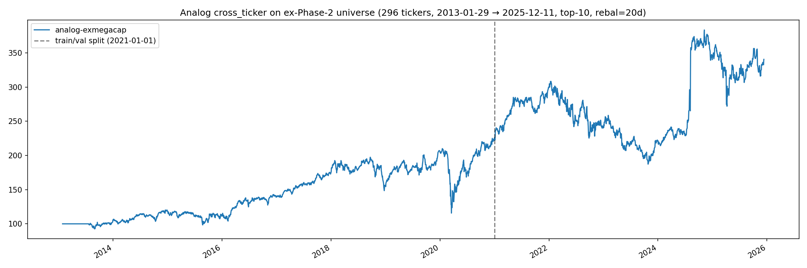

---
tags:
  - phase-2
  - stooq_us_long
  - reversed-OOS
---

# Relational analog cross_ticker — universe shift OFF mega-caps collapses the val edge

**Operational rule:** `Output/relational-analog.json` should remain
Phase-2-restricted; the val Sharpe 1.146 is a Phase-2-only number,
not a strategy-quality number. Any wider-universe live deploy needs
fresh OOS validation, not transfer of the Phase-2 result.

## Setup

Direct empirical test (2026-05-09) of the macro-tailwind concern
raised against the Phase-2 val Sharpe of 1.146.

- Ex-Phase-2 walk-forward: 296 `stooq_us_long` names ex-`PHASE2_TICKERS`.
- 2013-01-29 → 2025-12-11, top-10 rebal-20d, 10bps commission.
- Same algorithm (analog cross_ticker uncompressed — the Phase-2 OOS
  winner config), same hyperparams (`k=50, h=20, fp_window=21,
  scales=[5,7,10,12,21,26,50,90], top_n=10, rebal=20d`).
- Only the universe differs.

## Result

| Arm                  | Full Sharpe | Train | Val   | val−train |
|----------------------|-------------|-------|-------|-----------|
| Phase-2 cross_ticker | 1.07        | 1.03  | 1.15  | +0.11     |
| Ex-mega-cap          | **0.55**    | 0.61  | **0.484** | -0.13 |

Val edge collapses by **−0.66 Sharpe**. MaxDD also worse (−45% vs −37%)
and val−train Δ reverts to the typical −0.13 reversal pattern (Phase-2
cross_ticker's positive +0.11 was the anomaly, not the norm).

## Read

Roughly 0.5–0.7 Sharpe of the Phase-2 val number was mega-cap-specific
behavior (macro tailwind + within-mega-cap rotation), not generalizable
cross-sectional skill. The 0.48 val Sharpe on the wider universe matches
the prior phase-8 flag ("all four ideas degrade to Sharpe ~0.4 on the
wider universe") — independently confirmed three years later by direct
rerun.

## Caveat

This universe is `stooq_us_long` minus `PHASE2_TICKERS` — 296 mid/large-cap
survivor names, NOT true small caps (we lack market-cap data to filter
precisely). True small-cap performance would likely degrade further,
not improve.

## Outstanding question

Equal-weight passive benchmark on the same universes — if passive
ex-Phase-2 ≥ 0.6 Sharpe, the model is *negative alpha* outside mega-caps.

## Performance

[`analog_knn_scores_fast(n_workers=24)`](https://github.com/sughodke/StockSurvey/commit/fa026e7)
mp.Pool over t-axis with `OPENBLAS_NUM_THREADS=1` per worker (avoiding
8×8 BLAS oversubscription) brought wall-time from 2-4h serial estimate
to **12 min** for kNN compute on N=296. CWT cache lives in `modal.Volume('ss-relational-cwt-cache')`
so subsequent runs on this universe skip the ~10-min precompute.

## Artifacts

`Output/relational-exmegacap-{equity.png,stats.txt,walkforward.csv}`.

Repro: `uvx modal run apps/relational/scripts/modal/relational_exmegacap_modal.py`
(after `prep_exmegacap_prices.py`).

Master walk-forward log: [Leaderboard](../leaderboard.md) — the
*analog cross_ticker — universe-shift validation* row,
[`reversed-OOS`](../leaderboard.md#verdict-labels) by −0.131 Sharpe
on its own train→val gap and a further −0.66 Sharpe vs the Phase-2
baseline on the same algorithm.

## Source

[`302ad110`](https://github.com/sughodke/StockSurvey/commit/302ad110) — recorded in `CLAUDE.md` under "Key findings" (2026-05-09).
