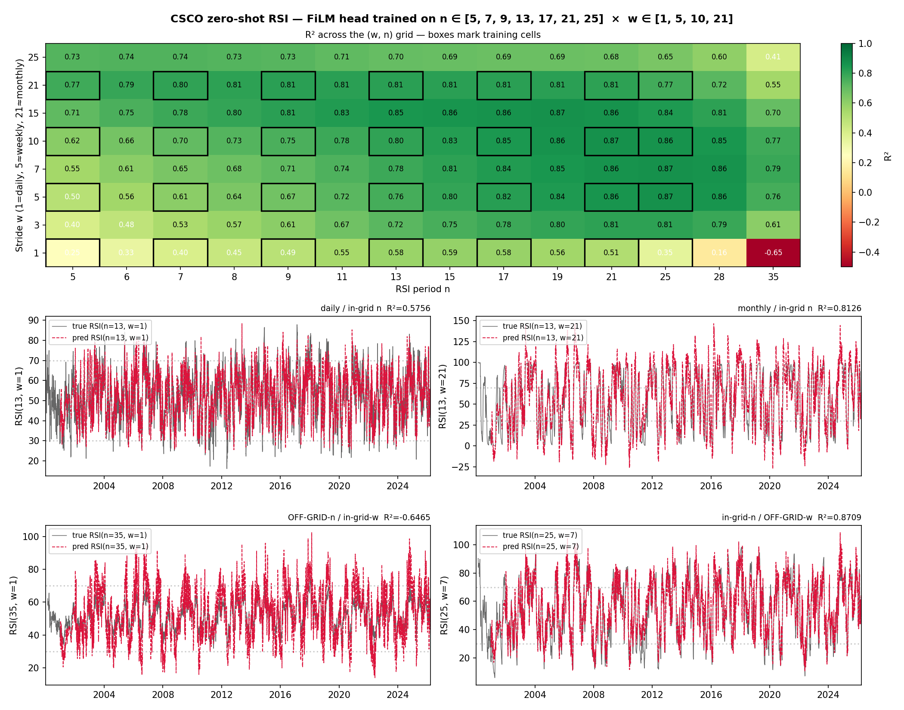
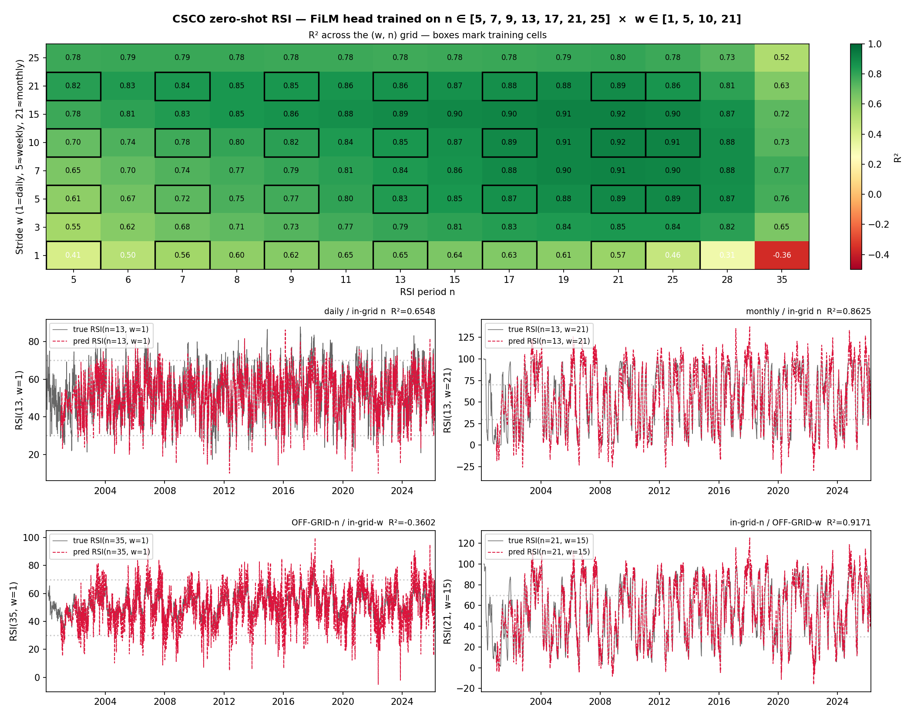
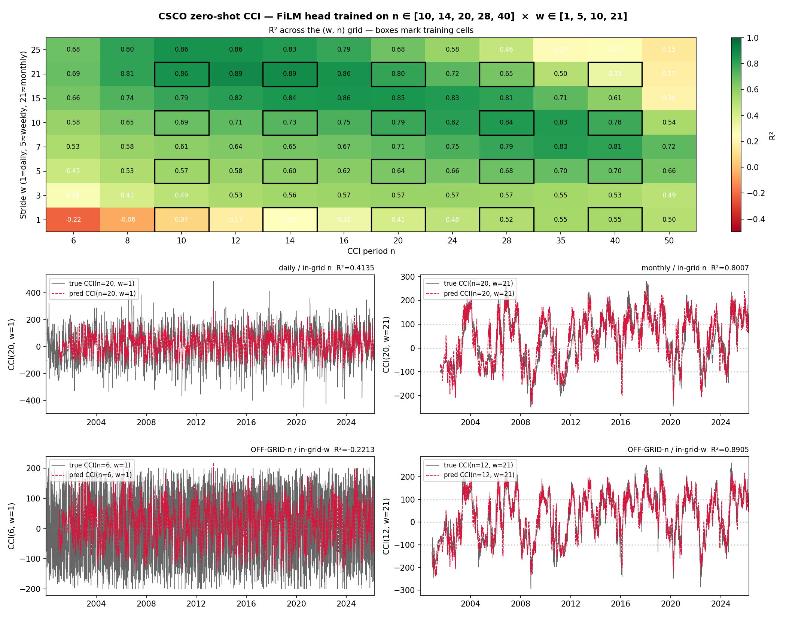
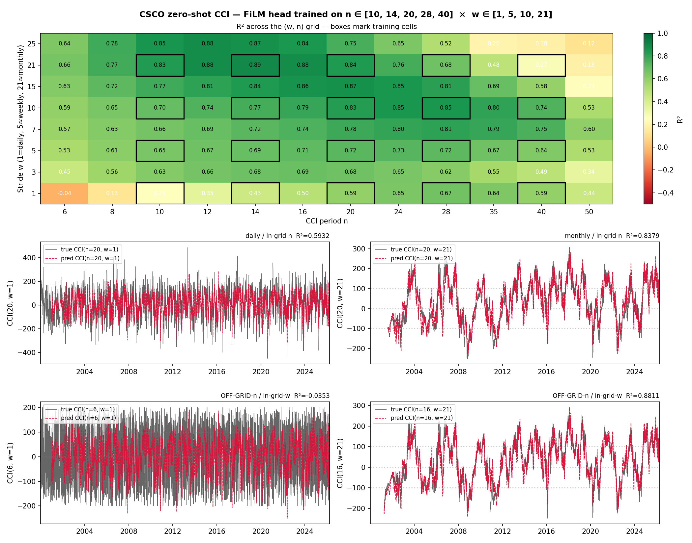
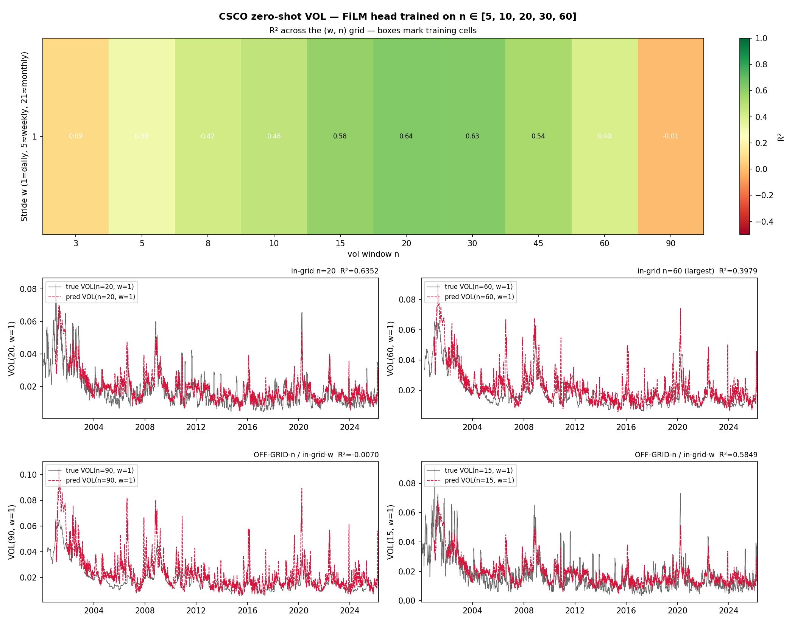
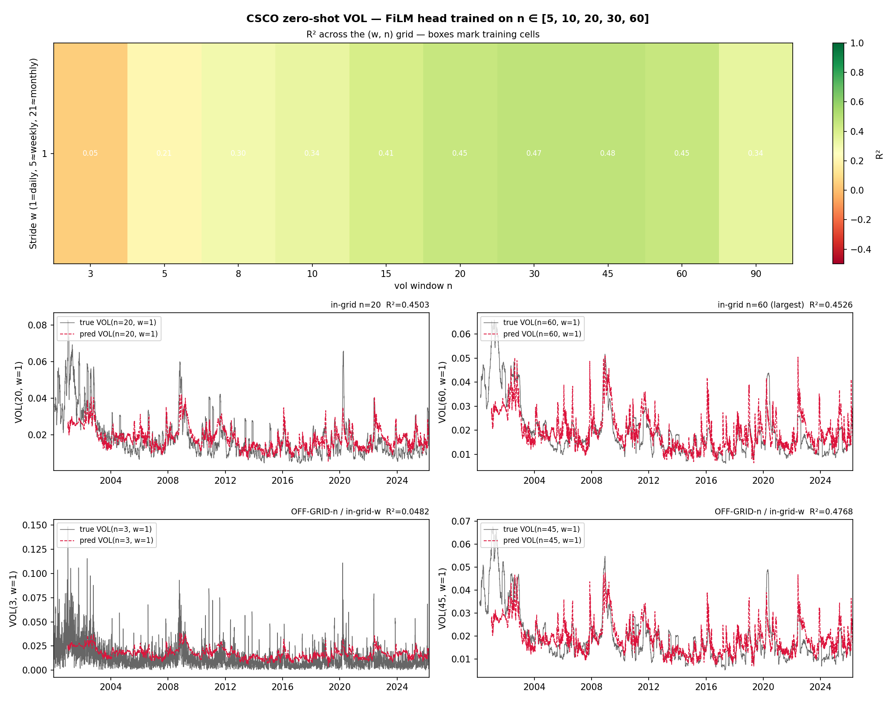
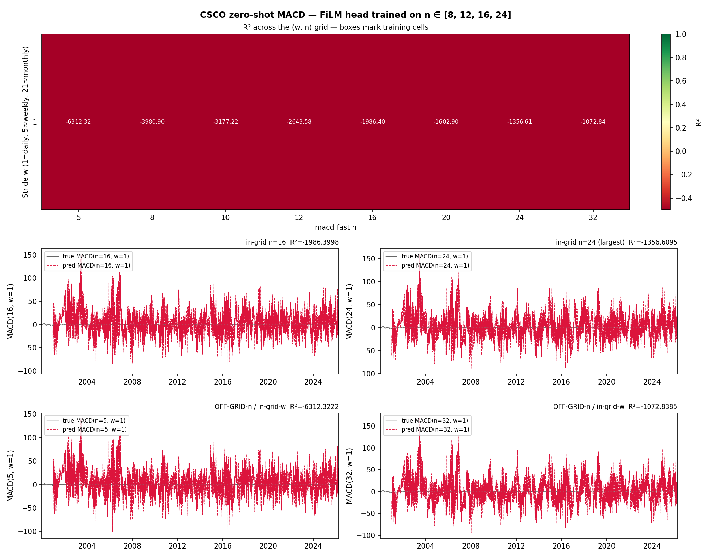
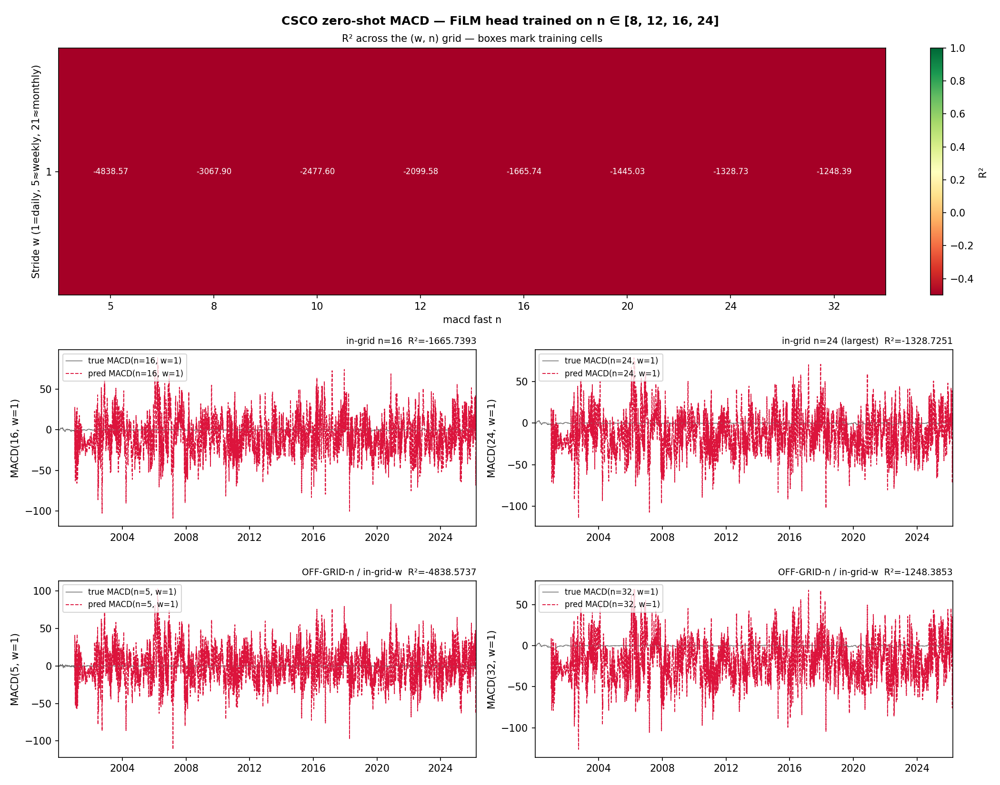
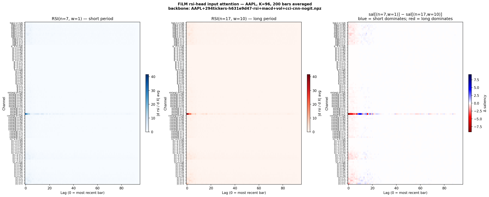
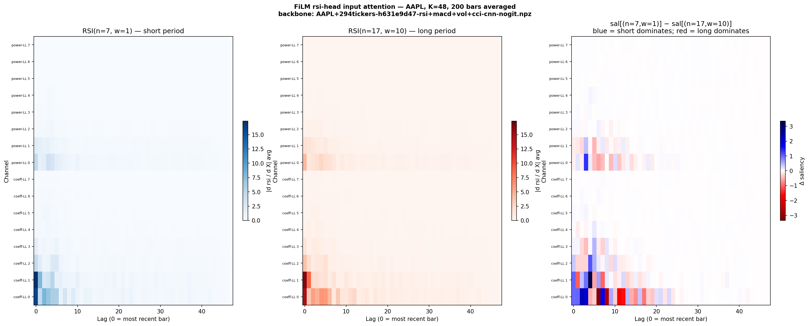

# Replay CNN — 2D DWT keep-LL compression preserves indicator-reconstruction signal

**Operational rule:** replay
[`--decoder cnn`](replay-decoders.md) backbone training can use
`--compress dwt --compress-levels 1 --compress-wavelet haar` to shrink
input ~4× without measurable quality loss on RSI / CCI / vol heads.
MACD remains unreliable (separate, pre-existing pathology — see TODO).
("SSL" wording in earlier revisions was loose — the supervision here
is per-target indicator reconstruction, not strict-SSL masked-AE.)

The 2D transform compresses both the time-window length `K` and the
scale axis `S` simultaneously. The
[K-axis (length) reading](replay-length-axis-compression.md) of this
result is extracted on a sibling page — actionable for backbone
defaults and live-bar latency, with a K-only follow-up proposed to
isolate the claim.

## Setup

Modal T4, 2026-05-07. CWT-only bundle, 295-ticker `stooq_us_long`
pool, AAPL primary, NVDA val, CSCO zero-shot, 500 steps, batch 8192,
K=96, scales 1..126.

Per-bar 2D DWT (Haar, periodization mode) keep-LL on
`(K, n_scales)=(96, 15)` tiles → `(K', S')=(48, 8)` per stack.

| Quantity     | Baseline | DWT-L1 | Reduction |
|--------------|----------|--------|-----------|
| Input feat   | 2880     | 768    | 3.75×     |
| CNN latent   | 5632     | 2560   | 2.2×      |

## CSCO zero-shot — RSI head, (n, w) sweep

Baseline (uncompressed CWT input):

DWT-L1 compressed:

## CSCO zero-shot — CCI head, (n, w) sweep

Baseline:

DWT-L1 compressed:

## CSCO zero-shot — vol head, (n, w) sweep

Baseline:

DWT-L1 compressed:

## CSCO zero-shot — MACD head, (n, w) sweep

The MACD head is the visibly broken one. Both arms produce sweeps
with R² in the −400 to −1200 range — the head is a pre-existing
pathology unrelated to compression and is tracked under
[the DWT compression follow-ups TODO](../TODO/dwt-compression-followups.md#macd-head-pathology-replay).

Baseline:

DWT-L1 compressed:

## CSCO zero-shot peaks

| Target | Compressed @ (n,w)   | Baseline |
|--------|----------------------|----------|
| RSI    | 0.92 @ (21,21)       | 0.90     |
| CCI    | 0.89 @ (12,21)       | 0.85     |
| vol    | 0.48                 | 0.48 (tied) |

## NVDA val R²

| Target | Compressed | Baseline | Δ      |
|--------|-----------|----------|--------|
| rsi    | 0.576     | 0.582    | -0.006 |
| cci    | 0.610     | 0.603    | +0.007 |
| vol    | -0.30     | -0.38    | +0.08  |

Compressed equals or slightly exceeds the uncompressed baseline on
every non-MACD target despite ~4× capacity drop — Haar LL acts as a
learned low-pass and the model wasn't using the high-freq detail it
lost.

## Attention map shift

- Baseline RSI head activates `coeff s=1,2,3,5` (high-freq end).
- Compressed activates `coeff-LL 0,1,2` + `power-LL 0,1` (the LL band
  carrying the same content downsampled).

Baseline FiLM attention (AAPL):

DWT-L1 compressed FiLM attention (AAPL):

## MACD pathology

R² ≈ −400 to −1200 across the (n,w) grid in **both** arms — pre-
existing head bug independent of compression. Tracked under the
DWT-compression follow-ups TODO.

## Constraints

- Causality preserved: per-bar tile transform only sees past bars
  `[t-K+1, t]`.
- CWT-only mode required (the optional zscore/return channels have no
  scale axis to 2D-DWT over).

## Artifacts

- `Output/cwtonly-{,dwtL1-}{AAPL-replay,NVDA-replay-zeroshot-from-*,CSCO-replay-zeroshot-{rsi,cci,vol,macd}-wn-sweep,AAPL-film-attention}.png`
- `Output/cwtonly-{,dwtL1-}CSCO-zeroshot-stats.json`

Implementation:
[`ss_features.Compression`](https://github.com/sughodke/StockSurvey/commit/2111751)
+ [`ss-replay --compress dwt`](https://github.com/sughodke/StockSurvey/commit/908981f)
`--compress-levels N --compress-wavelet haar`.

## Source

[`4c4d48b2`](https://github.com/sughodke/StockSurvey/commit/4c4d48b2) — recorded in `CLAUDE.md` under "Key findings" (2026-05-07).

Master walk-forward log: [Leaderboard](../leaderboard.md) (the
*2D Haar DWT-L1 keep-LL CWT-tile compression vs uncompressed* row —
[`partial-OOS`](../leaderboard.md#verdict-labels); reconstruction R²
is not a portfolio metric, so the verdict tracks reconstruction
quality, not Sharpe).
