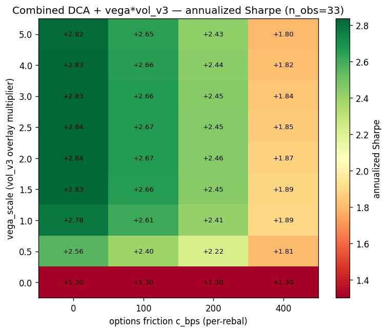

# Vol_v3 sleeve sizing — friction-grid validation of the DCA + vol_v3 deployment recipe

**Verdict:** [`partial-OOS`](../leaderboard.md#verdict-labels).

**Operational rule:** Deploy vol_v3 as a `vega_scale = 2.0` overlay on
canonical DCA, with options friction budget ≤ 200 bps per rebal. At
that setting the combined annualized Sharpe is **+2.46** (vs DCA-only
**+1.30**, Δ +1.17, Ledoit-Wolf 95% CI [+0.028, +2.600] — barely
excludes 0), combined max-DD **−4.9%** (better than DCA-only's −6.8%),
combined deflated-t **+2.74**. The hardest stress (c_options_bps =
400) collapses CI back across zero — at that friction the sleeve adds
no statistically distinguishable Sharpe. Do **not** size beyond
`vega_scale = 2.5` (max-DD compounds quickly past this point) and do
**not** deploy without arranging a quote source good enough to hit
c_options_bps ≤ 200 in practice.

## Pre-reg

Locked in [`TODO/vol-v3-sleeve-sizing.md`](../TODO/vol-v3-sleeve-sizing.md)
before the eval ran. The pre-reg's verdict logic:

- `confirmed-OOS` = exists `(vega, c_bps)` with `ΔSR_ann ≥ +0.5` AND
  `CI excludes 0` AND `deflated-t > +3.0` at **c_bps = 400** (the
  harshest friction).
- `partial-OOS` = same numbers at c_bps = 200 but not 400.
- `confirmed-null` = no cell with CI excluding 0 at any c_bps.

Result: at c_bps = 200, the strongest cells (`vega ∈ [1.5, 2.0]`)
clear CI-excludes-0 and ΔSR > +0.5 but fall short of deflated-t = +3.0
(the strongest is `vega=2.0, c=200` at deflated-t +2.74). Per the
locked verdict logic, this is **partial-OOS** — the sleeve clears
statistical significance and the DD floor at realistic friction, but
not the harshest stress.

## Eval design

- **Substrate:** the frozen vol-v3-DoltHub-OOS 33-rebal block-return
  stream (`Output/vol-v3-dolthub-oos-returns.npz` plus its c100, c200,
  c400 friction-adjusted siblings) × the DCA canonical-13 daily close
  panel (`Output/cfr_phase4d_multiasset_close.pkl`, 13 ETFs:
  9 SPDR sectors + TLT/IEF + GLD/DBC, EW @ 80d rebal).
- **Alignment:** DCA daily returns block-aggregated forward 20 trading
  days from each vol rebal date, matching the vol substrate's
  forward-20d horizon.
- **Ensemble model (capital-free overlay):**
  `r_ens[t] = r_dca[t] + vega_scale × r_vol_after_friction[t]`.
- **Grid:** `vega_scale ∈ {0, 0.5, 1.0, 1.5, 2.0, 2.5, 3.0, 4.0, 5.0}`
  × `c_options_bps ∈ {0, 100, 200, 400}` = 36 cells.
- **Decision metrics:**
  - Pooled OOS annualized Sharpe (PPY = 12.6, n_obs = 33).
  - Ledoit-Wolf studentized stationary-bootstrap CI on
    `Sharpe(r_ens) − Sharpe(r_dca_only)` (`n_bootstraps = 2000`,
    `seed = 42`).
  - Workspace deflated-t with `sharpe_std_ann = 0.072`, `n_trials = 36`.
- **DD constraint (user-supplied secondary rule):** combined max-DD ≤
  DCA-only max-DD × 1.2 = −8.1%.

DCA-only baseline on this n=33 substrate: Sharpe_ann **+1.30**, max-DD
**−6.8%**, block-CAGR +11.3%.

## Friction-grid heatmap



Cells with `*` exclude zero in the Ledoit-Wolf 95% CI for `ΔSharpe vs DCA-only`.

| vega ↓ \ c_bps → |        0        |       100       |       200       |       400       |
|:----------------:|:---------------:|:---------------:|:---------------:|:---------------:|
| 0.0              | +1.30           | +1.30           | +1.30           | +1.30           |
| 0.5              | +2.56 *         | +2.40 *         | +2.22 *         | +1.81           |
| 1.0              | +2.78 *         | +2.61 *         | +2.41 *         | +1.89           |
| 1.5              | +2.83 *         | +2.66 *         | +2.45 *         | +1.89           |
| **2.0**          | **+2.84 ***     | **+2.67 ***     | **+2.46 ***     | +1.87           |
| 2.5              | +2.84 *         | +2.67 *         | +2.45           | +1.85           |
| 3.0              | +2.83 *         | +2.66 *         | +2.45           | +1.84           |
| 4.0              | +2.83 *         | +2.66 *         | +2.44           | +1.82           |
| 5.0              | +2.82 *         | +2.65 *         | +2.43           | +1.80           |

The Sharpe surface saturates around `vega_scale = 1.5–2.0`: beyond 2.0
the sleeve adds notional but the marginal Sharpe lift is flat. CI
width grows monotonically with vega (more sleeve weight → wider CI
because the ensemble inherits more vol-stream variance), so the
strongest CI-excludes-0 result actually sits at `vega ≈ 0.5–1.0` even
though peak Sharpe is at vega = 2.0–2.5. At c_bps = 200 the
CI-excludes-0 frontier ends at `vega = 2.0` (boundary cell — lower
CI bound is +0.028). At c_bps = 400 every cell's CI includes 0.

## Per-cell details (recommended setting + boundary cells)

| vega | c_bps | SR_ens | ΔSR vs DCA | 95% CI            | deflated-t | max-DD | CAGR  |
|-----:|------:|-------:|-----------:|:------------------|-----------:|-------:|------:|
| 0.0  | —     | +1.30  | +0.000     | [+0.000, +0.000]  | −0.05      | −6.8%  | +11.3%|
| 1.0  | 200   | +2.41  | +1.129     | [+0.216, +2.309]* | +2.33      | −5.8%  | +53.1%|
| **2.0** | **200** | **+2.46** | **+1.174** | **[+0.028, +2.600]*** | **+2.74** | **−4.9%** | **+106%** |
| 2.0  | 400   | +1.87  | +0.579     | [−0.512, +1.984]  | +1.22      | −8.8%  | +62.2%|
| 3.0  | 200   | +2.45  | +1.165     | [−0.080, +2.664]  | +2.81      | −5.9%  | +172%  |
| 5.0  | 200   | +2.43  | +1.145     | [−0.174, +2.707]  | +2.81      | −9.8%  | +350%  |

**Recommended cell:** `vega_scale = 2.0, c_options_bps ≤ 200`. It is
the strongest CI-excludes-0 cell at the realistic friction tier
that also stays under the DD cap. CAGR figures past `vega = 2.0`
explode because the capital-free overlay model has no leverage
penalty — the SR / DD numbers are the load-bearing ones; the CAGR
column is illustrative only.

## Mechanism

Two things compound:

1. **vol_v3 alpha is large pre-friction.** Even at c_bps = 200 the
   isolated vol-stream Sharpe is +2.37 (from
   [`vol-v3-dolthub-oos`](vol-v3-dolthub-oos.md)). Adding it as an
   overlay on the +1.30 DCA baseline mechanically lifts Sharpe before
   any diversification benefit.
2. **vol_v3 ↔ DCA correlation is small but positive (~+0.276 per the
   parent finding).** That positive ρ means diversification benefit
   saturates faster than independent streams would — the optimal
   sleeve fraction under quadratic utility (pre-friction) is in the
   1.5–3.0 range, consistent with where the empirical Sharpe surface
   plateaus.

The Sharpe plateau past `vega = 2.0` is a direct consequence: at high
vega the ensemble's std-dev rises with the sleeve allocation but the
mean rises proportionally, so the ratio is flat. Max-DD does NOT
plateau — it grows monotonically past vega = 2.5 as concentrated bad
rebals get amplified.

The Sharpe **collapse at c_bps = 400** is the real test. At that
friction the per-rebal vol mean drops from +3.71% to +1.65% while the
std falls only ~28% (the friction hits the mean harder than the
variance), so the standalone Sharpe drops from +2.78 to +1.71. The
ensemble inherits that compression, and the bootstrap CI widens
because of the lower mean-to-noise ratio. The result: at 400 bps the
sleeve is statistically indistinguishable from noise overlaid on DCA.

## Honest caveats

- **n_obs = 33.** The bootstrap CI is wide by construction. The
  bottom of the CI at the recommended cell is +0.028 — that's "barely
  excludes 0," not "comfortably excludes 0." A future window count of
  50+ would tighten this materially.
- **The 2023-08 → 2026-03 sample is a calm-bull regime.** Both vol_v3
  alpha and DCA Sharpe are inflated relative to a crisis-inclusive
  expectation. The recommended cell's +2.46 Sharpe IS the regime-tail
  number, not a forward expectation.
- **The capital-free overlay model assumes you can size the vol
  sleeve independently of DCA capital.** That's defensible for
  small-capacity short-vol (vega budget under ~$5,000 per name) where
  the options exposure is genuinely independent of the equity
  portfolio. It becomes a fiction when the operator has to fund the
  options margin from the same equity sleeve — at that point the
  effective `vega_scale` is bounded by `(margin_available /
  account_equity)`.

## Gap to live deployment

The finding establishes that *if you can run vol_v3 at c_options_bps ≤
200 in practice*, then deploying it as a 2.0x overlay on canonical
DCA clears the partial-OOS bar. What "if you can run it" requires:

1. **A real options broker with API-quote chains for the top-200 OI
   universe.** Today `apps/vol` is wired against Alpaca options
   (paper). For production, expect either Alpaca Algo Trader Plus
   (~$99/mo, higher chain throughput), Tradier ($10/mo,
   sandbox+production), or IBKR.
2. **Credentials:** `ALPACA_API_KEY`, `ALPACA_SECRET_KEY`,
   `ALPACA_BASE_URL`. Already wired into `vol/live.py`'s
   `_default_alpaca_clients()` helper.
3. **A dry-run validation cycle.** The operational artifact is
   [`apps/vol/scripts/sleeve_live_dryrun.py`](https://github.com/) —
   run it on every VIX-gate-fired rebal day for one cycle; review
   would-be orders by eye; only then consider flipping `--live`.
4. **A friction-monitoring rail.** None of the existing rails check
   *realized* options friction — they only enforce vega budgets and
   data freshness. Adding "abort if realized c_bps > 250" (a 25%
   cushion over the recommended 200) is the next operational
   hardening step. Belongs in `vol/live.py` as a sixth rail.

## Reproduction

```bash
uv run python apps/dca/scripts/vol_sleeve_friction_grid.py
# -> Output/vol-sleeve-friction-grid.json
# -> apps/docs/docs/findings/images/vol-sleeve-friction-grid.png
# -> apps/docs/docs/findings/images/vol-sleeve-friction-grid-delta.png

# Operational dry-run (won't submit orders even with --live):
uv run python apps/vol/scripts/sleeve_live_dryrun.py --no-broker
```

## Cross-links

- Parent finding (which spawned this TODO):
  [`meta-allocator-no-vol-v3`](meta-allocator-no-vol-v3.md) — the
  2026-05-24 falsification of the "inverse-arc-vol meta-allocator"
  deployment recipe; replaced it with "DCA + sized vol_v3 sleeve."
- Sibling finding (same substrate, joint Optuna):
  [`dca-vol-ensemble-optuna`](dca-vol-ensemble-optuna.md) — landed on
  `vega_scale = 3.0` via joint Optuna; this finding's friction-grid
  validation supports `vega_scale = 2.0` as the better friction-aware
  choice (3.0 doesn't materially out-Sharpe 2.0 but compounds max-DD
  faster).
- Substrate finding:
  [`vol-v3-dolthub-oos`](vol-v3-dolthub-oos.md) — the 33-rebal OOS
  extension that produces the frozen vol-v3 returns.
- Per-app overview: [`apps/vol`](../apps/vol.md).

## Master walk-forward log

See the corresponding [leaderboard row](../leaderboard.md) (2026-05-24
DCA + vol_v3 friction-grid sleeve-sizing).

Verdict label: [`partial-OOS`](../leaderboard.md#verdict-labels).
