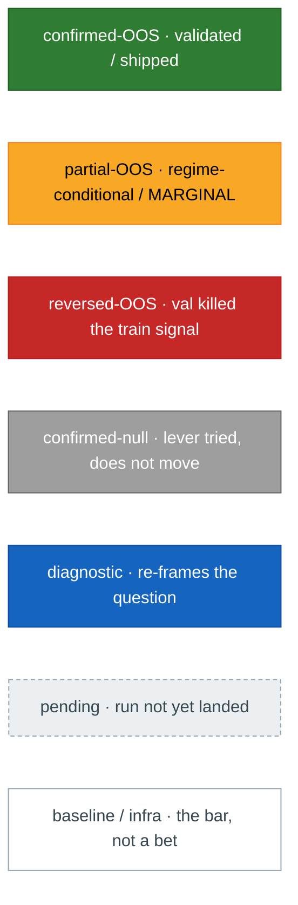
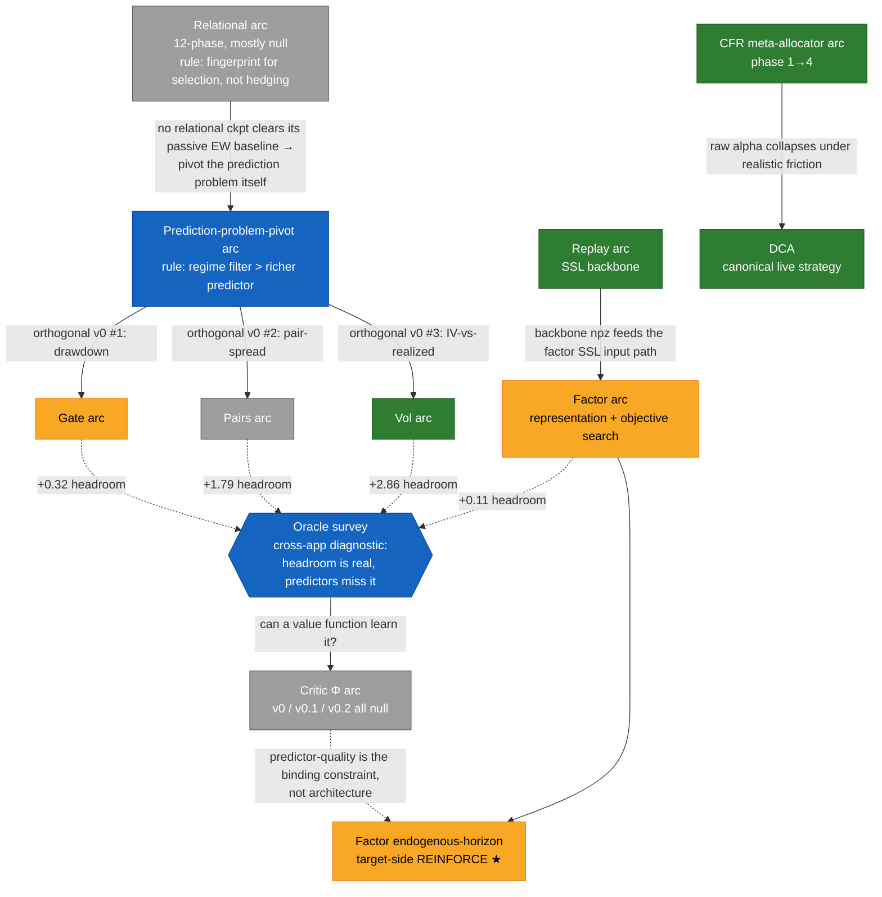
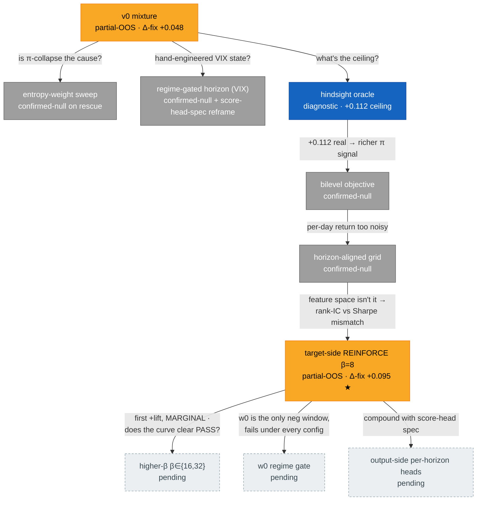
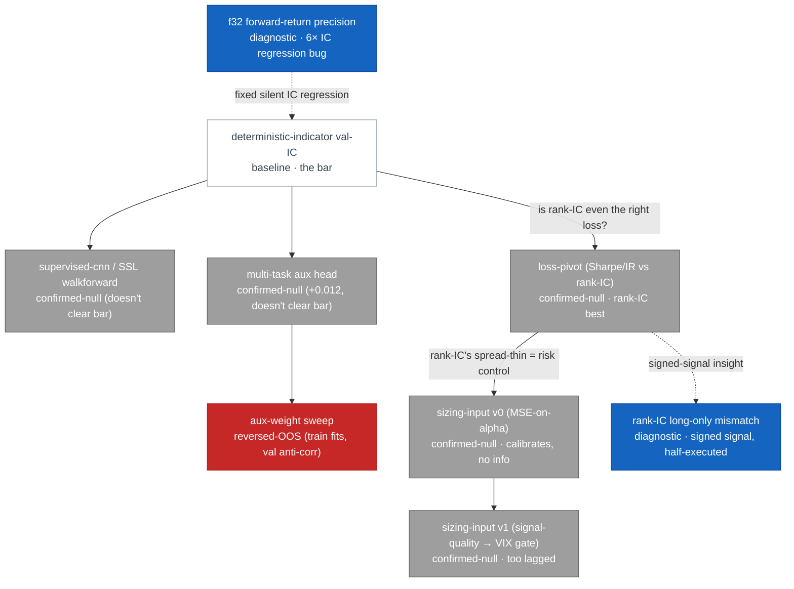
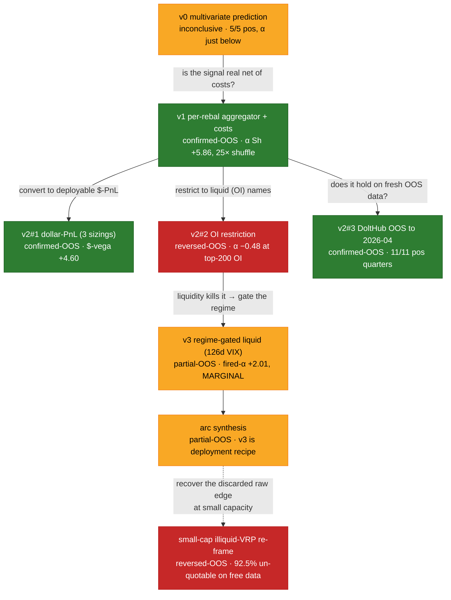
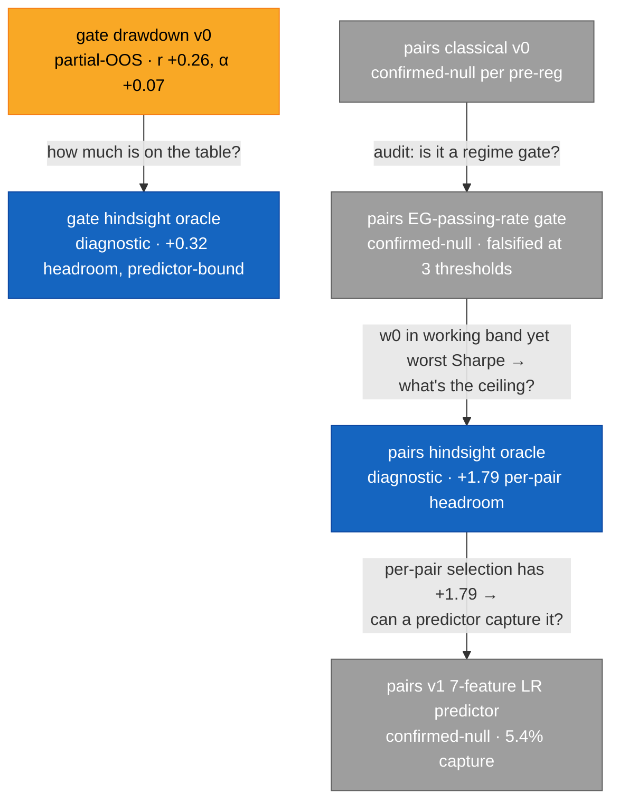
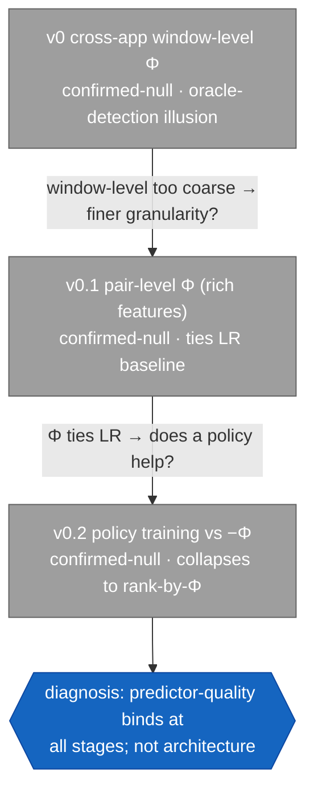
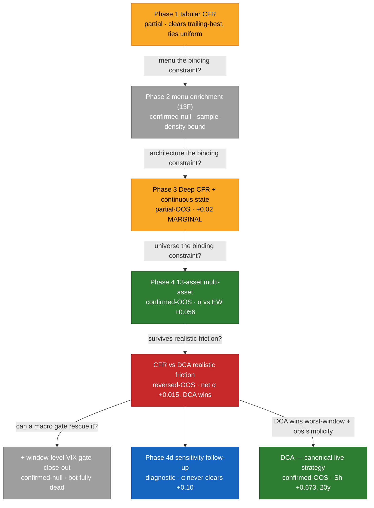
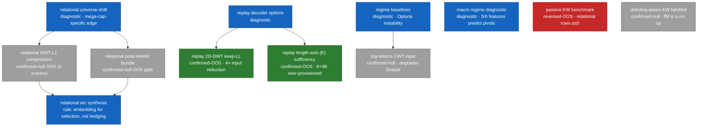

# Map

A visual index of every research arc: what was tried, what it
returned, and how each result gated the next experiment. Nodes are
experiments; edges are the **verdict → next-experiment** decisions
the [leaderboard](leaderboard.md) protocol mandates. Edge labels are
the *reason* the next experiment followed — read them and you have
the research narrative without reading a single findings page.

This page is the cross-cutting view; per-experiment numbers live in
the [Leaderboard](leaderboard.md), prose in
[Findings](findings/index.md). When you add a leaderboard row, add
its node here.

## How to read it

Verdict labels (the
[leaderboard vocabulary](leaderboard.md#verdict-labels)) are encoded
by node colour, so an arc's *shape* is legible at a glance — a long
grey chain is a dead lever; a green node is a validated/shipped
result; an amber node is a live frontier; a blue node is a
diagnostic that re-framed the question.

## Arc map — how the arcs hook up

The top-level structure. Solid edges = an arc spawned or pivoted
into another; dashed edges = a cross-app diagnostic feeding an
insight forward.

## Factor — endogenous-horizon arc

The deepest single arc: seven experiments chasing a +0.112 oracle
ceiling on state-conditional rebal cadence. Four rescues failed
identically (all damaged the w3 canary); the fifth — target-side
REINFORCE on the Sharpe-residual — is the first positive lever and
the live frontier.

## Factor — representation + objective search (earlier)

The pre-endogenous-horizon work: can a learned backbone or an
alternative objective beat the deterministic-indicator rank-IC bar?
Consistently no.

## Vol surface arc

The codebase's one big OOS-validated signal — and the one that also
shows how a real edge dies on deployability.

## Gate + Pairs arcs (prediction-problem-pivot spawn)

Two of the three orthogonal v0 tests the prediction-problem-pivot
arc launched. Both have real-but-predictor-bound signal — the oracle
diagnostics revealed large unrealized headroom.

## Critic Φ arc

The cross-app oracle survey's follow-up: can a learned value
function Φ(state, action) → Sharpe capture the headroom the oracles
revealed? Three arms, all confirmed-null — the cheap version of the
idea is comprehensively falsified, but the diagnosis (predictor-
quality is binding) fed forward into the factor REINFORCE frontier.

## CFR meta-allocator arc → DCA

A four-phase escalation that reached a deployable PASS, then died on
realistic-friction re-eval — and in dying, established DCA as the
canonical live strategy.

## Relational arc + infra (parked / supporting)

The relational 12-phase arc (mostly null, parked behind the
prediction-problem pivot), the replay backbone arc (shipped
compression results that feed factor), and the regime/cross-app
diagnostics that gate the others.

## Maintenance

When a leaderboard row lands, add its node to the matching arc
diagram with the right verdict class and an edge from the
experiment that gated it (label = the reason it followed). A node
with no outgoing edge is a live frontier or a terminal close — the
[TODO](TODO/index.md) for that arc says which. If an arc grows past
~10 nodes, split it into a sub-section rather than letting one
flowchart sprawl.
