# Map

A visual index of every research arc: what was tried, what it
returned, and how each result gated the next experiment. Nodes are
experiments (or, where the detail is one click away, *arcs*);
edges are the **verdict → next-experiment** decisions the
[leaderboard](leaderboard.md) protocol mandates. Edge labels are
the *reason* the next experiment followed — read them and you have
the research narrative without reading a single findings page.

This page is the cross-cutting view; per-experiment numbers live in
the [Leaderboard](leaderboard.md), prose in
[Findings](findings/index.md). When you add a leaderboard row, add
its node here — but think first about whether it deserves a node or
collapses into an existing arc.

## How to read it

Verdict labels (the
[leaderboard vocabulary](leaderboard.md#verdict-labels)) are encoded
by node colour, so an arc's *shape* is legible at a glance — a long
grey chain is a dead lever; a green node is a validated/shipped
result; an amber node is a live frontier or marginal; a red node is
a real signal killed in OOS or by deployability; a blue node is a
diagnostic that re-framed the question.

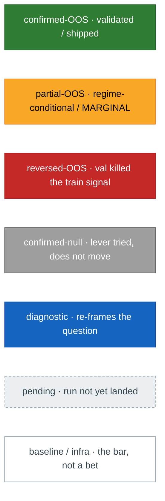

## The frontier — what survives after deflation

The single most important picture in the repo: the
[cross-arc Deflated-Sharpe ladder](leaderboard.md#cross-arc-deflated-sharpe-ranking).
Every deployable arc was re-run to dump its OOS net return stream and
scored on the **deflated-Sharpe t-stat** (Sharpe corrected for fat
tails, sample length, and number of configs tried). The meta-finding:
**raw mean-of-window Sharpe is not apples-to-apples** — once selection
bias is priced in, only one arc clears t > 2.

```mermaid
flowchart TD
    dca["DCA — multi-asset EW basket<br/>deflated t +2.07 · DSR 0.98 · n_trials=4<br/>★ only arc clearing significance"]:::cOOS
    rel["relational analog cross_ticker<br/>t +0.74 · n_trials=16 · mega-cap-specific"]:::pOOS
    vol["vol v3 regime-gated<br/>t +0.13 · headline Sharpe +1.15 collapsed<br/>under 12-trial deflation"]:::pOOS
    fac["factor indicator-baseline 20d<br/>t −1.37 · confirmed-OOS on IC,<br/>negative once ~50-config search priced in"]:::rOOS
    cs["cross-sectional factor zoo<br/>12-1 momentum, low-vol BAB,<br/>shape-kNN reversal, 5d skip-1<br/>all DSR-sub-significant"]:::cnull
    gate["gate v0 drawdown overlay<br/>t −1.73 · excess-stream Sharpe negative<br/>despite +0.07 mean-of-window α"]:::rOOS
    pair["pairs v0<br/>t −0.18 · confirmed-null per pre-reg"]:::cnull

    dsr{{"Cross-arc DSR ladder<br/>= the apples-to-apples meta-finding"}}:::diag
    dsr --> dca
    dsr --> rel
    dsr --> vol
    dsr --> fac
    dsr --> cs
    dsr --> gate
    dsr --> pair

    rule["Operational rule:<br/>headline Sharpe is a hypothesis;<br/>deflated-t is evidence"]:::diag
    dsr -.-> rule

    click dsr "../findings/deflated-sharpe-leaderboard.md"
    click dca "../findings/cfr-vs-dca-realistic.md"

    classDef cOOS fill:#2e7d32,stroke:#1b5e20,color:#fff
    classDef pOOS fill:#f9a825,stroke:#f57f17,color:#000
    classDef rOOS fill:#c62828,stroke:#b71c1c,color:#fff
    classDef cnull fill:#9e9e9e,stroke:#616161,color:#fff
    classDef diag fill:#1565c0,stroke:#0d47a1,color:#fff
```

## Ensemble discovery — can any combination beat DCA?

The natural follow-up to the DSR ladder: if no *single* arc clears
deflation by a wide margin, can a **combination** of the positive-t
arcs honestly produce a higher deflated-t than DCA-alone? Searching
all 91 candidate ensembles (C(7,2) + C(7,3) + C(7,4)) across the
positive-DSR arc set under a single weight rule (inverse-variance,
equal, tangency — all tested) and apples-to-apples
DCA-on-same-overlap reference: **no**. The headline "+5.11 lift over
DCA" for `relational + vol-v3-dolthub` collapses under two
falsifications: (1) vol-v3-dolthub-alone scores **+5.55** on its own
33-obs window — every ensemble containing it strictly *dilutes* the
deflated-t; (2) DCA scores only +1.53 on the 30-obs overlap because
that window (2023-08→2026-03) contains zero crises, vs DCA's
full-sample +1.93 across 20.7 years and 4 regimes. The "lift" is
sample-window selection.

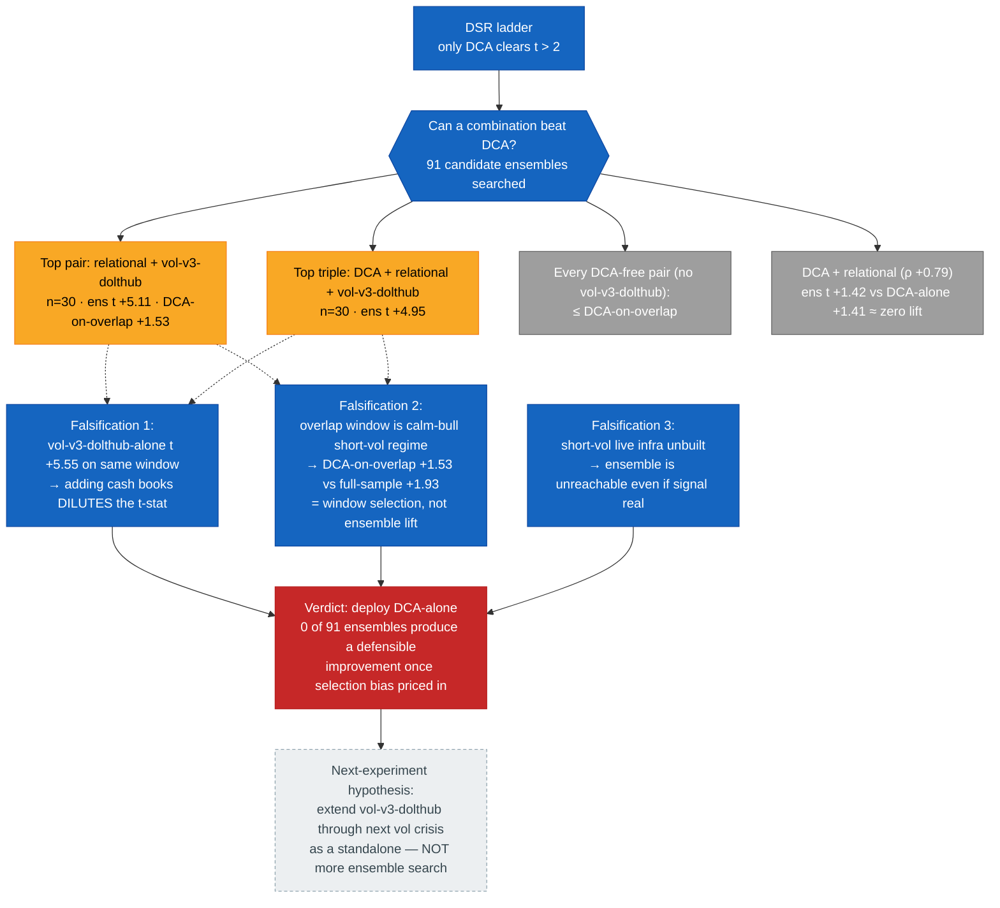

The mechanism behind the negative result is geometric: combining a
high-t arc (vol-v3-dolthub) with a lower-t arc (anything else)
weights the variance contribution of the lower-t arc into the
ensemble denominator without proportionally lifting the mean. For
the ensemble t to exceed the best component's t, the components need
either (a) negative correlation strong enough to compress combined
variance below either component's own, or (b) the lower-t arc must
itself clear the high bar. Neither holds here — pairwise ρ on the
overlap windows ranges −0.04 to +0.31, and no second arc has the
sample-window-conditional t to compete with vol-v3-dolthub.

The operational rule extracted: **ensembling is not a free-lunch
escape from the deflation wall**. A k-arc ensemble carries
Σ component trials + (k−1) trials of its own, and even before that
penalty the best single component's t is the ceiling unless
correlations are strongly negative. The repo's positive-t arcs are
all weakly-positively-correlated risk-on books, so the ceiling is
binding.

## Arc map — how the arcs hook up

The top-level structure: how each arc spawned, what it pivoted into,
and which cross-app diagnostic re-shaped the question. Solid edges =
an arc spawned or pivoted into another; dashed edges = a cross-app
diagnostic feeding insight forward.

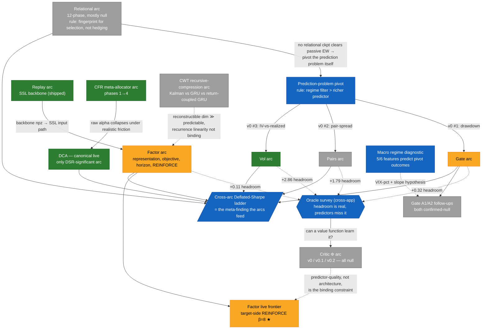

## Vol surface arc — the deployable-edge case study

The codebase's one big in-sample-validated signal, three OOS
extensions, and two re-frames that demonstrate **deployability is a
separate gate from cost**: an edge can be real and still die because
you cannot quote the instrument.

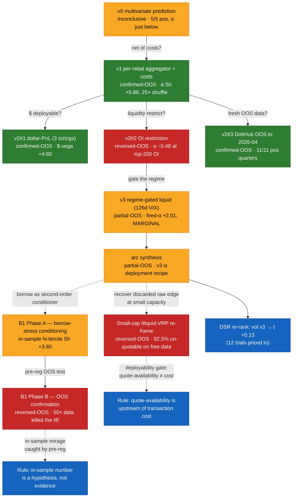

## Factor arc — three sub-arcs collapsed

Three years of factor work compress into three intertwined questions:
*what features?* (representation), *what loss?* (objective), *what
horizon?* (the late-arc finding that horizon was the binding lever
all along). The endogenous-horizon REINFORCE thread is the live
frontier; every other lever is grey.

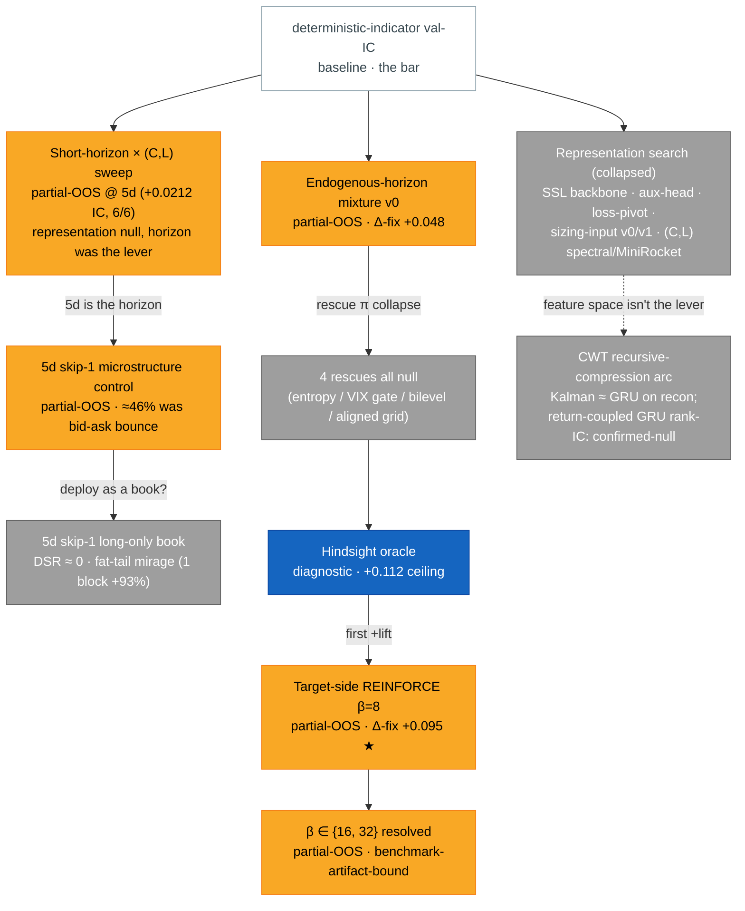

## Cross-sectional factor zoo

The pre-registered single-hypothesis arms that test "does the
canonical literature anomaly survive in this repo's OOS protocol?"
Headline: **the deflated-Sharpe ladder collapses them all**, even
the best (low-vol BAB) is sub-significant.

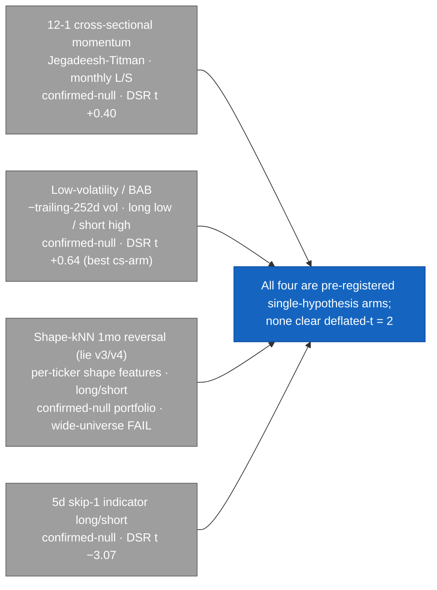

## Gate + Pairs arcs (prediction-problem-pivot spawn)

Two of the three orthogonal v0 tests from the prediction-problem
pivot. Both have real-but-predictor-bound signal — the oracle
diagnostics revealed large unrealized headroom, and the v1 / A1 / A2
follow-ups falsified that simple lifts close that gap.

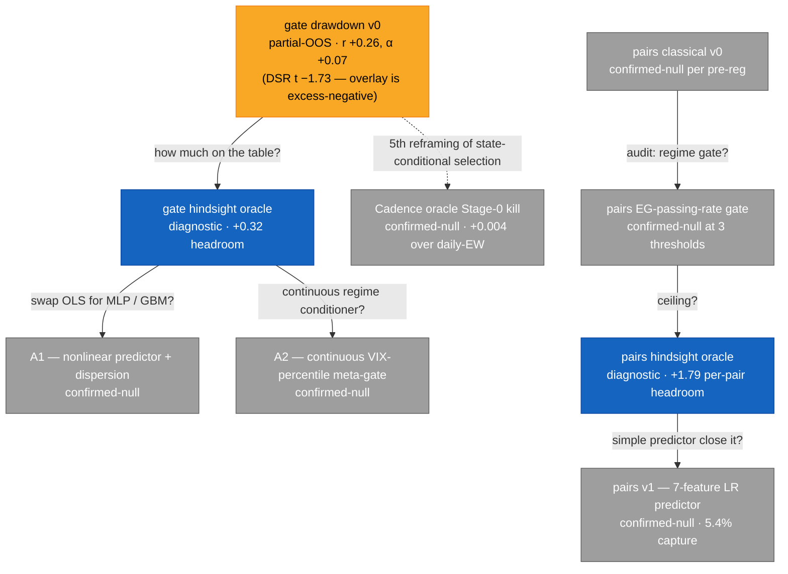

## Critic Φ arc (collapsed)

Three arms, all confirmed-null. The diagnosis — *predictor-quality
is the binding constraint, not architecture* — fed forward into the
factor REINFORCE frontier; the arm-level detail is one click away.

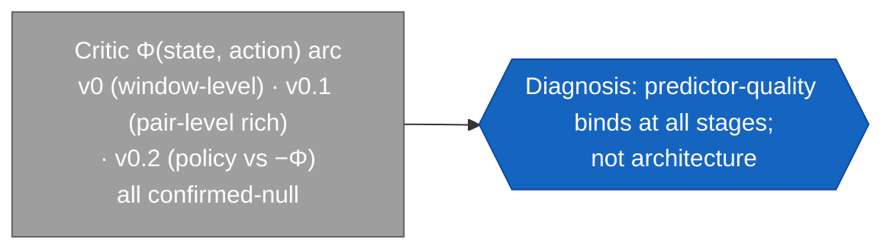

## CFR meta-allocator arc → DCA → live frontier

A four-phase escalation that reached a deployable PASS, then died on
realistic-friction re-eval — and in dying, established DCA as the
canonical live strategy and (via the DSR ladder) the only arc in the
repo clearing significance.

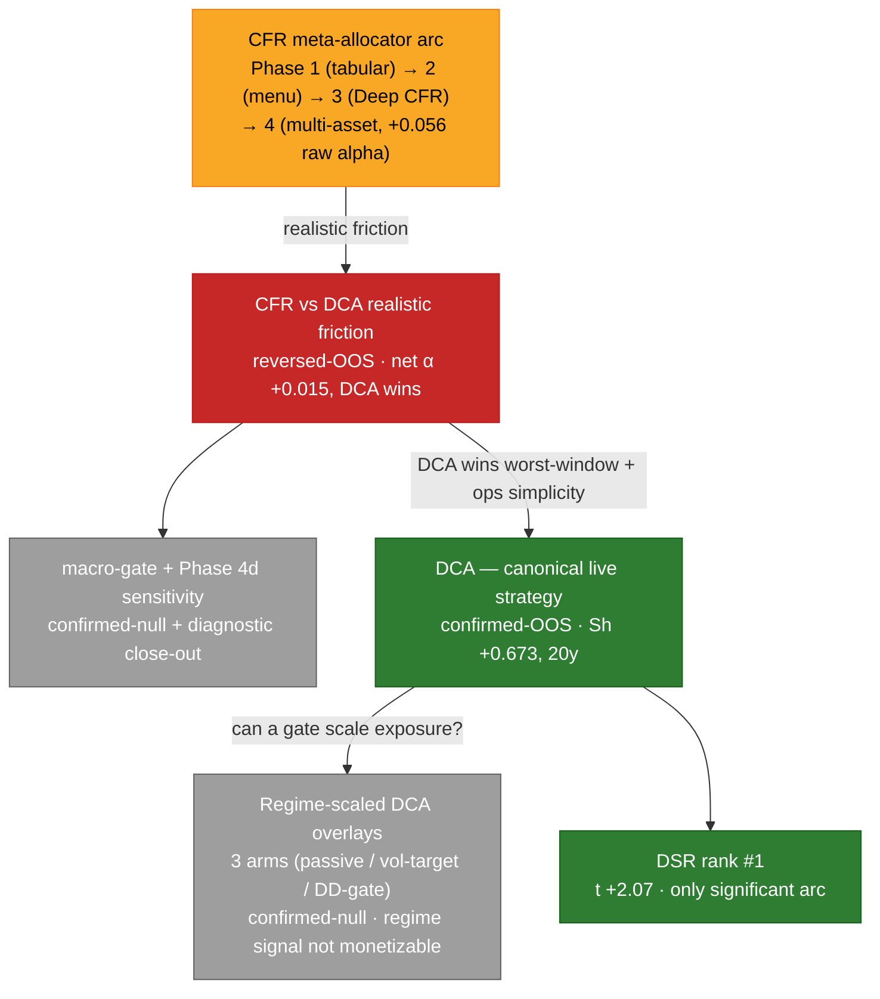

## Relational + replay + infra (parked / supporting)

The relational 12-phase arc (mostly null, parked behind the
prediction-problem pivot), the replay backbone arc (shipped
compression results that feed factor), and the diagnostics + shared
packages that gate the rest of the workspace.

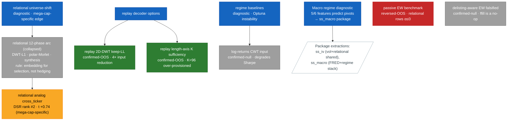

## Meta-narrative — what the map says taken together

```mermaid
flowchart LR
    a["Cross-sectional return-forecasting<br/>(relational + factor representation)<br/>→ all null"]:::cnull
    b["Prediction-problem pivot<br/>drawdown / pair-spread / IV<br/>→ partial-OOS with regime conditioning"]:::pOOS
    c["Oracle survey<br/>headroom is real,<br/>predictors don't capture it"]:::diag
    d["Critic + REINFORCE<br/>architecture isn't the lever,<br/>predictor-quality is"]:::cnull
    e["DSR ladder<br/>even survivors are sub-significant<br/>under selection-bias deflation"]:::diag
    g["Ensemble discovery<br/>0 of 91 combos beat DCA-on-overlap<br/>after honest n_trials + window control"]:::cnull
    f["Next lever:<br/>paid data / capacity-constrained edges<br/>(see research-strategy memory)"]:::pend

    a --> b --> c --> d --> e --> g --> f

    classDef cOOS fill:#2e7d32,stroke:#1b5e20,color:#fff
    classDef pOOS fill:#f9a825,stroke:#f57f17,color:#000
    classDef cnull fill:#9e9e9e,stroke:#616161,color:#fff
    classDef diag fill:#1565c0,stroke:#0d47a1,color:#fff
    classDef pend fill:#eceff1,stroke:#90a4ae,color:#37474f,stroke-dasharray:4 3
```

The narrative the arcs jointly tell: **free-data, cross-sectional,
single-asset-class anomaly hunting hits a deflation wall**. Of the
six stream-bearing strategy arcs on the DSR ladder, DCA is the only
one above t = 2 — and DCA is not a *prediction* edge, it is a
risk-premium-capture buy-and-hold. The published-anomaly arms
(12-1 momentum, low-vol BAB) plus the repo's own predictors all
fail to clear significance once trial counts are priced in. The
forward bet, made explicit in the [research-strategy
memory](https://github.com/sughodke/StockSurvey/blob/master/CLAUDE.md):
**pursue structurally-persistent edges — capacity-constrained, novel
data, microstructure** — rather than novelty-to-Claude on the same
free OHLC.

## Maintenance

When a leaderboard row lands, decide *before* adding a node:

1. Is this a new arc, or a new arm of an existing arc? Most rows are
   the latter — add them inside the relevant sub-diagram, don't
   create a top-level node.
2. If the arc has grown past ~10 nodes, **collapse** the older arms
   into a single descriptive node (the way "Critic Φ arc",
   "Representation search", and "CFR phases 1→4" are collapsed here)
   and link the finding page from the collapsed node. The map is a
   curated cartography, not a changelog — don't let it grow
   monotonically.
3. The DSR ladder section at the top is the meta-finding view. When
   a new stream-bearing arc lands, add it there *and* in its arc
   diagram. Meta-evaluations and non-portfolio diagnostics do not
   appear on the ladder by construction.
4. Edge labels are the *reason* the next experiment followed —
   re-read them after editing to make sure the narrative still
   reads top-to-bottom.

A node with no outgoing edge is either a live frontier or a terminal
close — the [TODO](TODO/index.md) for that arc says which.
